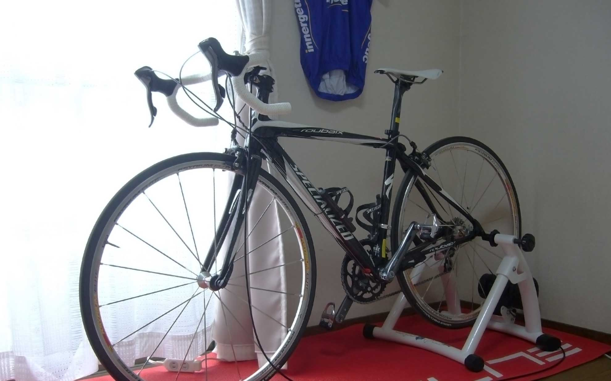

意外と自転車に乗っている人でうつ病の人がいるような気がします。僕もですけど。  
<!--more-->
　  
どうやら関係があるようです。かくいう僕もうつ病で会社を辞めて現在療養中なのですが、自転車に乗り始めてから少し気分が良くなってきているような気がします。  
もちろん薬による効果もあるのですが、一定のペースで呼吸をする運動（自転車、ウォーキングなど）はうつ病改善に効果があるようです。もっともそれを知って自転車に乗り始めた訳ではなく、友人がロードレースが大好きで、半ば強引に誘われる形で自転車を始めたのですが、今ではすっかりハマってしまっております。
　  
今は無職で何もしていないので、もちろんヒマです。しかもうつ病で不眠症なので基本的に夜型生活になってしまってました。不眠症で夜眠れなくても昼間寝られるからいいや、と思ってましたが、最近毎日のように自転車屋さんに遊びに行かせてもらってるお陰で昼間の行動時間が多くなった気がします。（特に何もしてないですけど・・・）  
不眠症のお陰で早朝の誰もいない少しヒンヤリした道を走りながら日の出を感じるのはひそかな喜びになったりもしています。  
もっとも病気にならないようにするのが一番ですが、病気と自転車のお陰で何だか今まで知らなかった人生に出会えたような気がして少し嬉しかったりします。  
そんなこと言っても今の自転車に大金をつぎ込んだ言い訳にはならんなぁ（笑）・・・・・。

  
　  
うつ病がどんな病気か知るには一番わかりやすい気がします。家族や身近な人に読んでもらえると理解してくれやすいと思います。
　  

