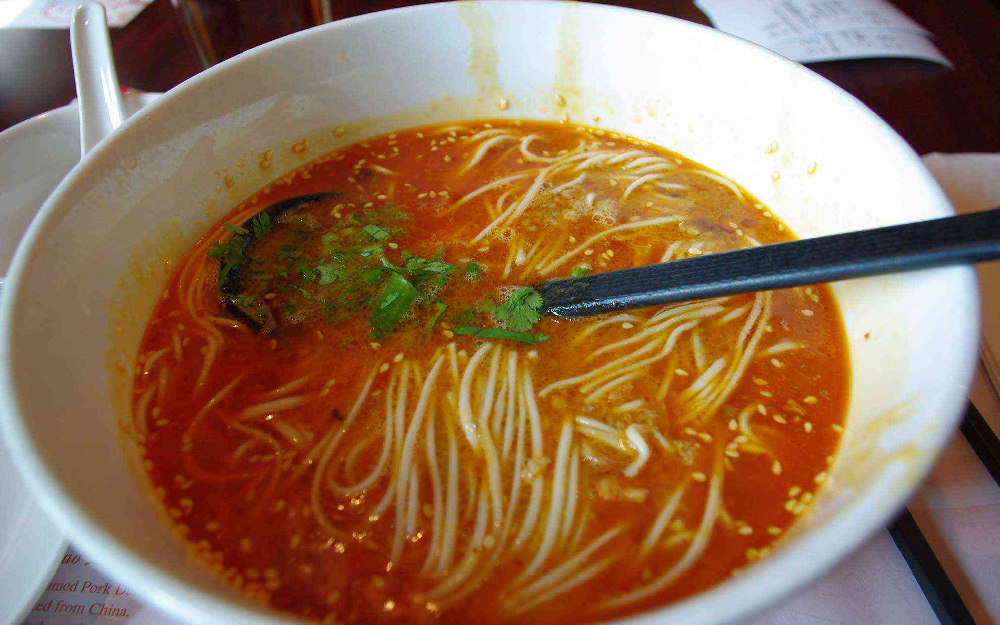
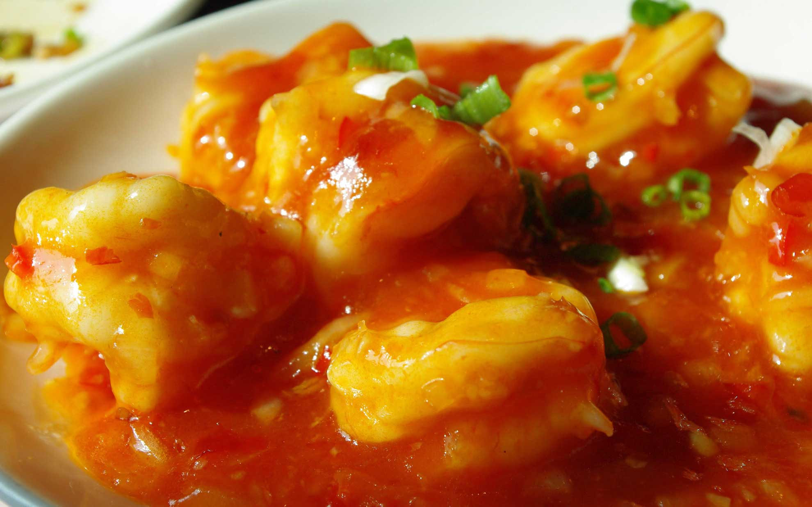

香港にやってきました。飛行機に乗っただけなのに疲れた・・・。  
<!--more-->
　  
今日は台風の上空を通過したので揺れまくり＆寝不足のため酔いました・・・。  
疲れたなぁ。  
ホテルはBPインターナショナル (龍堡国際賓館)に宿泊します。BPがベイデン・パウエルの略だと知ってビビりました。ボーイスカウトの創始者で、中学から高校生のころスカウト活動にのめりこんでいたのを今でもよく思い出します。  
ボーイスカウトはキャンプばっかりやっている雰囲気がありますが、それ以外にも様々な人から多くのことを教えてもらった良い思い出が多いです。  




　  
夕食はハーバーシティー(海港城)にあるクリスタルジェイド(翡翠拉麺小籠包)で坦々麺を食べたのですが、人生ナンバー１くらい旨かった。  
そこの小龍包も激しく旨く、おかわりしました。おかげで元気が出てきました。  
英語が通じるのは便利だなぁ香港は。  
ホテルはネット４時間接続で３０ドル。約５００円。許せる値段かな。  
　  
そういえば自動車社会の香港でストライダに乗っているツワモノを発見。  
すごいスピードで香港の街に消えていきました。自転車（ママチャリじゃなくて）に乗っている人は珍しい気がしました。  
　  
とりあえず今日は眠れなくても横になっていよう。  
明日はマレーシアへ飛びます。  
　  
  
　  
  
　  
  

　  
