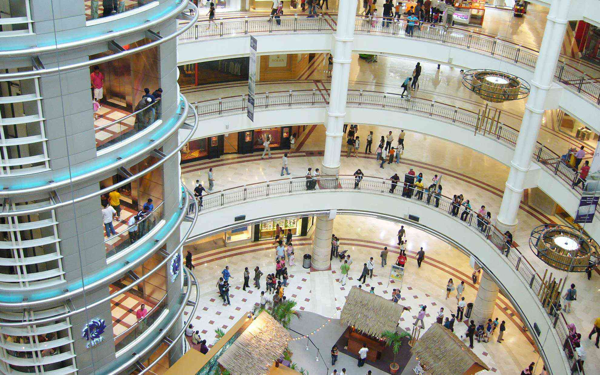

今日は香港からクアラルンプールへ移動して、無事ホテルにチェックイン。 
<!--more-->
　  
### あなた、疲れているのよ。
・・・のはずが手書きの部屋番号の文字を４を６と読み間違えてカードキーを刺しても一向に部屋の鍵が開かない、というマヌケな失敗をしてしまいました。情けない・・・。  
ホテルは歩いて立地を考えてペトロナスタワーから近い場所にしました。いやー、都会ですな！早速疲れたので部屋で寝ました。  
　  
マレーシアも香港や日本と同じ右ハンドル左車線なので歩いていて違和感がありません。自転車はあまり市内では見かけませんでした。自動車が多いからかな？  
　  
マレーシア料理はナシゴレン（チャーハン）やミーゴレン（焼きそば）のような気軽に食べられ、日本人のお口に合う料理が多いような印象です。  
今日はペトロナスタワー内のショッピングモール・KLCC(Suria KLCC)でお買い物や夕食を食べましたが、ショッピングモールは日本でもどこでも同じような構造をしているので、スタバでコーヒーとか飲んでいると自分がどこにいるのか一瞬分からなくなったりします。日本のイオンモールにいるみたい。  
　  
明日はマラッカへ行きます。

  

  