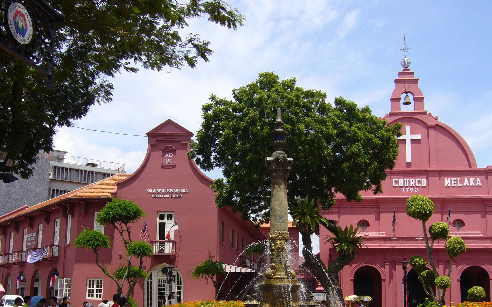
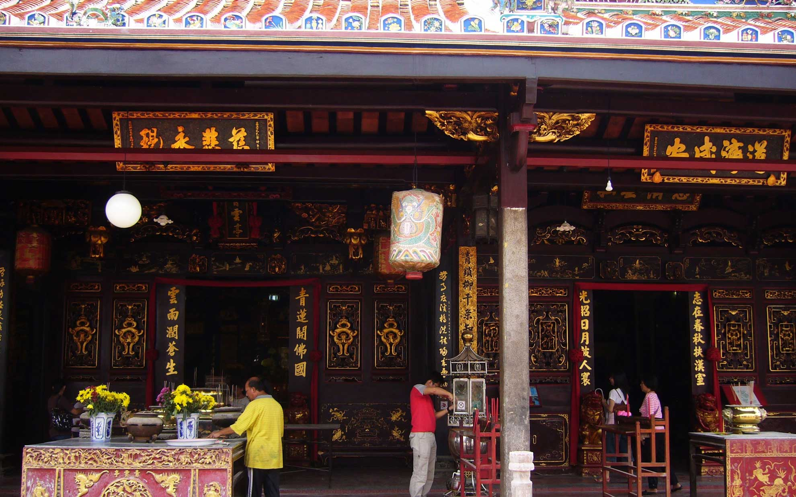
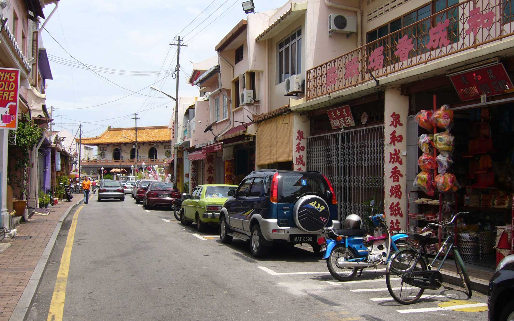
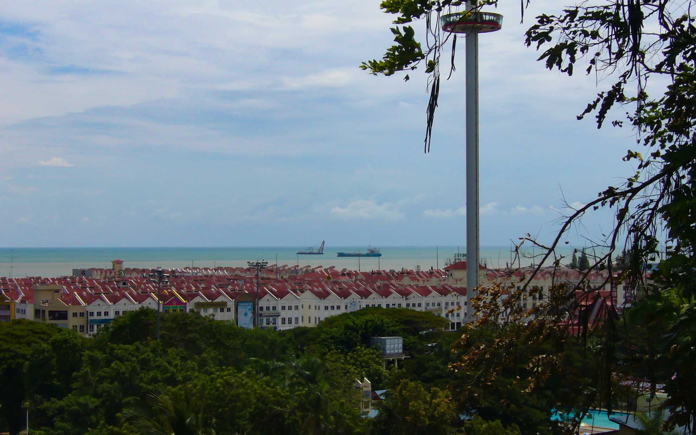
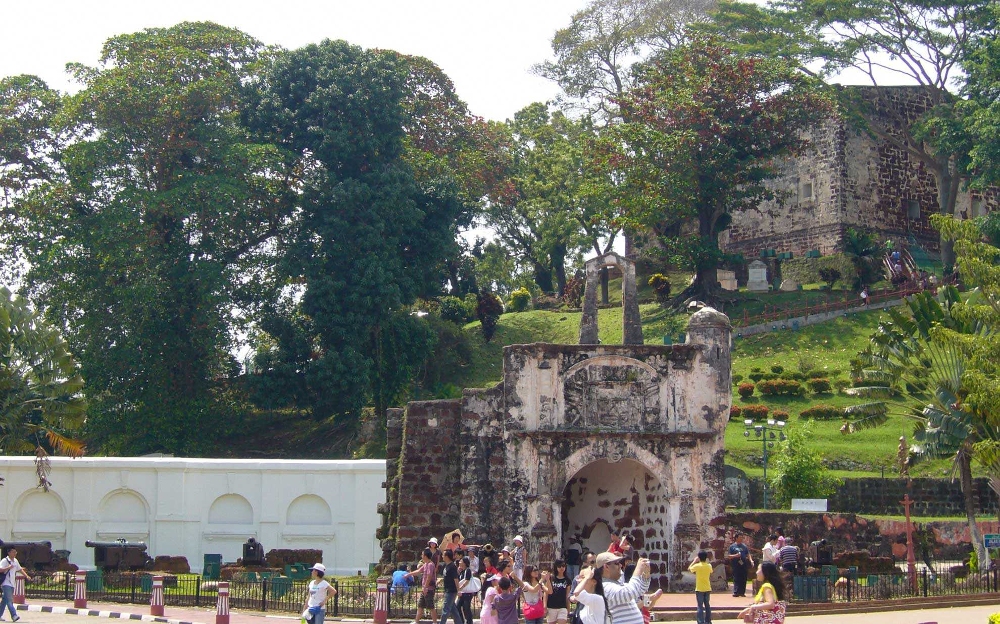

最近世界遺産にも指定されたマレーシアの古都・マラッカに行ってきました。
<!--more-->
　  
### 文化が融合した街
海上交通の重要な要衝だったマラッカは中継貿易で栄えましたが、重要である故にポルトガルやオランダ、日本に占領された歴史も持ちます。  
丘の上には教会の跡が残っていてました。そこにある像の人物はフランシスコ・ザビエルで、ここから日本に向けて布教活動へ出発したと言われているそうです。  
そんな歴史のなかでマラッカは華僑が活躍した街のうちの一つとも言えるのではないかと思います。  
漢字が並ぶ街の様子は今でも日差しや雨をしのげるアーケードのような建物が残り、こういった風景はまだ他の南アジアの街で見かけることができます。  
　  
中国系が多い町なので中国語の看板が多くて、一瞬どこにいるかわからなくなってしまいます。こういう独特な雰囲気は風情があって、旅をしているなぁと実感できるのが個人的に好きです。暑いながらも吹き抜ける風が気持ちよくて、いい場所だなぁ。  
マラッカ海峡が目の前に見られたのも感動しました。  

  

  

  

  

  