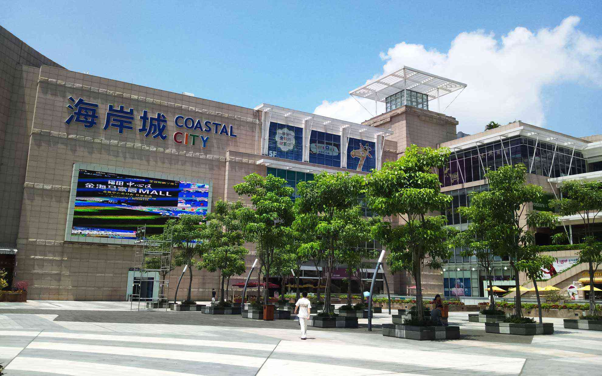
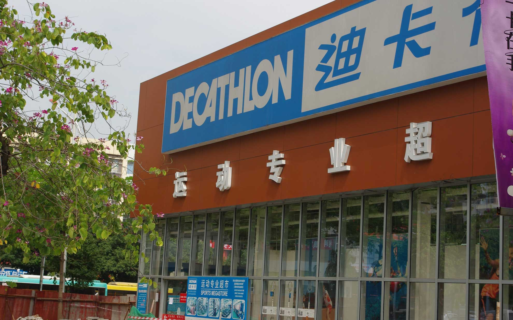
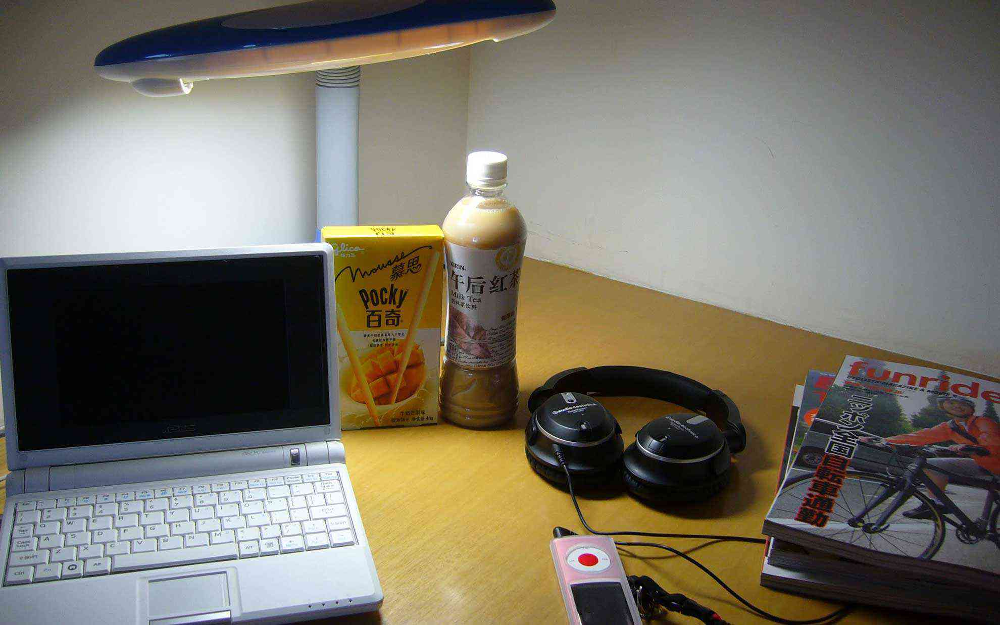

中国の深圳にある蛇口（ジャコウ）という地区にきております。
<!--more-->
  

香港からフェリーに乗って一時間で到着すると、そこは中国。でも蛇口は比較的外国人滞在者が多い街で、街は全体的に綺麗だしスタバやマックなどのおなじみの店もあるので安心感がある気が・・・するかな。  
とは言ってもネットはしっかり規制が入っていてGoogleやFacebookにも接続できないので、基本的にネットはVPNを経由しないと不便かも。  
1週間や1ヶ月単位で安いVPNサービスを探して契約しました。おかげで日本と変わらないネット環境になりました。  
　    
自転車もママチャリじゃなくてロードで走っている人も良く見かけます。BMCのマウンテンを発見して少しコーフンしてしまいました。どこで乗ってるんだろう・・・。

今日は蛇口にあるジャスコ（海岸城）に行ってきました。
地元近くのイオンモールの何倍もの広さで、中にスケートリンクなんかがあったりして超巨大なショッピングモールです。
お昼ごはんは味千ラーメン(九州に本店がある)でラーメンと餃子を食べ、そのまま夕食の食材を探しにジャスコの食品売り場へ。
　  
中国とは思えないほどの日本食の数に驚きました。昔フランスに留学していたときに日本食が食べたくてアジア食品店に通っていたときのことを考えるとまるで天国のよう。当時の体験が原因で海外に出かけても日本のものを探してしまうクセが出てしまいます。
テレビなどでも取り上げられているように日本のものは中国や香港では人気があります。日本風でとりあえず平仮名で書かれた偽物もありますが、ジャスコではトップバリューがそのまま売られているので海外赴任で住んでいる方にも便利だと思います。
　  
その後、スポーツショップ「デカトロン」へ。冬用のジャージを買いました。約9,000円。自転車買えてしまう金額でしたが、今年の冬に活躍してくれると期待しております。あと冬用のグローブ。
蛇口は去年も来たけれど、着々と自転車がデカトロン一色になりつつあります。  
マンションに戻って日本食を食べてＮＨＫを見ていると、今日は日本ずくめな一日だったなぁと思いました。
　　
  

  

  