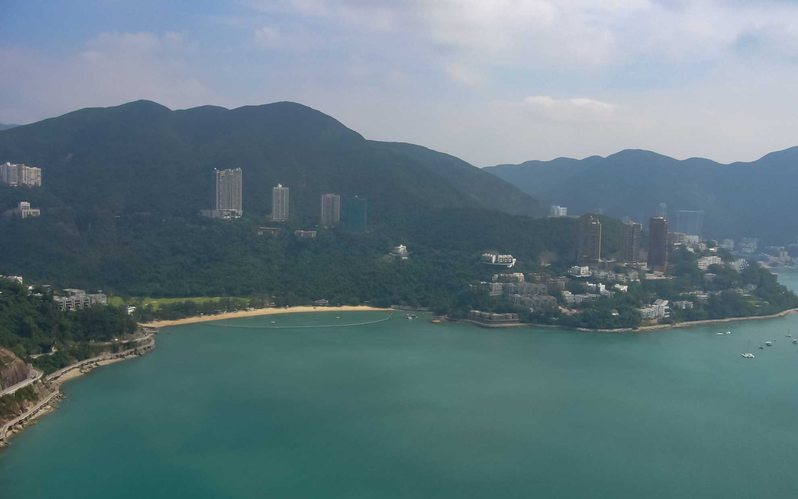

香港島にあるオーシャンパークへ行ってきました。
<!--more-->

香港へは朝少し早起きをしてフェリーで1時間かけて行きます。フェリーはクーラーがガンガンに効いていて寒いくらい。2階建ての小さなフェリーですが、カウンターで食事を作っていて食べている人もいました。船酔いしやすい自分には無理だ・・・。  
交通機関は地下鉄の金鐘（Admiralty）駅で降りて、バスチケットと入場券を買いました。  
NO.629のバスに乗り、アバディーントンネルを抜ければすぐオーシャンパークです。  
バスを降りてパンダの看板を見ながら進んでいくとゴンドラで移動するみたい。  
　  
ゴンドラというには簡単なつくりのもので、かなり高い場所をグングンと進むので怖かったです・・・。いや、ここは香港だし大丈夫でしょ！と自分に言い聞かせながら外の風景を楽しみました。幸いなことに風も穏やかだったので揺れずに済んでよかった・・・。  
　  
  

パンダとのご対面は特に時間制限とかもなく、パンダも自由気ままにノンビリとしています。・・・いや本当に自由でいいなあ。  
カメラでいいショットを狙いますが気を利かせてくれるわけもなく、パンダは笹を食べたり寝転んだりしていました。お客さんが少なかったのでコチラも自由に見ることができました。
　　
  
  
  
  
  
