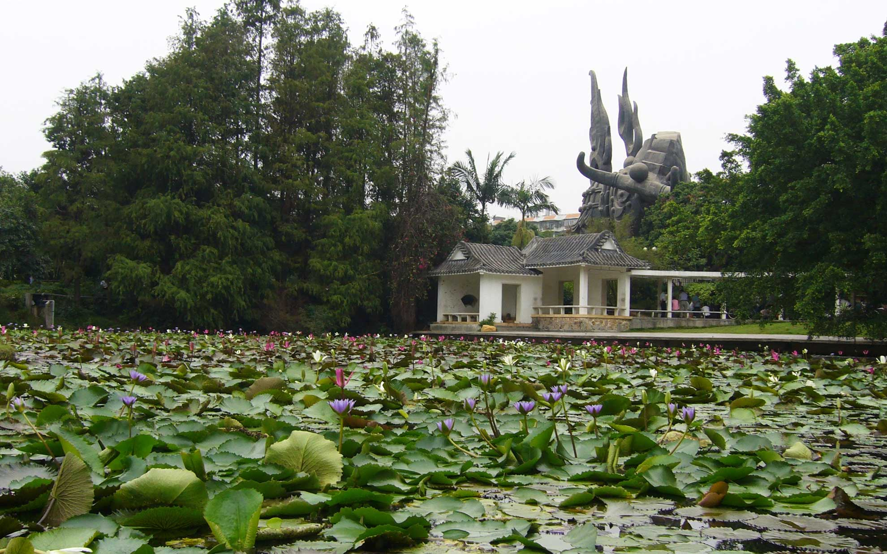
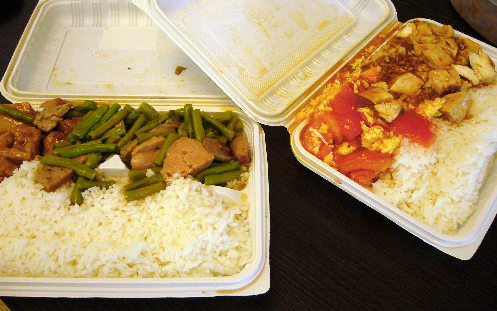
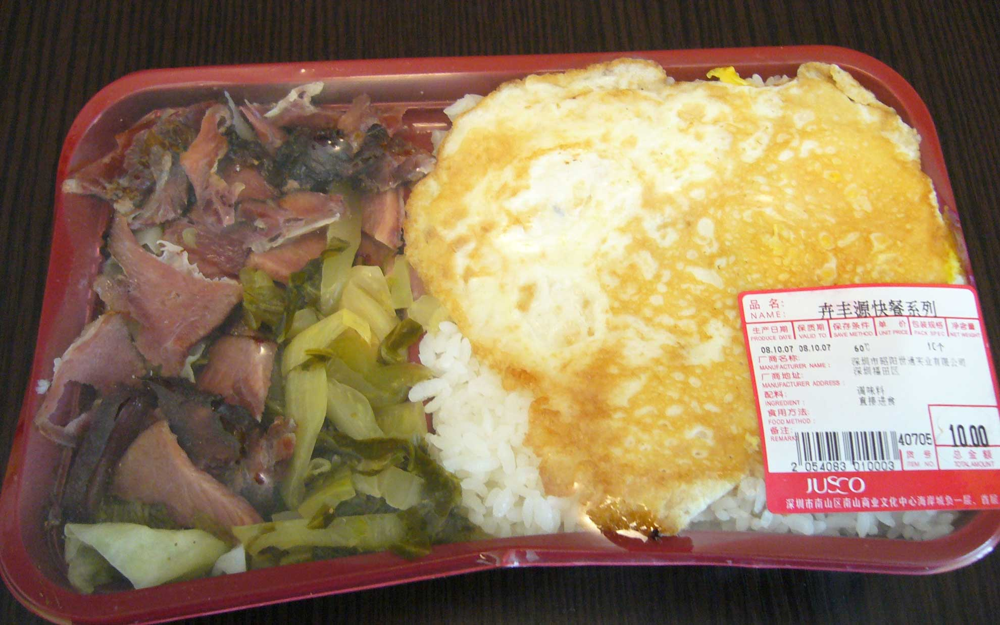

アパートから蛇口の街へ散歩にでかけてみました。
<!--more-->

歩いて20分くらいのところに「四海公園」という公園があります。
公園には複数の池があって、昼寝したり釣りをしたり、犬を散歩させたり、二胡の演奏にあわせて歌を歌っていたり、トランプ博打をやっていたり（笑）、フリーダムな平日午前11時でした。でも蓮の花が見頃なのかキレイでした。気温もそんなに暑くなかったのでちょうど良い散歩になりました。  

  

タクシーを捕まえてイオンへ。  
食料品を買って最後はお惣菜・お弁当コーナーというのは中国のイオンも同じらしく、おかずを選んで好きなお弁当を食べるのが人気のようです。僕もさっそく麻婆豆腐とトマトと卵の炒め物の2種類を選んでお弁当を買いました。たしか10元だったので150円くらいですか。すごい安い。まぁイオンのお弁当なので他より高いらしいのですが、それでも安い。  
　  
お弁当の量は相変わらずもの凄く、店員の女の子が同じ量のお弁当を買っていたけど、全部食べるらしいです。  
僕もありがたく頂きました。美味しかったですよ。完全に歩いた分以上のカロリーを食べた感じ。 
味付けが個人的に好きな中華味なので、たまにはいいですよね。  
また元気がある時は散歩しに出かけようと思います。     
　  

  
  
