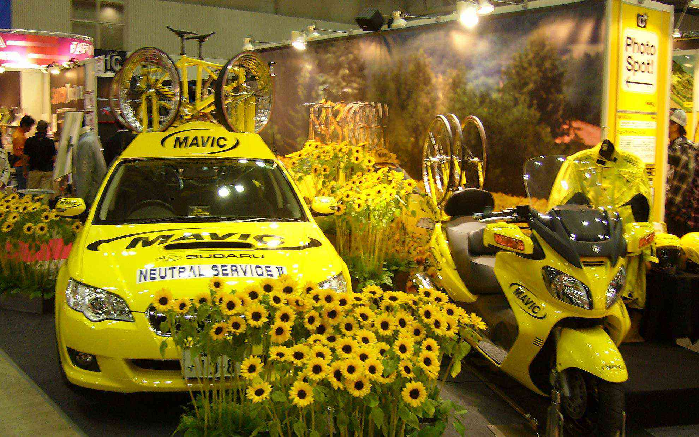

幕張で行われたサイクルモード2008に行ってきました。
<!--more-->

あいにくの雨でしたが、会場はスゴイ人の数で試乗の列も最大1時間待ちという盛況っぷりでした。  
スペシャライズドのターマックとエピックに早速試乗もしてみましたよ。  
　  
その他小径車や折りたたみ自転車など他メーカーも色々試乗したり、トークショーを見たりして、あっという間の一日でした。  
せっかく幕張に行くなら・・・ということで途中で築地市場にも初めて行きましたが、活気があってすごいですね。外国人がかなり多く観光で来ていて、まぐろ丼など色々食べてました。  
疲れましたが久しぶりに一日を満喫できた気がして嬉しかったです。
　  
サイクルモード2008では多くのイベントや試乗体験などを通じてより自転車を理解してもらおうと試みられています。今年は何だか豪華なイベントが各所で行われていてビックリしました。  
コルナゴではエルンスト・コルナゴ氏のサイン会、ウィリエールにはブルセギンが来ていて、お昼を食べようとフラフラしてたらメルクスとすれ違ったり、JSPORTSでおなじみの栗村さんや白戸さん、イベント司会でおなじみの絹代さんや富永さん、アンカーのブースでは飯島選手、辻浦選手、山本選手のトークショーなど豪華なイベントでした。できれば来年は名古屋でもやってほしいなぁ。  
  

  
  
  
  
