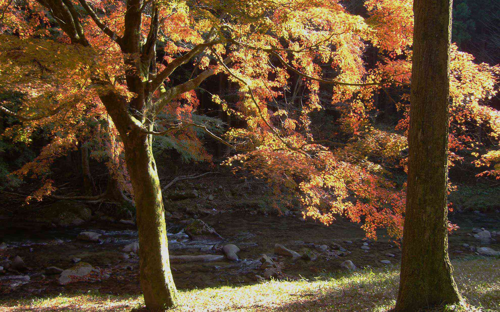

新城の豊川支流の巴川沿いのルートはオススメです。
<!--more-->

新城総合公園を抜け、豊川沿いに北上していくと一色という地区にでます。  
そこから左折して巴川上流を走っていくのですが、夏は涼しく秋は紅葉が美しいルートです。  
　  
  

この道は普段は誰もいない道なのですが、自然が美しく大変気に入っている道です。誰も知らないだろうと思っていたら、かなり紅葉スポットとして有名らしく県外からの車がいっぱいでビックリしました。  
　  


