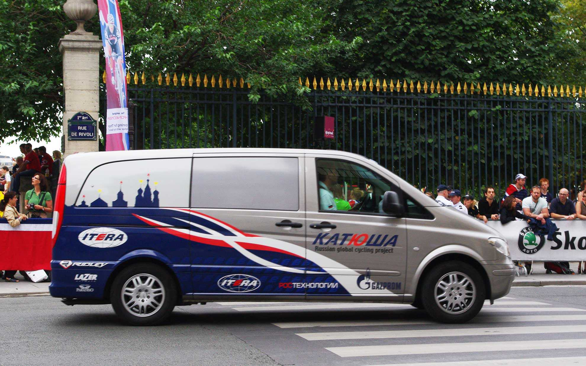

ロシア初のプロサイクリングチーム・カチューシャが記者会見を行った模様。
<!--more-->

ロシア語だと「KATЮШA」と表記するんですね。  
会見にはプーチン・ファミリーが勢ぞろいで、さぞかし楽しそうな雰囲気だったそうです。    
ちなみにロシア語はKATЮШAと書きますが、"Ю"を"ュー"、"Ш"を"シャ"と発音するとカチューシャ、となります。キリル文字という独特の文字を使っているせいで、見た目から読む気が失せるかもしれませんが、慣れると不思議！ギリシャ語を読んでる感覚で段々読めてきます。「Й」で"イークラトコエ"って発音するあたりはフランス語で「Y」を”イーグレック”と発音するのと似てるのかな・・・。
　  
さて、このチームはマキュアン先生が移籍したことで有名になりましたが、他にもカルペツ、ポッツァート、ステーグマンあたりの強力な助っ人選手がでてくれるので、いきなりシーズンから成績をだしそうな感じ。（カルペツはロシア人だっけ・・・）

2009年のUCIプロツアーチーム（予定）は下記の通りになりそうです。  
　　  
アージェードゥーゼル・ラモンディアル (フランス)  
アスタナ（カザフスタン）  
ブイグテレコム (フランス)  
ケスデパーニュ (スペイン)  
コフィディス (フランス)  
エウスカルテル・エウスカディ(スペイン)  
フランセーズデジュー (フランス)  
ガーミンースリップストリーム (アメリカ)  
カチューシャ (ロシア）  
ランプレ・N.G.C. (イタリア)  
リクイガス (イタリア)  
チームミルラム(ドイツ)  
クイックステップ (ベルギー)  
ラボバンク(オランダ)  
フジ・セルヴェット* (スペイン)  
サクソバンク・IT ファクトリー (デンマーク)  
サイレンス・ロット (ベルギー)  
チームコロンビア (アメリカ)  
　  
*前 スコット-アメリカンビーフ  

　  
  

