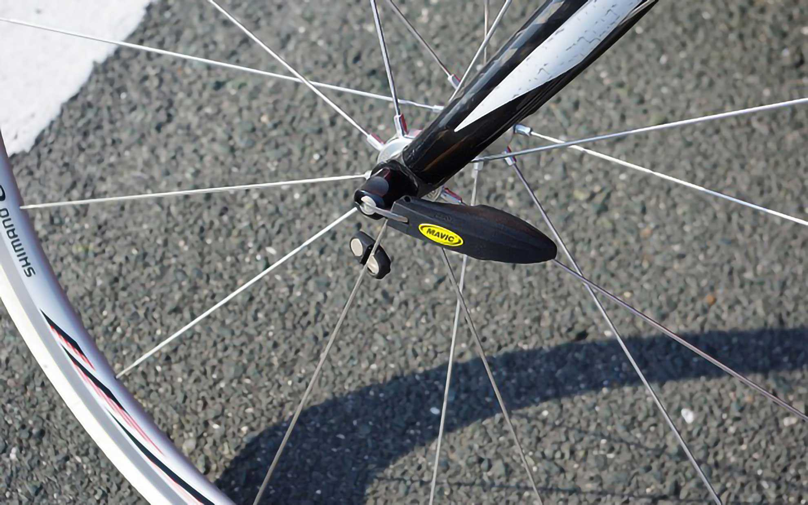

心拍計が気になって仕方がないので買ってみました。
<!--more-->

最近気になって仕方がなかった心拍計を買うことにしました。
きっかけはバイシクルクラブの記事で、「心拍計を使えば1ヶ月で走りは変わる！脂肪を燃やせるカラダを作る！」というのを読んでテンションがあがった勢いでお店で注文しました。  
心拍計の王道ポラールではなく、マヴィックの新商品「Wintech HR」です。  
QRで速度も計測できるなんて画期的だなぁ。これで心拍を測りながらサイコンでトレーニングしたいです。  
　  　  
  

