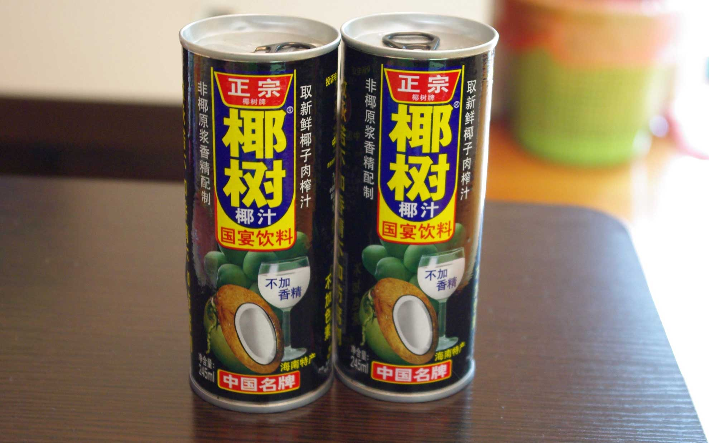
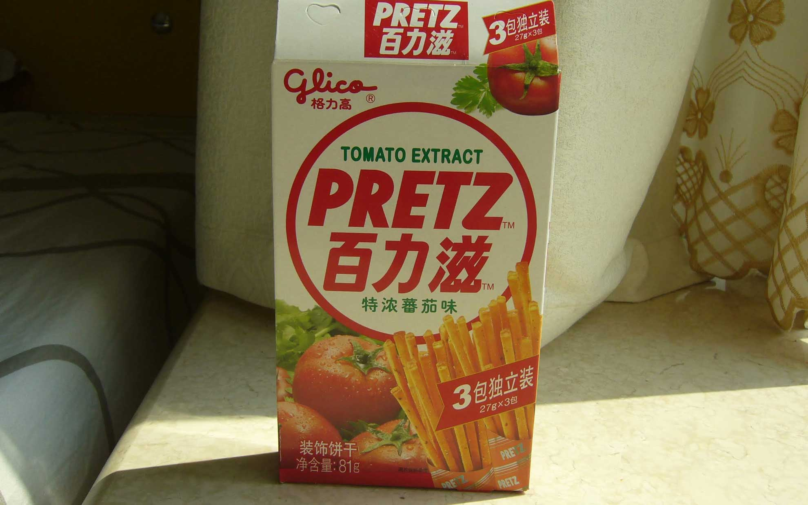

 今日からふたたび中国でしばらく過ごすことにしました。
 <!--more-->

花粉症で目と鼻が大変なことになっていたのですが、香港に着いたら何も感じない・・・目も鼻もスッキリして信じられないくらい。  
今回はJALのマイレージが貯まっていたのでJALの香港便を予約しようとしたのですが、あいにくの満席。そこで同じ便の共同運航便扱いでJALが加盟しているワンワールドのキャセイ・パシフィック側で空席があったのでマイルをそちらで使って席を予約しました。裏技と言うほどではないのですが、同じ飛行機の便でもこういう方法で席を取る方法もあります。  
ということで無事、蛇口（じゃこう）に到着しました。  
　  
蛇口までの行き方としては、空港から乗り換えでフェリーに乗るか(便が少ない)、いったん香港エクスプレスで香港島の上環までいってからフェリーで行くあたりが無難な行き方でしたが、今回はタクシーで深圳湾口岸まで行って300ドル、3人で行ったので一人100ドル（1500円くらい）で行けます。香港から直接蛇口まで橋があり、蛇口で香港と中国の両方の入国審査をいっぺんに受けられて便利です。入国審査後は中国のタクシーに乗り換えて5分くらいでアパートに到着です。便利だなぁ。  
　  
今日は暑いらしく半袖でも暑いくらい。でも夜は割と涼しいので5月くらいの気候です。  
　  
中国にくると必ず買う物があります。  
ココナッツの缶ジュースなんですが、さっぱりしていてオイシイです。  
近所のスーパーやコンビニなど、どこでも買えるので、つい買ってしまいます。  
あまり南国のイメージがありませんが、道端ではサトウキビが露店で売っていたり、5月くらいになるとライチが売っていたりして南国らしさを感じさせてくれます。  
写真に書いてある漢字で「椰树」で”イェーシュー(yēshù)"と発音します。つまり椰子の木という意味ですね。スーパーのレシートには「椰子汁」と書いてありました。「汁」はジュースを意味します。中国語の表記は簡体字という簡略化された文字や日本語にない字があったりしますが基本的にやっぱり漢字なので意味が少しわかって楽しいです。  
　  　  
  

