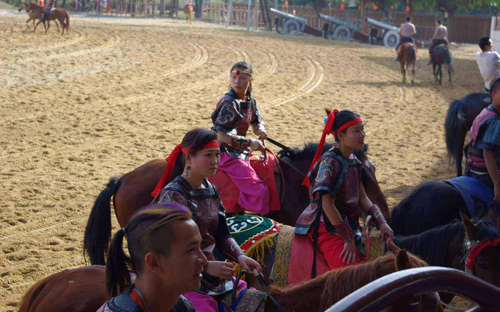
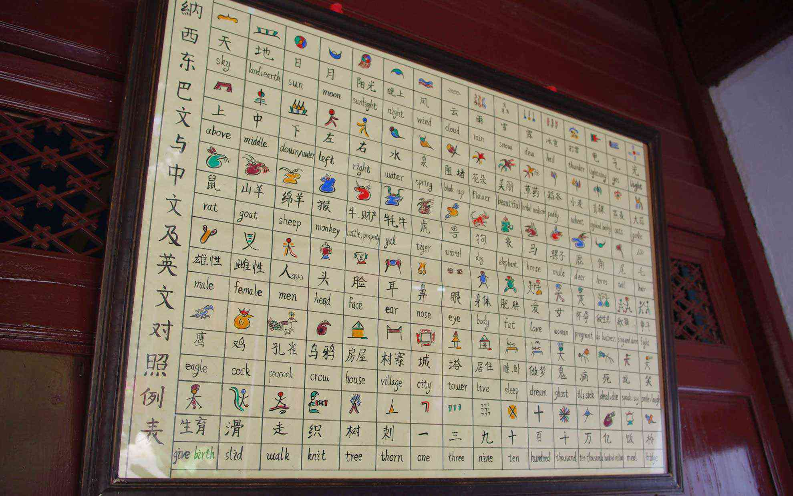

 深圳の中国民族文化村に行ってきました。
 <!--more-->

中国の少数民族の暮らしを再現した建物やイベントで理解してもらうというテーマパークです。  
建物はそれほど真剣に再現しているようには思えなかったのですが、実際に働いている人は各民族の方らしく、トンパ文字の体験や哈尼族の綺麗な民族衣装を着た女の子から少しお話を伺うことができました。中国語勉強しておけばよかったな・・・。  
夜のほうが大規模なショーがあるらしく、日本人観光客も香港からわざわざツアーで足を運ぶらしいです。  
僕が行った時はのんびりしていて、騎馬民族のショーを見た以外はお茶を飲んだりフラフラと各民族の建物を見学したりしました。僕にはこれくらいの規模がちょうどいいのかもしれないな。   
　  　  
  
  
  
  
