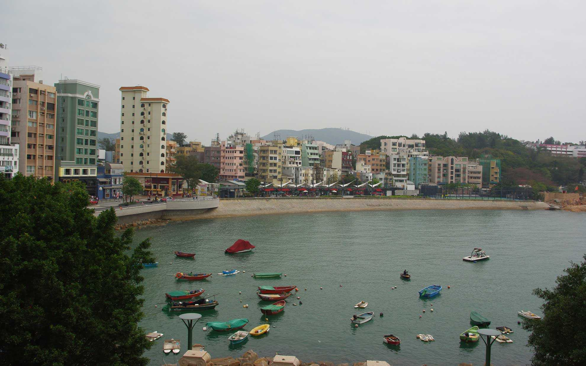
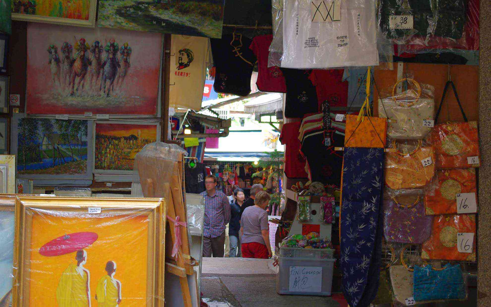
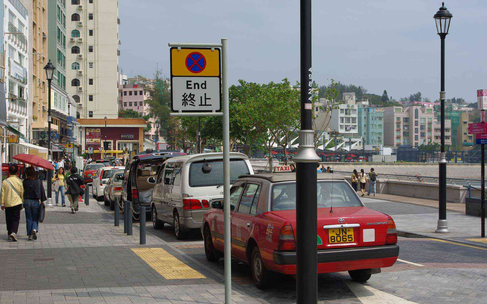
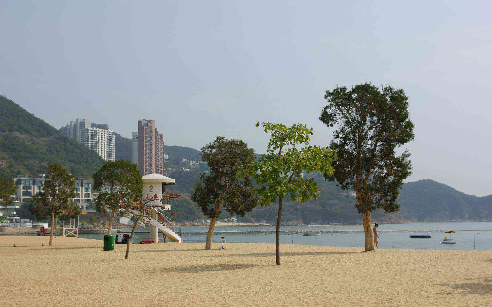
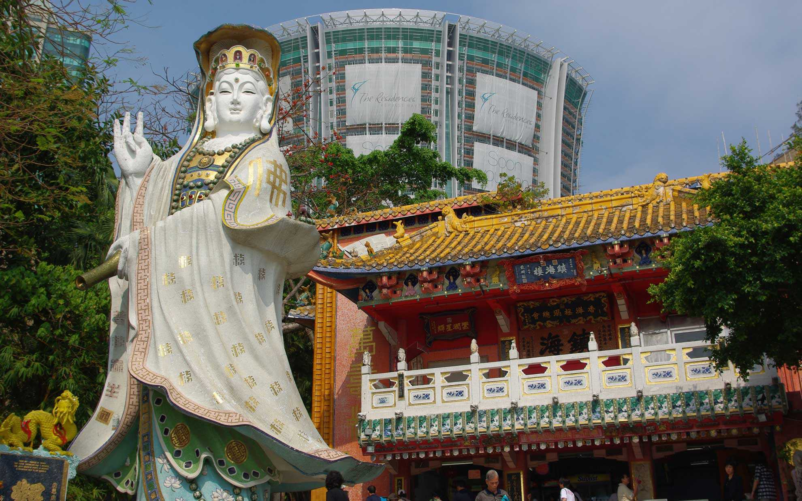
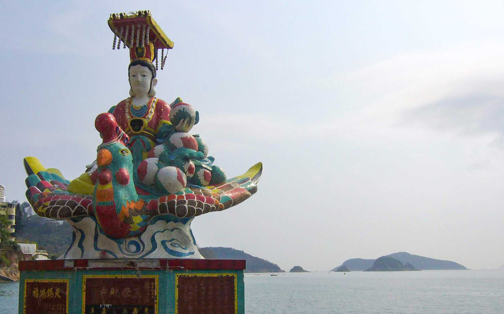
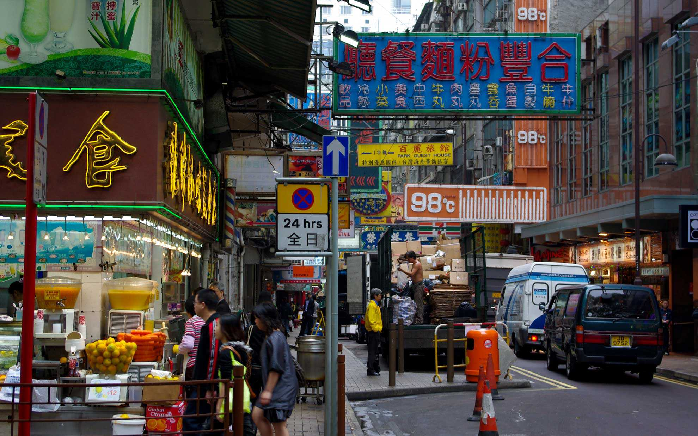
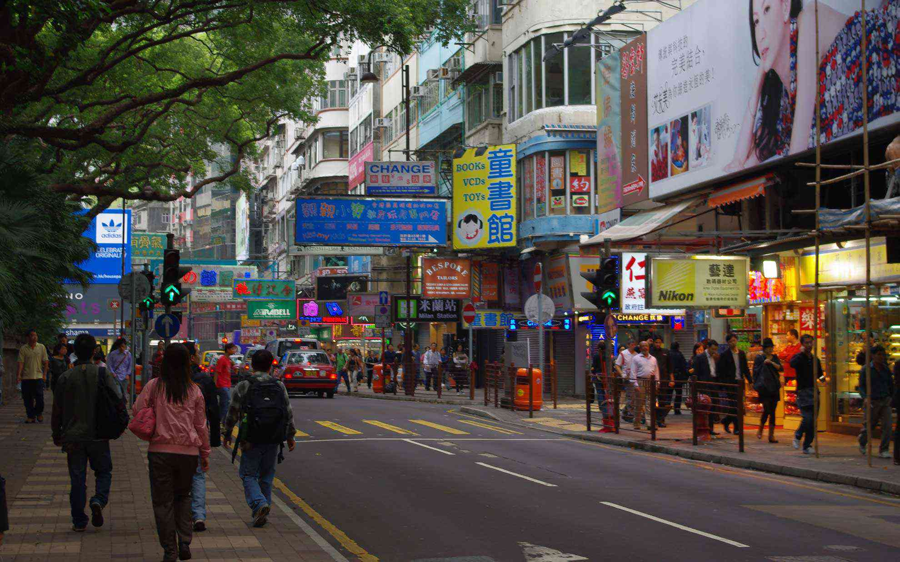

 友人達が遊びに来るというので香港へ出かけました。
 <!--more-->

香港島の南東部にある赤柱(スタンレー)は洋風と中華風の建物が混在した海辺の街で、香港の中でもまた違った雰囲気がする街です。今日はバスに乗ってでかけました。  
まだ開発途中なのか、いたるところで高級マンションの建築が進んでいるいっぽうで少し怪しそうなTシャツやサングラスなどを扱うお店が並んでいて面白いです。  
  
  
  
　  
香港で白浜が美しいと言われる浅水湾(レパルス・ベイ)へ。  
砂浜がリゾートっぽくていい感じなのですが、生えている木が・・・木が・・・なんか変？  
木の根が見えないから変に感じるんですね。  
ビーチを歩いているとお寺が見えてきました。ここは海の女神様「天后」をお祀りする廟で、お祈りしている人が多かったです。  

  
  
  

ここでランチを食べて、少しまったりしたあとはビクトリア・ピークへ。  
夜景を撮ろうと思っていましたが、当然のことながら三脚がないとうまく撮れません。  
まぁ仕方がないか。  
でも一日をかけて香港島をゆっくりと散歩できたので良かったかな。  

  
  
  

