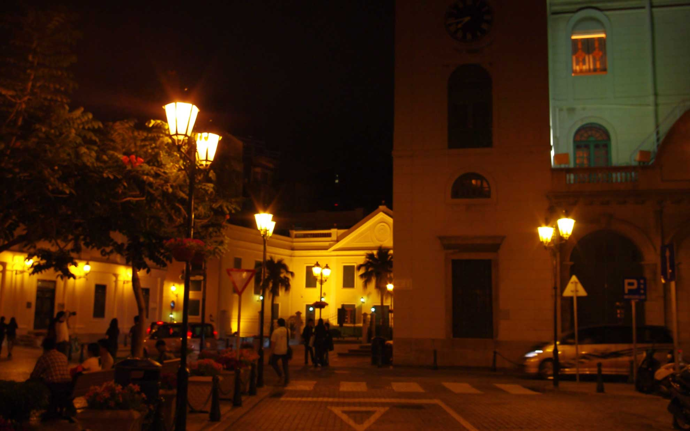
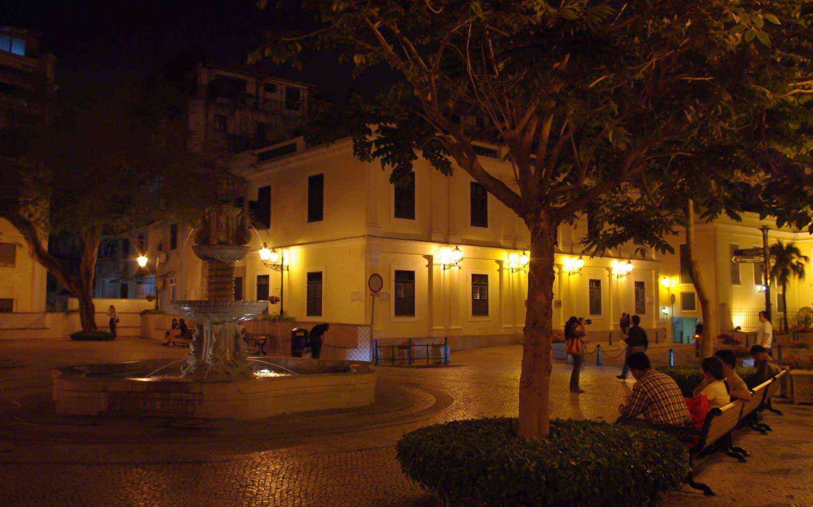
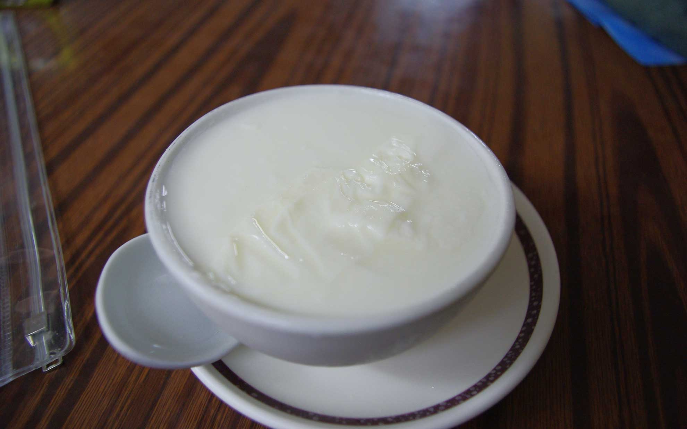

 今日はガイド役となって友人達にマカオを案内させてもらいました。
 <!--more-->

香港からマカオへは高速フェリーや普通のフェリーが運航していて、複数の船会社がしのぎを削っているのでお値段もそれほど高くなく便利です。  
マカオはこれで3回目くらいになるのですが、そんなに色々と観光しているわけではなかったので簡単な案内くらいしかできません。  
船から降りてセナド広場へ。  
マカオと言えばこの広場が有名で、広場に面した歴史的な建物がポルトガル風（行ったことないけど）で人気です。この広場だけでなくマカオには洋風の歴史ある風景が残っており、中華圏文化と融合した独特な景観が香港とはまた違って興味深いです。空気感というか、やっぱり香港とはなんか違うんですよね。  
マカオ料理のお店で晩ご飯を食べて夕暮れを迎えると、街がライトアップされて昼間以上にヨーロッパみたいな感じになります。  
いろいろな楽しみ方があるマカオですが、比較的治安が安心な地区をブラブラと歩くのは楽しかったです。  

  

 
