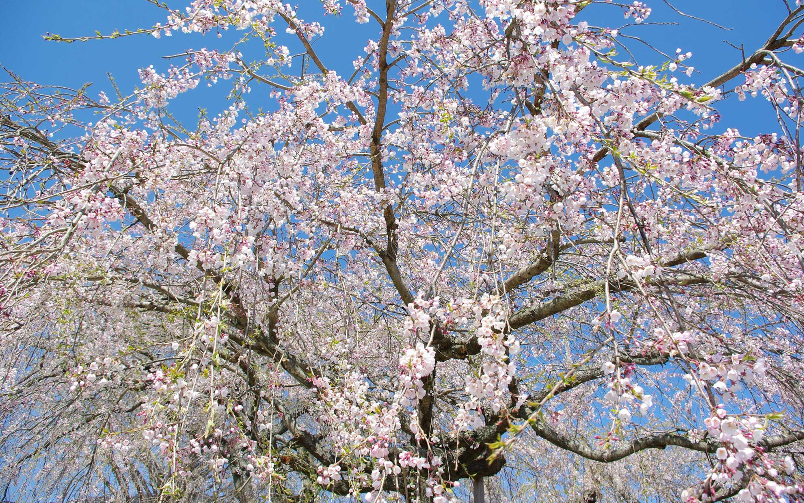

 日本に戻ったらすっかり春となっていました。  
 <!--more-->

宝円寺の枝垂れ桜は愛知県の天然記念物で樹齢はおよそ400年！ だそうで、家から自転車に乗ってもそんなに遠くないので毎年見にきているかな。  
ここの桜は迫力がありつつも、風にそよそよと流される桜の枝がなんだか儚い感じもして桜の木が持つ独特な雰囲気がします。  
日本で桜が好まれるのは、そんな要素もあるからなのかな・・・。  

  

　  


