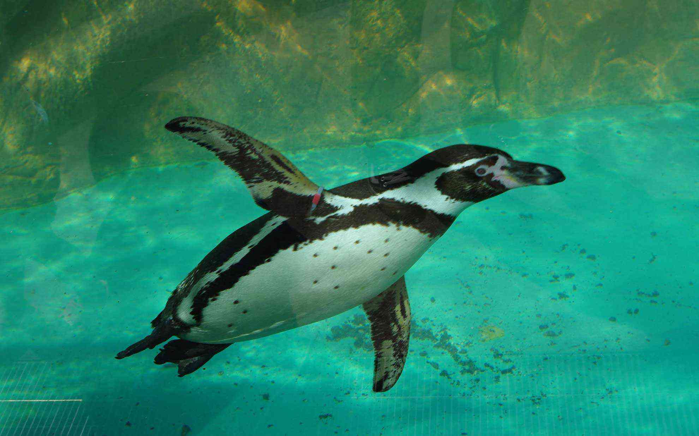
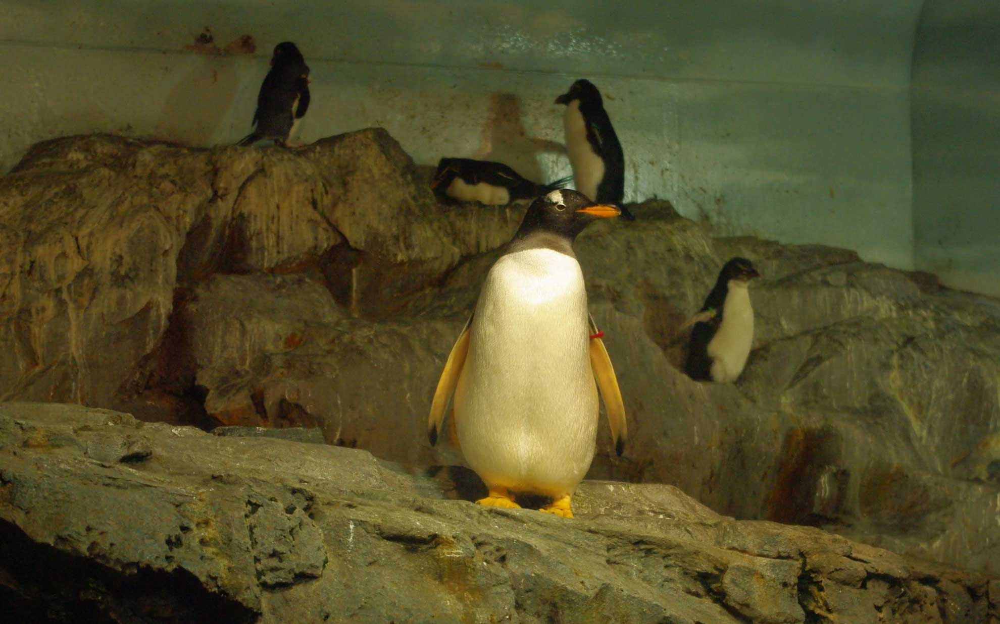
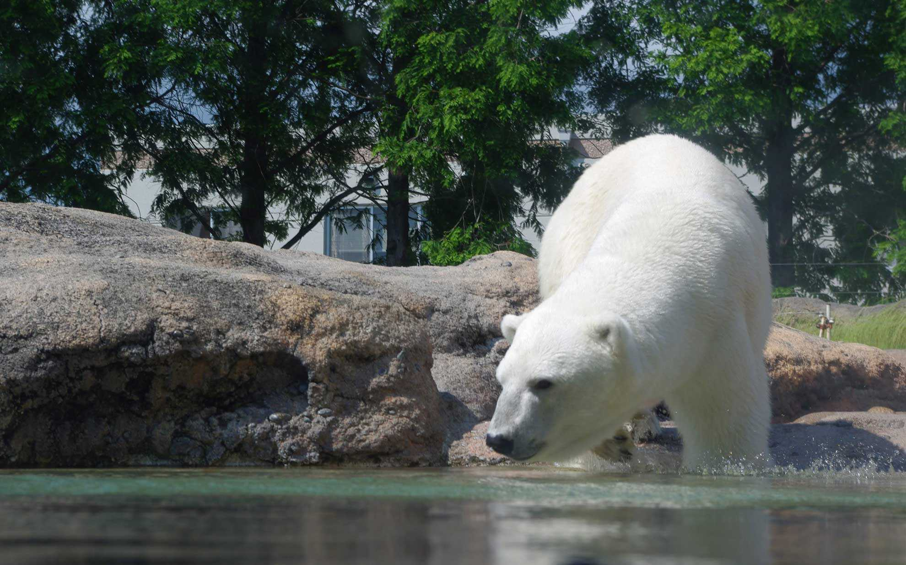
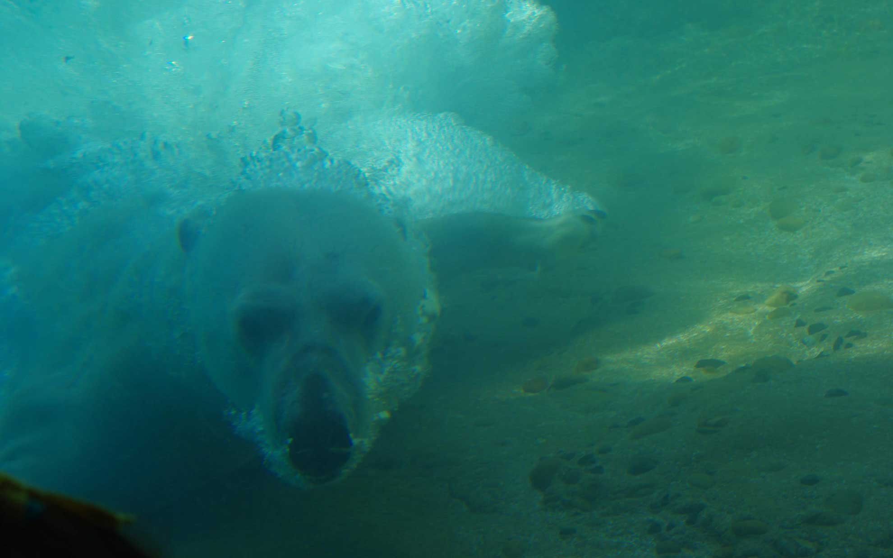

 かなり久しぶりに豊橋動物園へ行ってきました。  
 <!--more-->

豊橋動物園へは学生以来に来たのかもしれません。思い出せないくらい久しぶりです。  
小学生の時にサルからウンコを投げられた思い出のほうが強烈で、サルは怖いです。  
今日は暑いのでペンギンとシロクマを見てきました。展示方法が今は工夫してあって、シロクマが近くに来てくれるように飼育員さんが餌を凍らせて水中に落としてくれるので迫力がある姿を見ることができました。遠目にはモフモフして可愛いのですが、シロクマはあたりまえだけどクマです。鼻息とかも聞けて結構大人でも楽しめました。  
  

  
  
  
  
  
