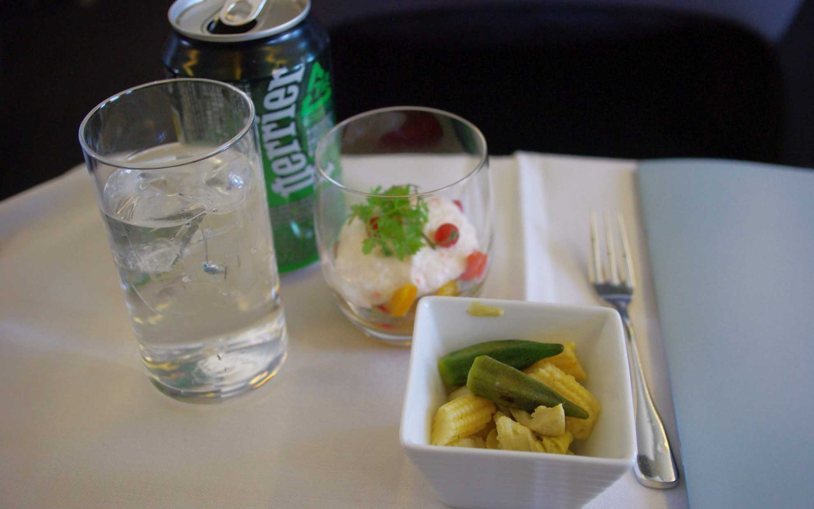
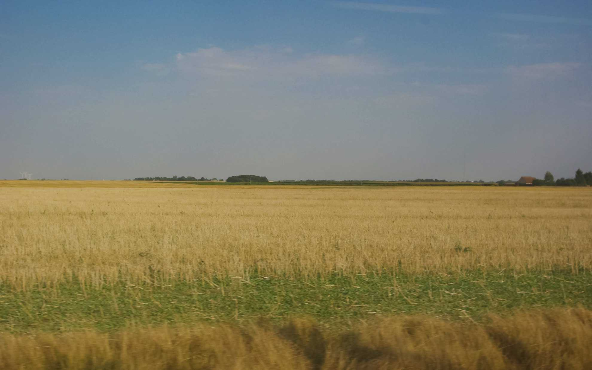
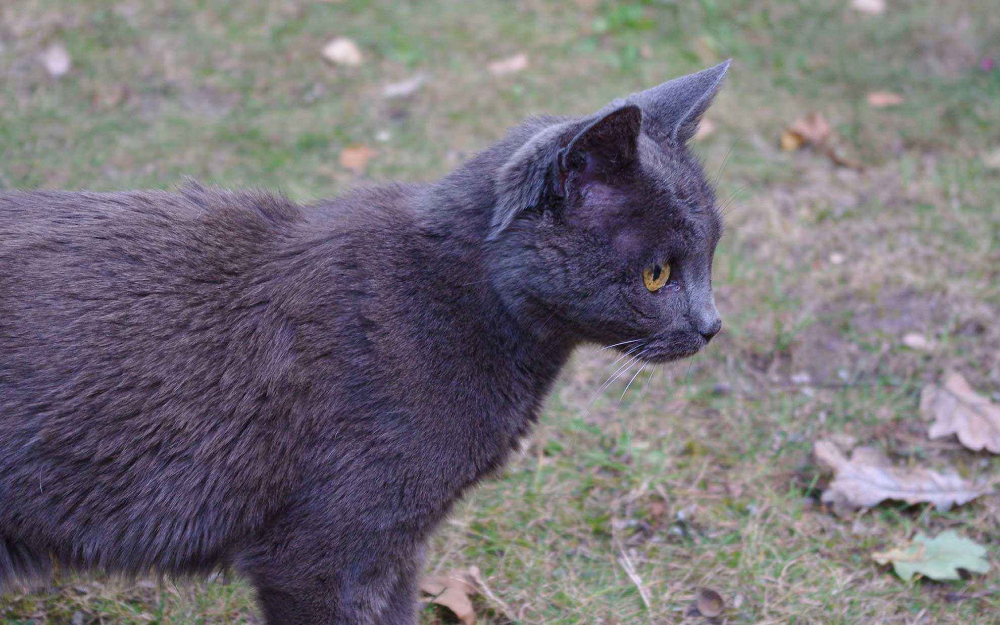
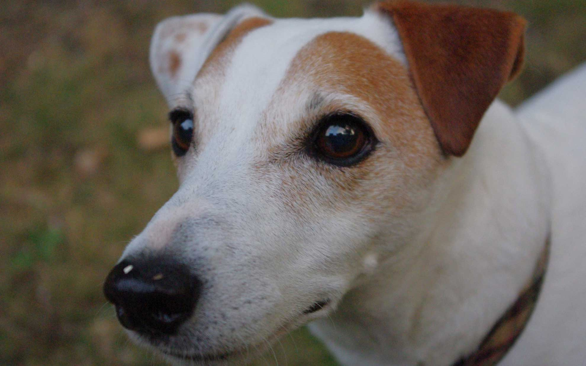

 フランスのおかあさん的存在のマダムの家に来ています。  
 <!--more-->

セントレアからJALでパリ直行便を予約したのですが、空港でアナウンスが。  
これはひょっとして・・・インボランタリーアップグレード！！！  
ということで、めでたくビジネスクラスでパリまで乗ってきました。JALのシェルフラットは完全なフラットにはならないものの、足が伸ばせるだけで本当にラクです。あいにく体調があまり良くなかったので食事は軽食と到着前にラーメンをいただいただけでしたが凄く快適でした。宝くじが当たればなあ！(笑)  
　  
シャルル・ド・ゴール空港に着いたら、そのままバスでリヨン駅まで乗ります。そこから歩いてセーヌ川対岸のオーステルリッツ駅までスーツケースを転がして、電車で1時間ほどでオルレアンの駅に到着です。  
本当は最寄りのトラムの駅から歩こうと思ったけど、疲れたのでタクシーで行きました。  
　  
家には懐かしい顔が。  
疲れたけどホッとして嬉しくなりました。  

  
  
  
  
  