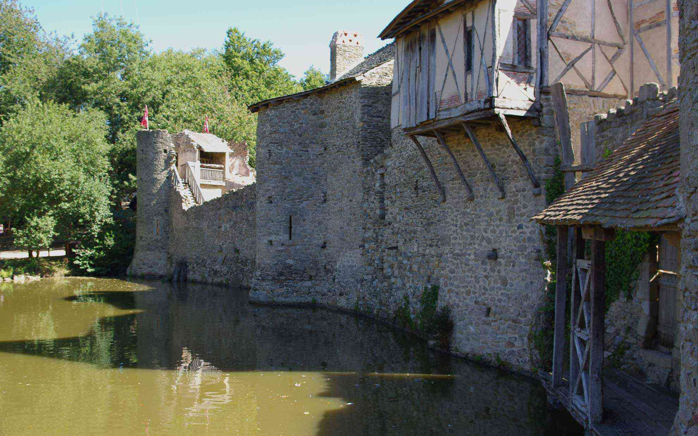

フランス的テーマパーク「Puy de Fou」へ行ってきました。    
 <!--more-->
「PUY DU FOU」を自分の分かる範囲で翻訳翻してみると「アホの山」としか思えませんでした。実際はラテン語からきてるんですね。「PUY」は頂上とか丘とかを意味する「Podium」から、「Fou」はアホじゃなくて「Fagi」、つまりブナの木を意味します。なので「ブナの木の山」という感じでいいのかな？  
実際にここにお城の廃墟があって、地元出身の議員のフィリップ・ド・ヴィリエがここヴァンデ県の歴史を再現した屋外演劇「La Cinescenie」を始めたのがテーマパークの始まり。その演劇とテーマパークを今回見に来ました。  
今回は地元の観光ツアーに参加して行くことになりました。  
途中休憩で小さな村に寄ったりするのは日本でも一緒ですが、お土産屋さんとかは寄らないみたい。  
　  
写真撮影不可ということだったので撮りませんでしたが、ここのメインの見所は夜のショーにあります。
石器時代から中世、革命から大戦、そして解放されたフランスをプロジェクションマッピングや本物の動物と多くの演者の方々が本物のお城の城址を使って演じてくれます。フィナーレでは誰しも総立ちになって「ああフランスって素晴らしい！」と思ってしまうほど良くできたショーでした。僕もフランス人でよかった！ と一瞬思ってしまいました（笑）。
　  
翌日は朝からテーマパーク内を散策しました。古い街並みを再現してお店で中世の方法で作っているお土産品なども購入できます。また、いろんなショーが時間をおいて催されていてタイムスケジュールを見ながら好みのショーを見て歩くことも可能です。無数の鳥を巧みに操って歴史の物語を再現するショーや、騎士が闘うショーもあります。  
なかなか見所が多いので全部は見て回ることはできませんでしたが、かなり楽しみました。  
　  
地元の旅行会社のツアーだったので外国人の僕は珍しいみたいで、みんな気さくに声をかけてくれたり、晩ご飯ではワインのテイスティングを任されたので少しだけワインの専門用語で表現したら拍手してもらったりして楽しい旅行となりました。  
誘ってくれたマダムに感謝したいと思います。  　  

  
  
  
  
  
  
  
  
  
  

