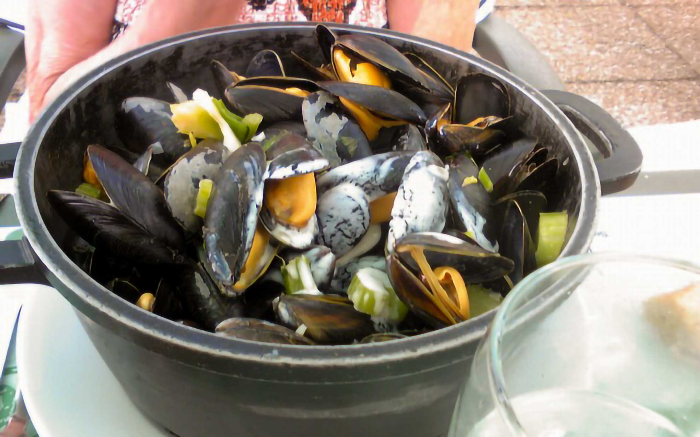
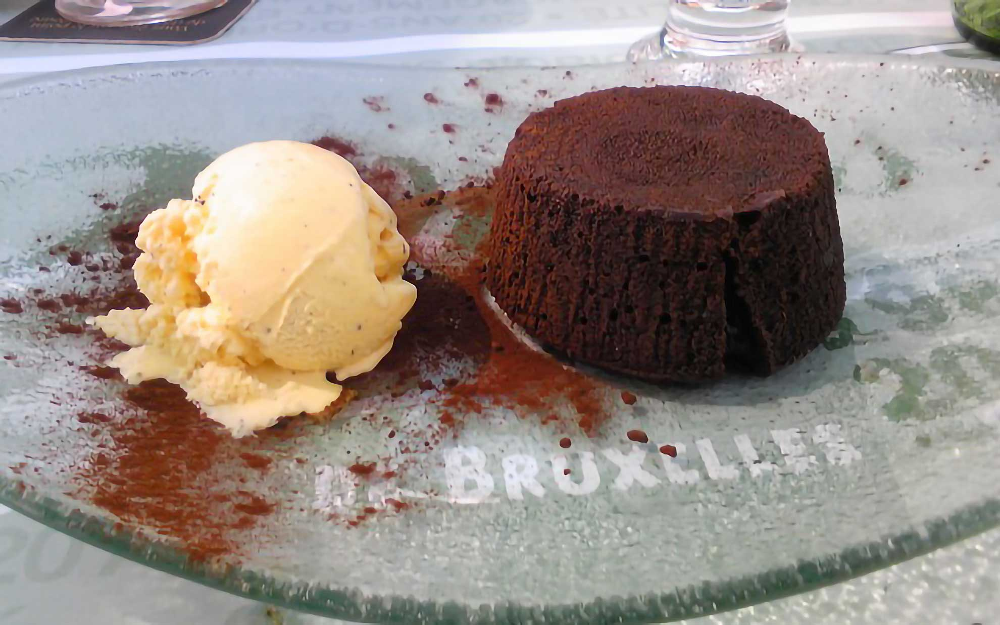
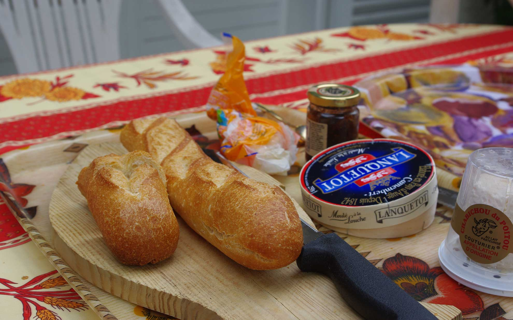
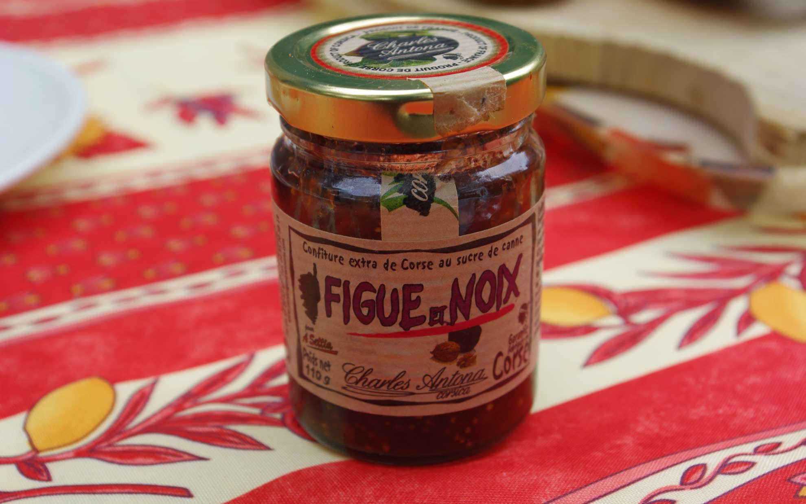

帰る日のお昼ご飯は豪華にエスカルゴをいただきました。
 <!--more-->
今日はベルギー料理専門店のレオンに行ってきました。ムール貝を使った料理が有名で、チェーン店なので気軽にどこでも食べられるお店です。いつも鍋いっぱいのムール貝を食べているので、今日は別のグラタンを食べてみました。これもおいしい。  
デザートはxxxHolicを読んでいて、いつか食べようと思っていたフォンダン・ショコラ。その名の通りチョコがトロトロでおいしかった～。フォンダンショコラを考えた人、天才だなぁ・・・。    
アツアツのエスカルゴの殻から取り出して食べるのですが、ソースがめちゃくちゃウマイ。エスカルゴ自体には味がないのでこのソースが楽しみ。ソースをパンにつけて食べるのが至福のときであります。
作り方はバター、パセリ、ニンニク、塩、コショウを混ぜて具と一緒に貝殻にいれてオーブンで熱するだけというシンプルさ。今度ソースだけでも作ってみようかなぁと思ってます。
　  
これでフランス滞在はおしまい。ほとんど外出しなかったけど家のまわりを散歩してのんびり過ごせました。  　  
　  
今回の旅行で新しく覚えたフランス語をメモっておきました。まぁ思い出す単語の方が圧倒的に多いのですが、それでも知らない単語に出会えると面白くてワクワクします。  
　  
agrumes････柑橘類  
chirurgien・・・・外科医  
colin・・・・タラ科の魚（セース？）  
coeur de palmier・・・・キャベツヤシの芽（サラダで食べるとすんごくウマイ）  
comptabilite・・・・会計学  
froider・・・・冷やす（俗語なので辞書にはないみたい）  
oscillant・・・・振動する・動揺した  
oseille・・・・スイバ・スカンポ  
quetch・・・・プラムの種類  
　  
他にも色々あったけど、メモする前に忘れてしまいました。年齢のせいか瞬間記憶が衰えているなぁ、と痛感。NHKのフランス語講座でもやってリハビリしようかな。  
　  
今回の旅行ではたまたまフランスに帰国していた友人と、たまたま仕事でフランスに来ていた友人と再会して晩ご飯を食べました。  
みんな色々な経験をしながらも仕事を頑張っているので僕も早く病気が良くなるように向き合わないといけないな・・・。  
お土産にはチーズとチーズ専用ジャムを買って帰ります。  
このジャムはコルシカ島の名物らしく、チーズの塩気と絶妙に甘さがあって甘塩っぱい複雑な味わいが癖になります。これにバゲットが凄くあう。美味しいので危険だわ・・・。  

  
  
  
  
  