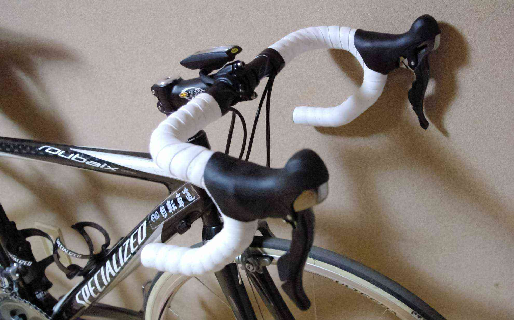

今日は待望の新しいアルテグラに換装してもらいました。
 <!--more-->

シフトレバーまわりがスッキリしてカッコイイです。  
もちろん、シフトもスムーズで、デュラエースを買わなくても充分満足できると思います。もちろん予算があればデュラエースもいいんですけどね。  
いやぁ、今までの変速機とやっぱり違うなぁ。最初情報がリリースされたときは「買わない」と公言していたのがまるで夢のよう（笑）。やっぱり本物を見ると違いがわかります。  
乗ってみて第一印象は「かたい！」。  
なんかダンシングのタイミングが合わなくて、今まで強引に力で踏んでいたのがペダリングをキチンと重視しない感じになった気がします。  
これも慣れだと思うので、どんどん乗っていこうと思います。

  
