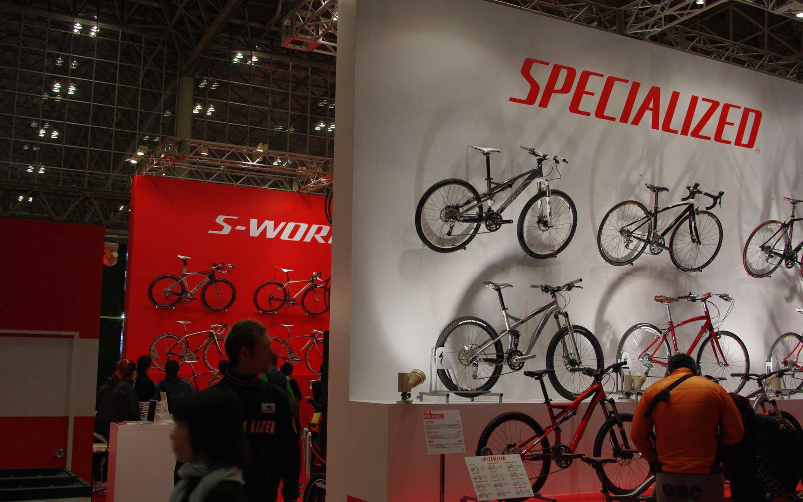
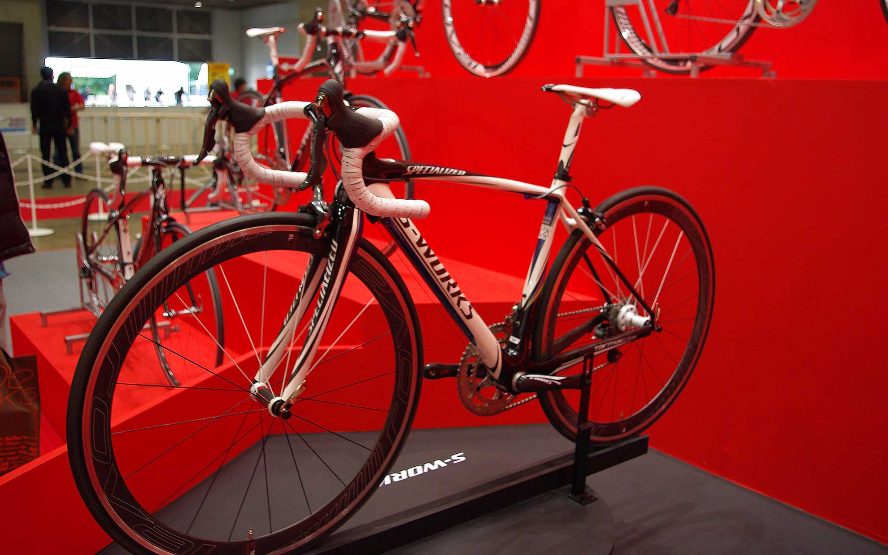
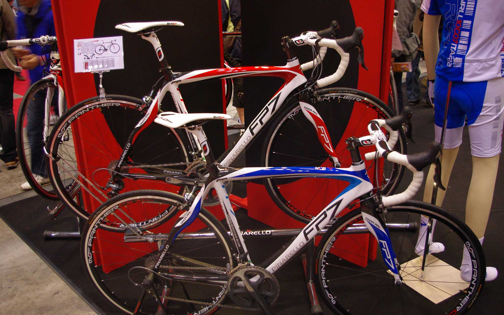
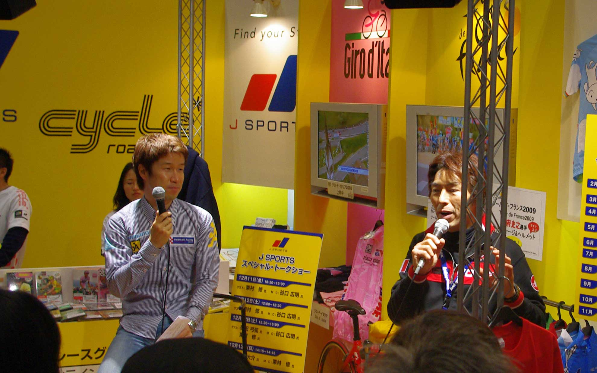
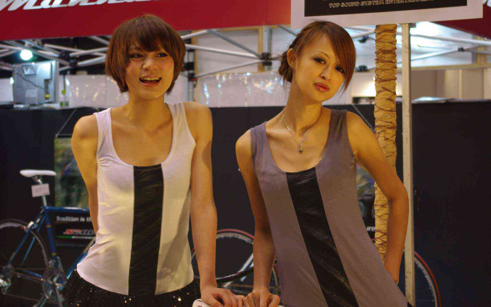
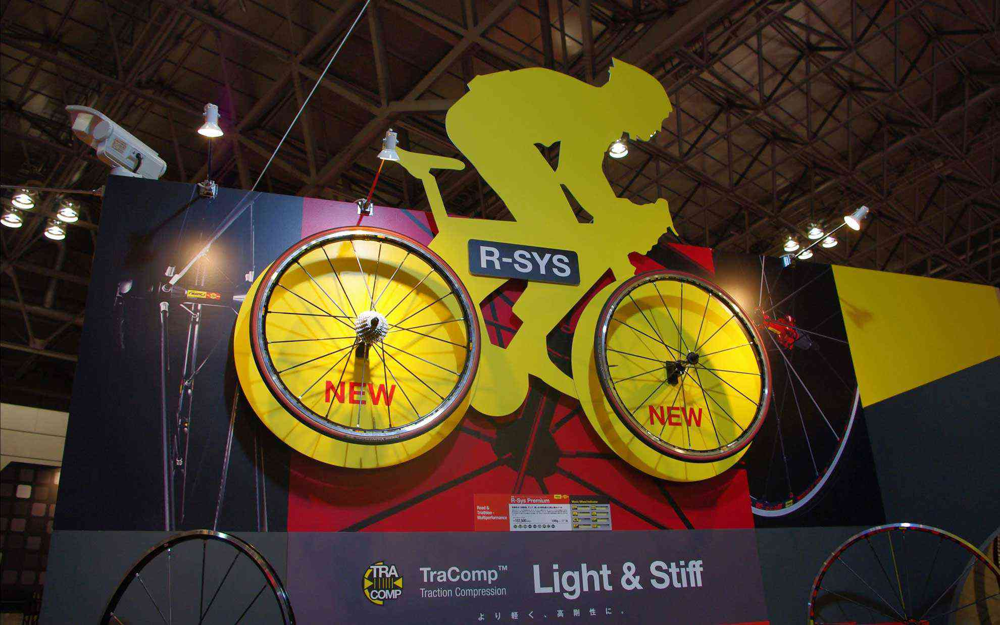
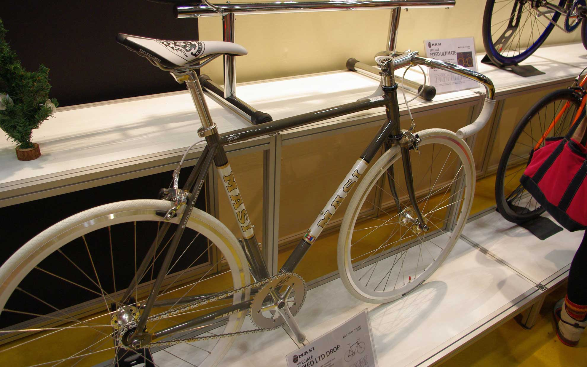
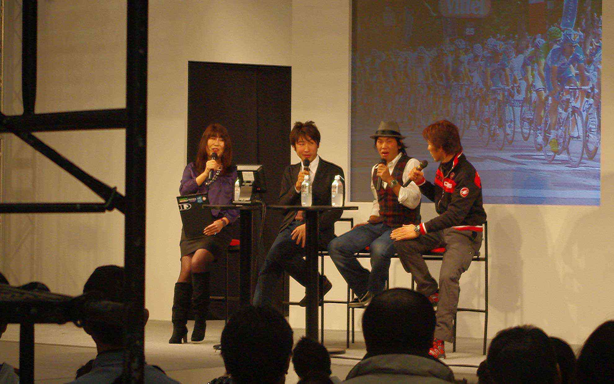

幕張メッセで開催された「サイクルモード・インターナショナル」に行ってきました。
 <!--more-->

日本や海外の自転車メーカー、自転車関連グッズのメーカーが勢ぞろいして試乗車に乗ったり、実物を見たり出来る展示会です。今回で３回目になりますが、華やかな雰囲気があって楽しいです。ちょっと人が多いので途中頭が痛くなって休憩を挟んだりしましたが、楽しめたと思います。  
スペシャライズドのブースが巨大で驚きましたが、サクソバンクモデルのターマックSL3も見られて良かったです。  
ローラー台コーナーのお馴染みタイムトライアルコーナーで1kmを1分22秒で走ったりしました。お陰で脚が痛い･･･。  
でも自転車好きにはたまらない大満足の一日でした。  

  
  
  
  
  
  
  
  