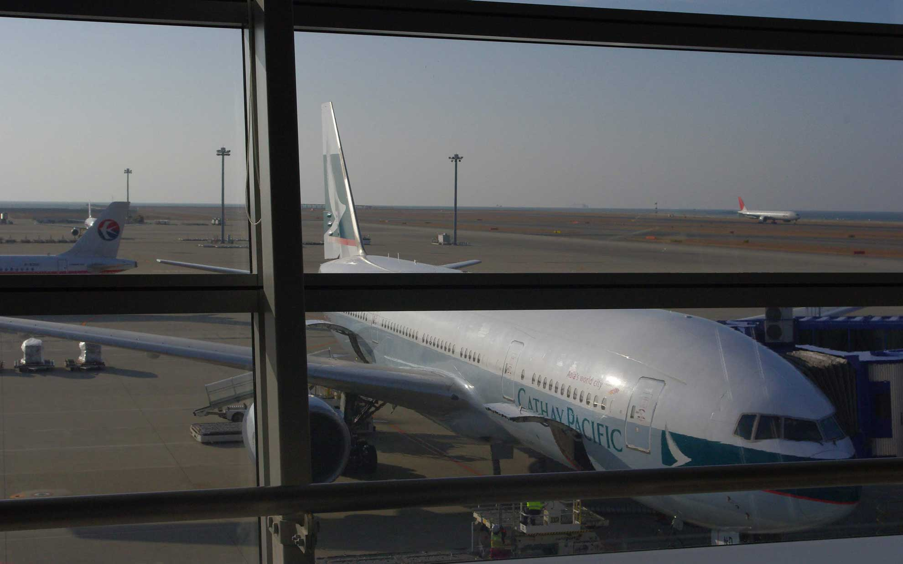
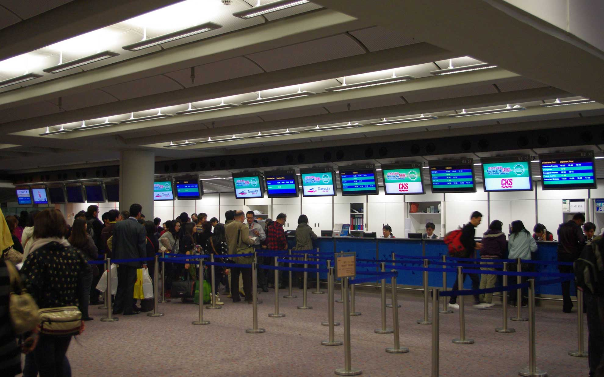
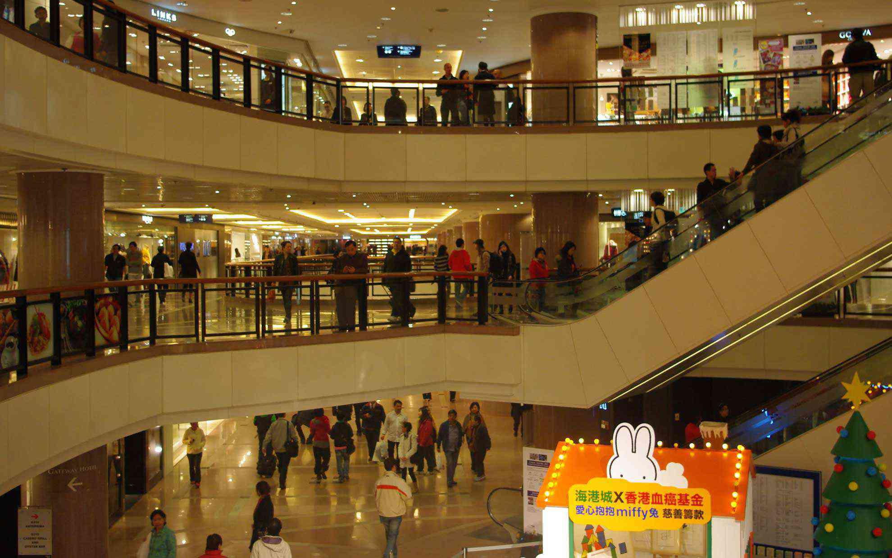
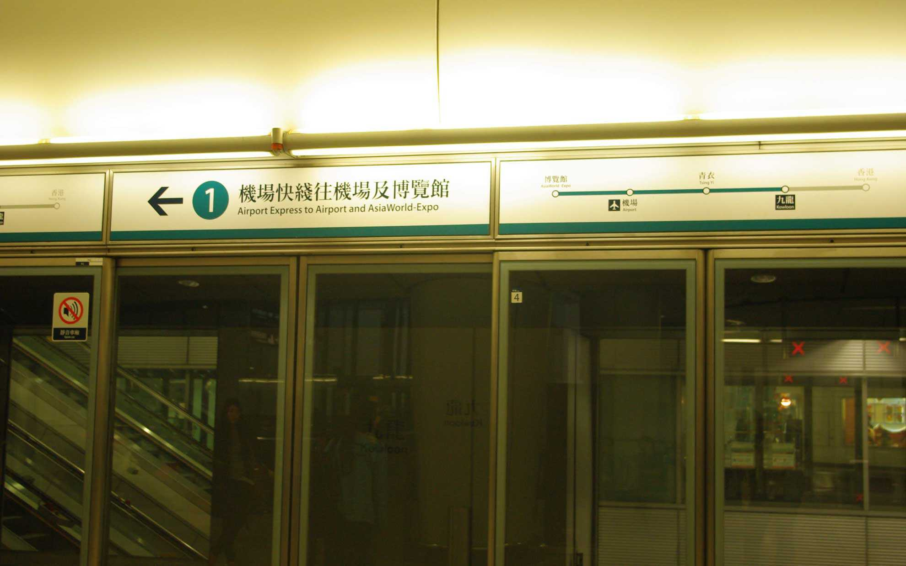

今年の年末は中国で過ごすことにしました。
 <!--more-->

朝早く起きて香港までの飛行機に乗って、船に乗り換えて蛇口まで行くのですが香港国際空港の乗り換えが便利になってビックリ。今まではバスに乗って埠頭まで行っていたのが、電車で移動できて非常にラクになりました。  
ただ天気が良くなくて波がスゴいことになっていたので気持ち悪くなってしまいました･･･。疲れた･･･。  
何とか無事に中国の我が家に到着。日本に寒波がきているせいか、こちらも寒いです。  
チケット売り場はトランジットカウンターみたいな感じで設置されています。入国審査しないでフェリーに乗り換えできるのが便利です。すぐ隣にゲートがありますが、乗船３０分前じゃないとゲートには入れません。スタバとかでゆっくり休憩して待ちました。
　  
疲れが予想以上に溜まっていたみたいで、翌日は家でグダグダしていました。  
家からは天気が良いと香港国際空港が見えます。  
お昼ごはんは買いに行くのがメンドウだったので近所のコンビニでラーメンと烏龍茶を買ってみました。日本のカップラーメンもたくさん売っていますが敢えて中国の香辣牛肉麺を購入。  
烏龍茶は三得利のものを購入。三得利はサントリーの中国名です。日本のカップラーメンと違ってスパイシー。結構美味しかったです。
　  
今日は香港にやってくる母を迎えに行って、待っている間に暇だったので香港スイーツのお店でマンゴープリンと亀ゼリーを食べました。  
その夜中に突然の吐き気と下痢で脂汗がめちゃくちゃ出て死ぬ思いをしたのが今日の明け方で、なんとか今も生きています・・・。亀の呪いだよな多分・・・。  
みなさま良いお年を・・・。

  
  
  
  
  
