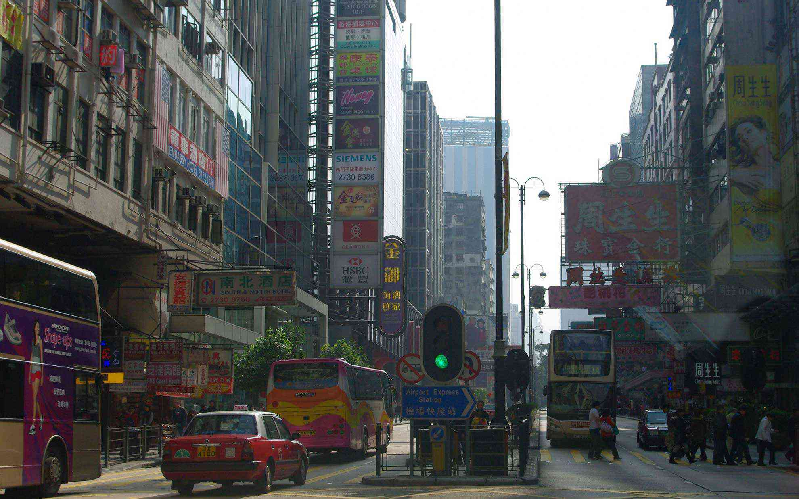
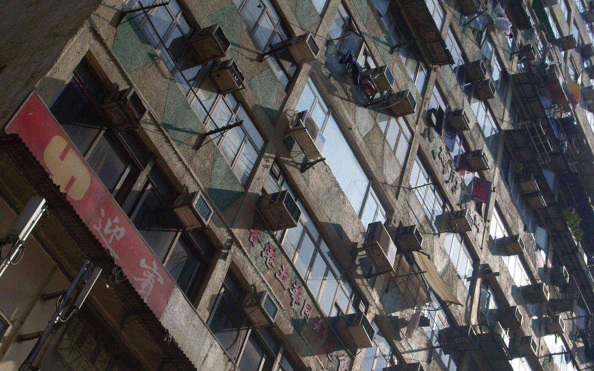

あけましておめでとうございます。今年もよろしくお願いします。
 <!--more-->

日本の普段の生活では食べたことがない豪華なおせち料理を食べて、贅沢な新年を迎えました。  
　  
新年の一日は正月ということでやることもないので「じゃあ香港に行こうか」となりました。  
家から近くの深圳湾口岸（国境）に行って、そこからバスで600円くらい50分で香港市内に到着します。名古屋に行くより安いなぁ。出かけたのがもうお昼ぐらいだったので着いてから昼ごはんを食べに「翡翠拉麺小籠包」へ。
ここの坦坦麺と小籠包はオイシイので香港に行かれる際はぜひ。（東京・横浜にも店舗があるそうです。）今回はインゲン豆の炒め物とエビチリも食べましたが、どれもオイシイ！  
日本へのお土産を買ったら何だか疲れたのでそのまま帰ってきました。  
　  
今日はデカトロンでフリースを買って、その後イオンへ行ってきました。  
ここは本当に大きなイオンモールで、全部歩くのは大変。  
でもサイゼリヤや日本食のお店も多く、ジャスコの日本食コーナーは充実しているので日本人には嬉しいんじゃないかな。  
日本に帰ったらフリースを着て外に出よう。  

  
  
  
  
  
  