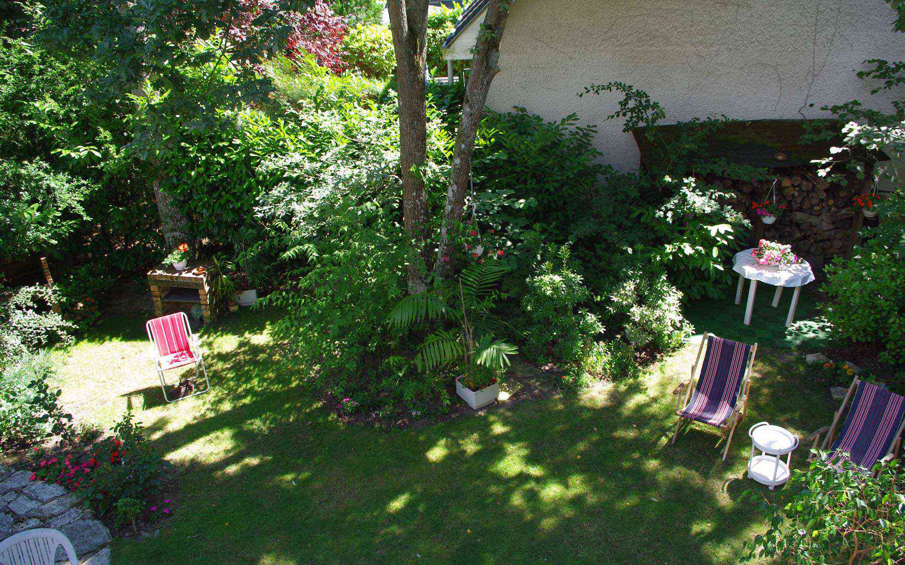
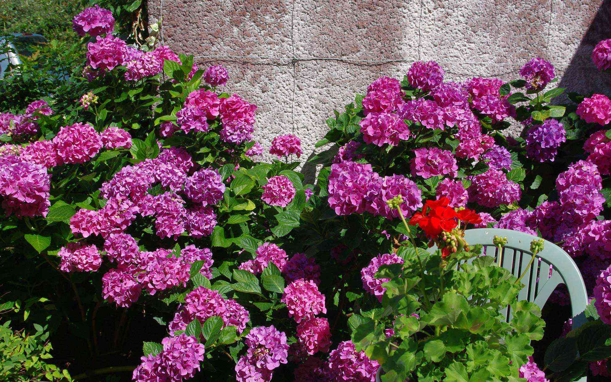

数年振りに母を連れてフランスに来ています。
 <!--more-->

マダムと母は年齢的には少し離れているのですが、互いに共感できるところが多いらしくメールでのやりとりを僕よりも頻繁にしていました。  
今年は7月の良い気候の頃に連れてくることにしました。  
オルレアンはフランスでは少し北に位置しているからか、昔留学していたボルドーの夏よりは少し涼しくて過ごしやすいと思います。  
マダムの家の木々は涼しげで、家に咲く紫陽花も本当に綺麗。  
　    
毎朝の散歩は僕が寝ている間に2人で出かけているらしく、僕は涼しい朝をベッドで快適に寝ていました。  
気候がよいと元気も出てきて3人で散歩に出かけることも。  
明日はパリに出かけます。  

  
  
  
  