今回のフランス旅行最大の目的、ツール最終日を見にきました。
 <!--more-->

今日は朝ご飯を早めに食べてからパリに向かいました。午前中はオルセー美術館を優雅に見学、ランチもカフェでカフェめしを食べて優雅なランチタイムを過ごしました。  

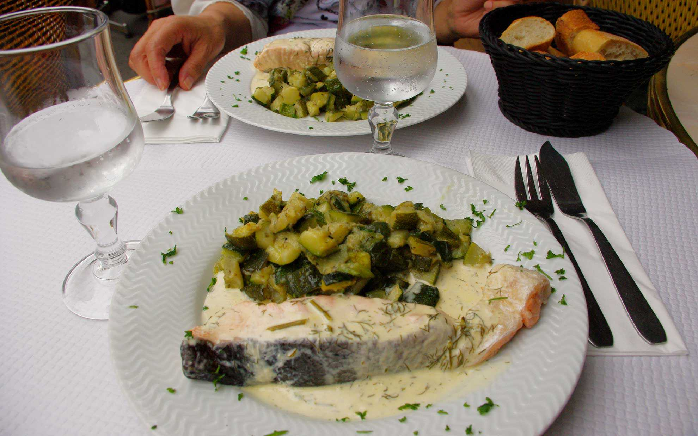  
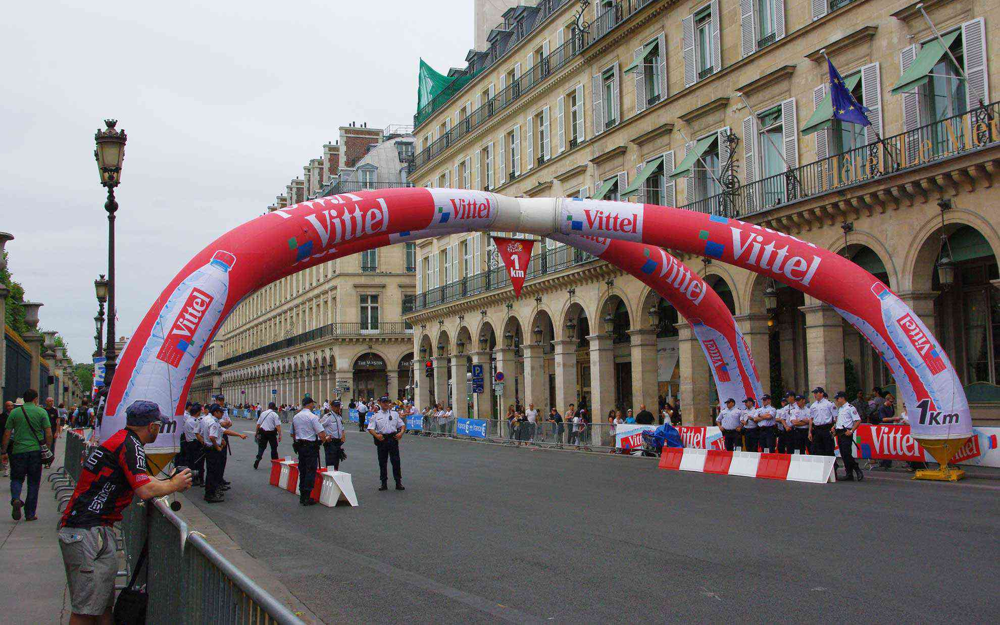  

ちょうど12時くらいだったのでそろそろ場所取りをしようと思ったら、さっきまでいなかった人たちがいっぱい集まってきました。まぁ僕たちも集まってきたんですが･･･。  
ラッキーなことにジャンヌ・ダルク像の近くのベスト・ポジションを取ることが出来たので、そこで立ったまま待つこと2時間･･･。その間相当ヒマです。足も疲れてきます。子供は疲れきり、大人はビールを飲んでツールの話に夢中です。  
　  
ようやくキャラバンが到着。楽しい祭りの雰囲気になりました。  
予定では15時過ぎくらいに選手が通るとオフィシャルサイトに書いてあったのですが、結局選手が来たのは17時くらい。それまで立ってガマンなのだよ･･･。  
そんなガマンが吹き飛ぶくらい、選手が来たときには感動しました。  
コンタドールだ！　後ろから「ヴェンガ！アルベルトー！ 」とスペイン人が叫んでます。  
新城選手も走ってます！当たり前だけど。ジロとツール完走おめでとう！  
　  
そんなこんなで選手はあっという間に通り過ぎてしまうのですが、シャンゼリゼは周回コースになっているので選手を何度も見られるのでお得な気がします。待った甲斐がありました。  
カヴェンディッシュのスプリントとか優勝シーンとかは見られなかったものの、足を棒になるまで待つ価値はありました。今度は折りたたみ椅子とお弁当を持っていきたいところです。  
いやぁ疲れました。明日はのんびり休憩しようと思います。  

  
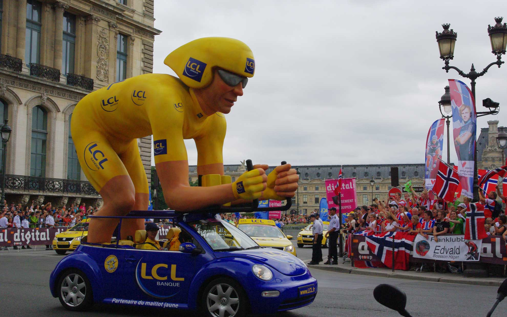  
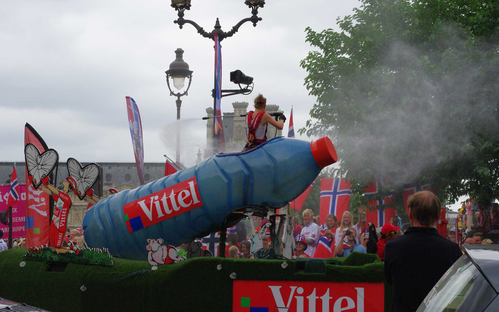  
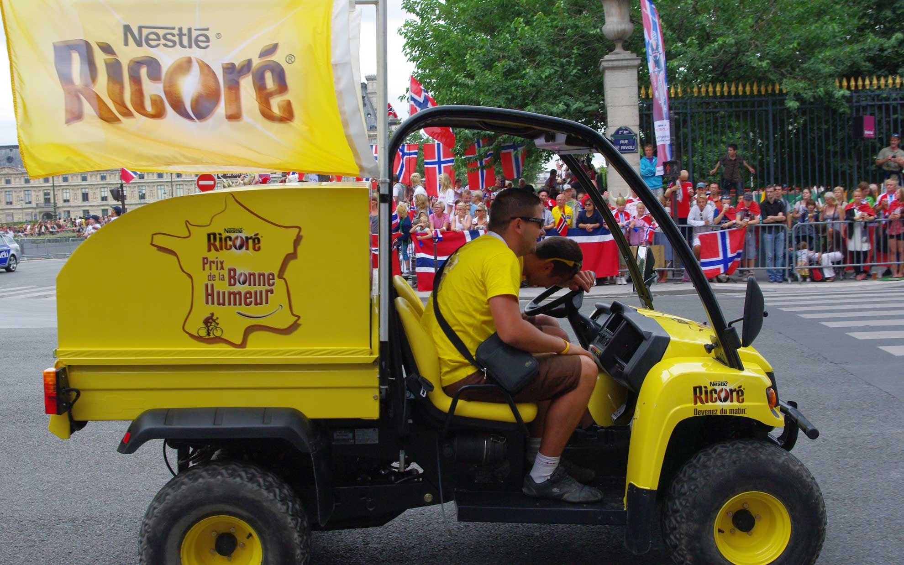  
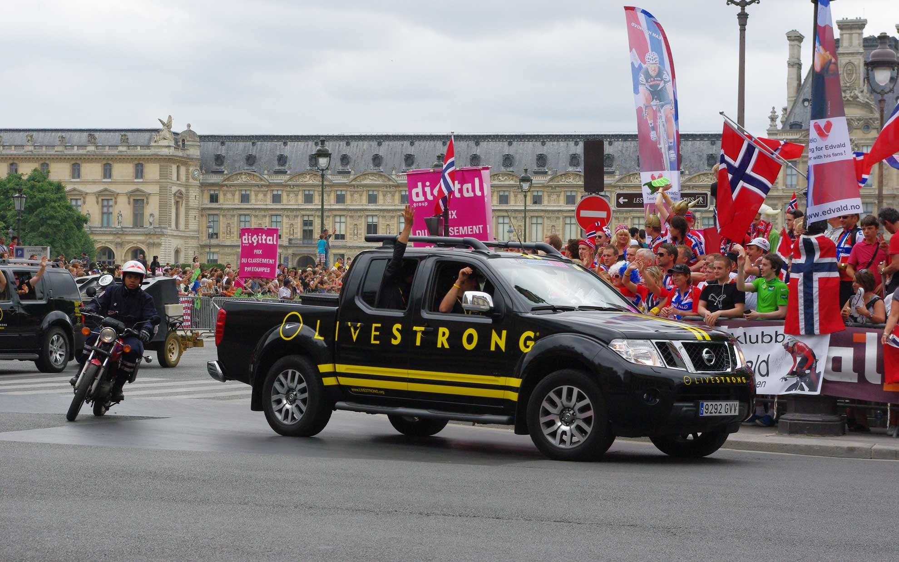 
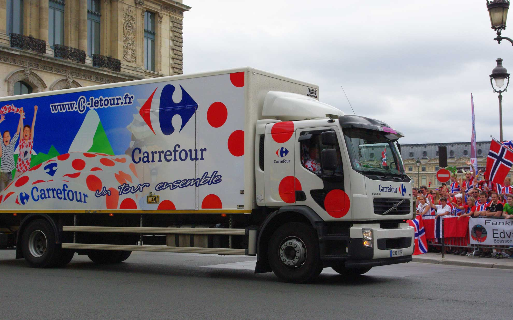  
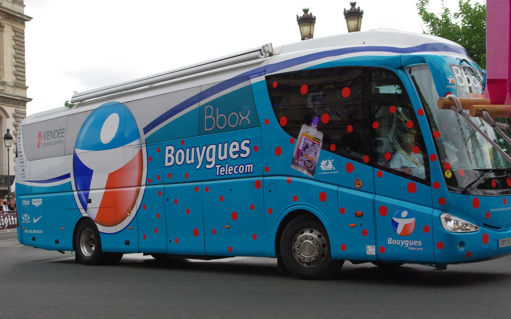  
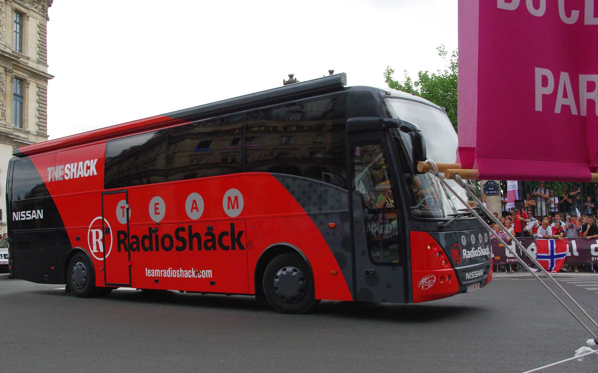  
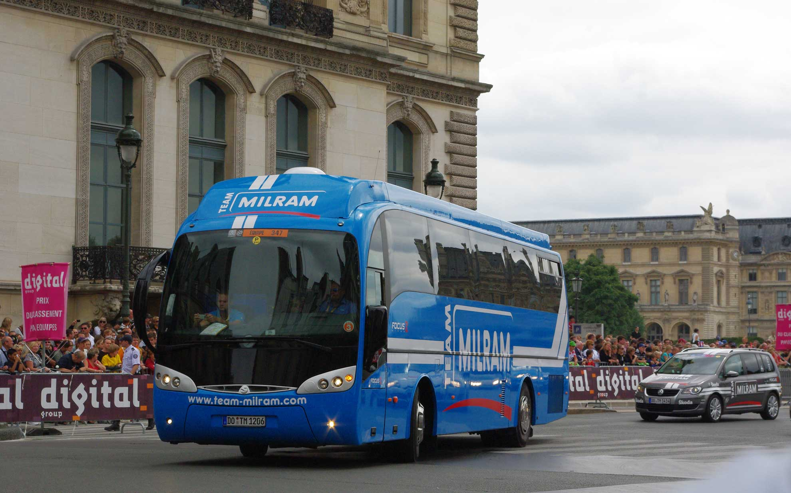  
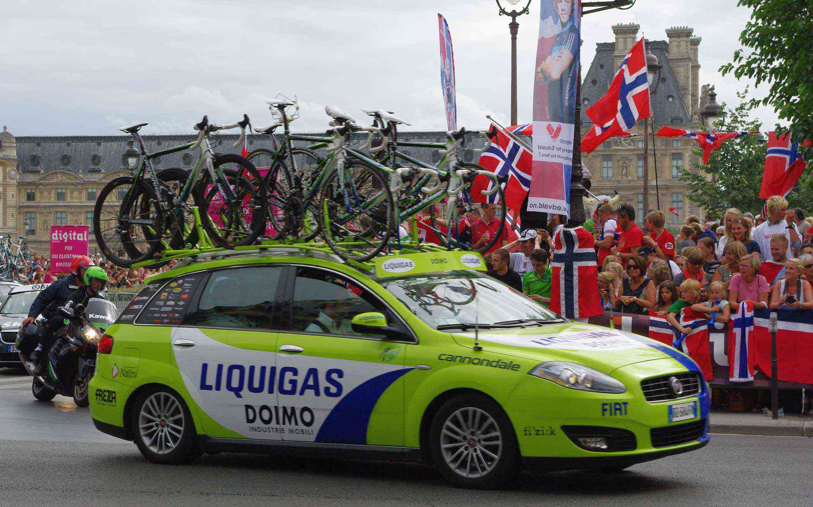  
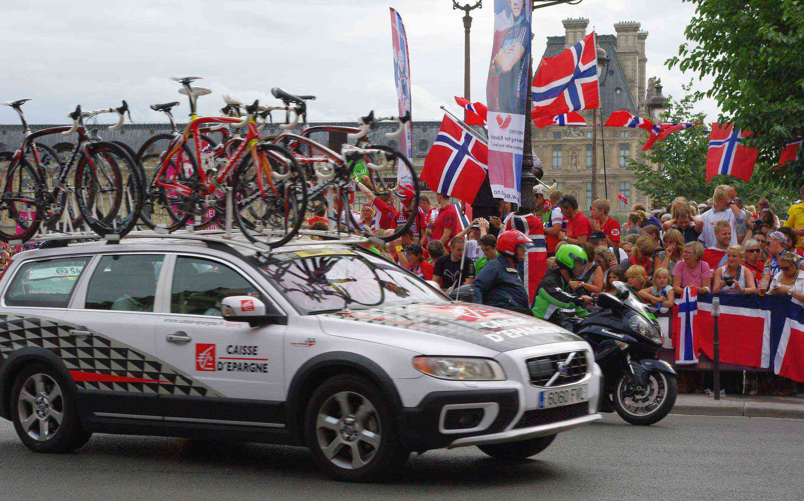  
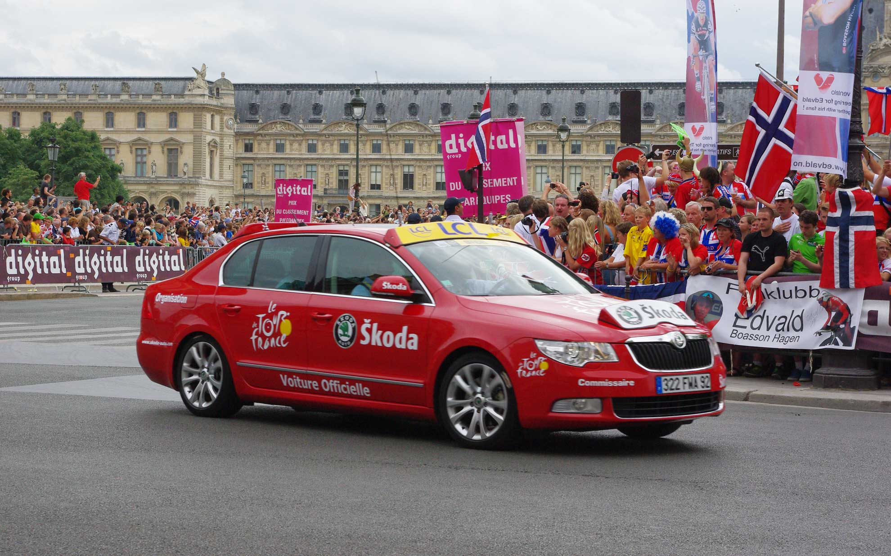  
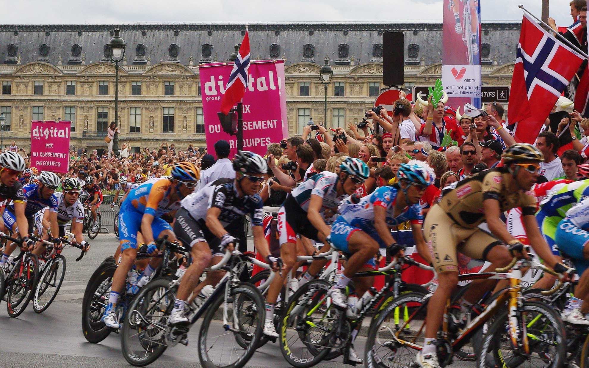  
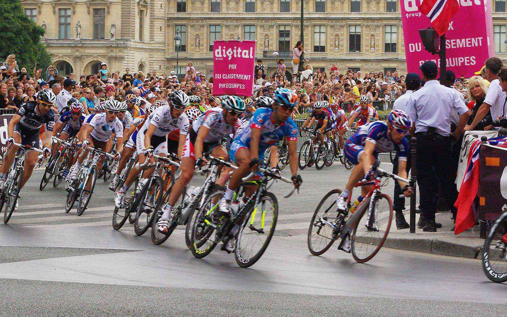  