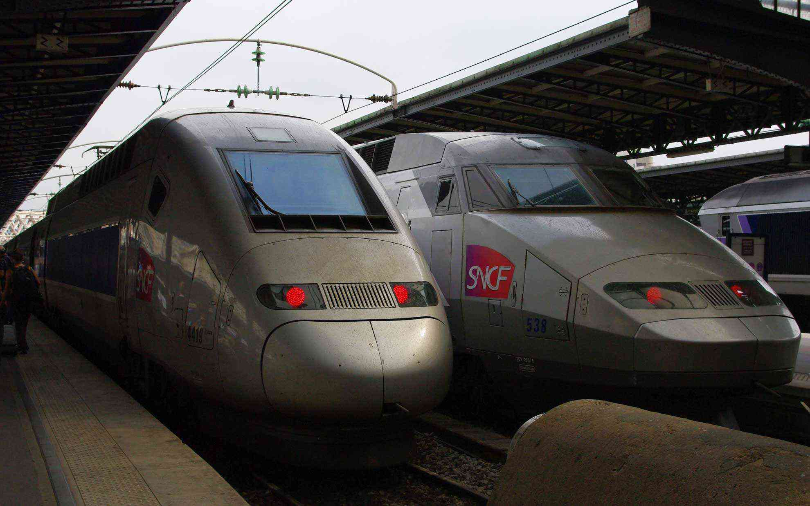
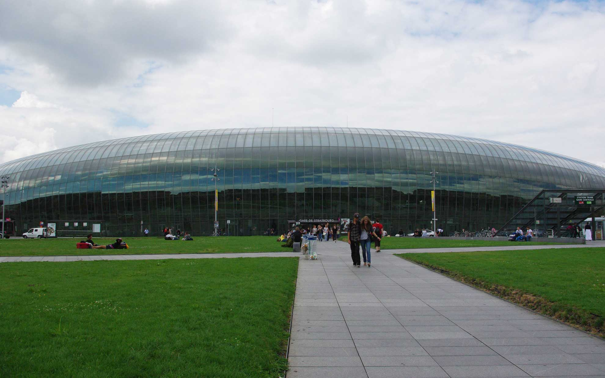
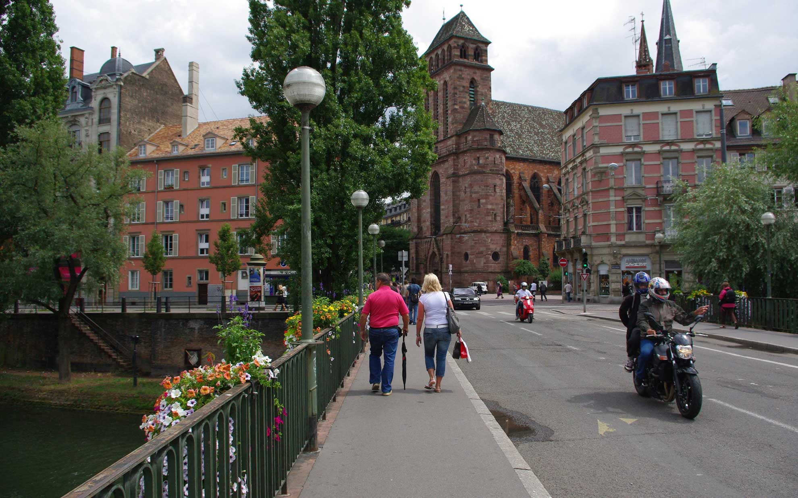
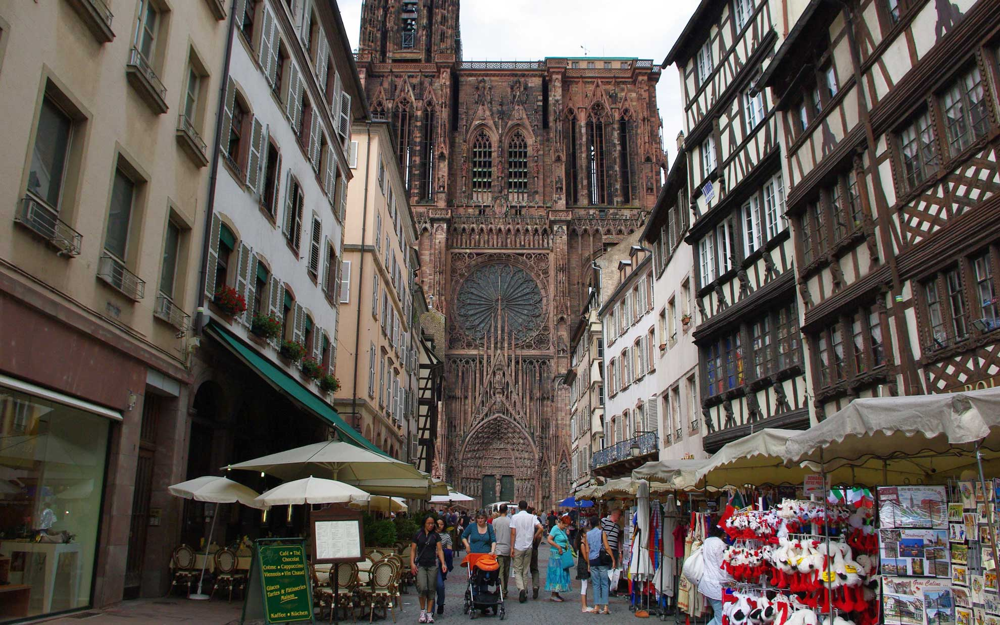
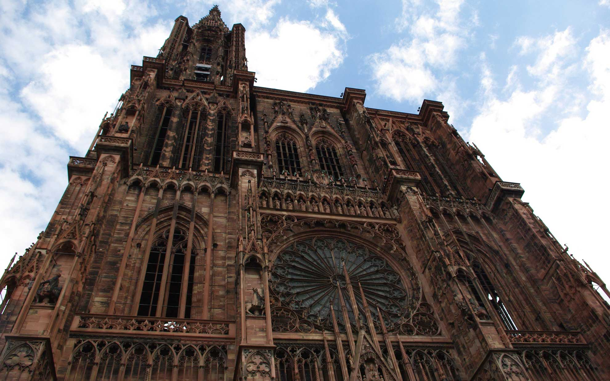
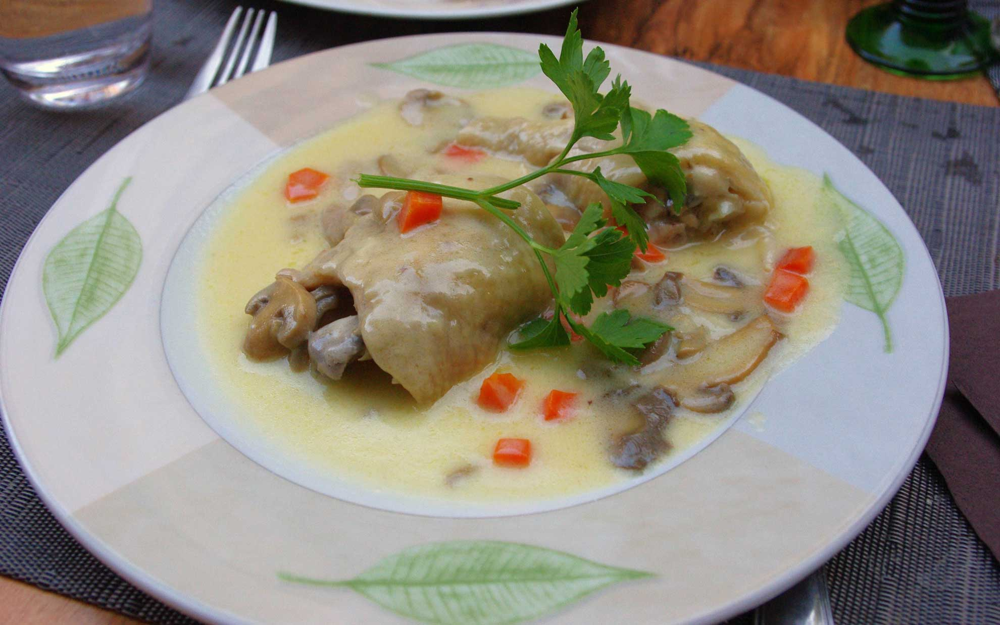
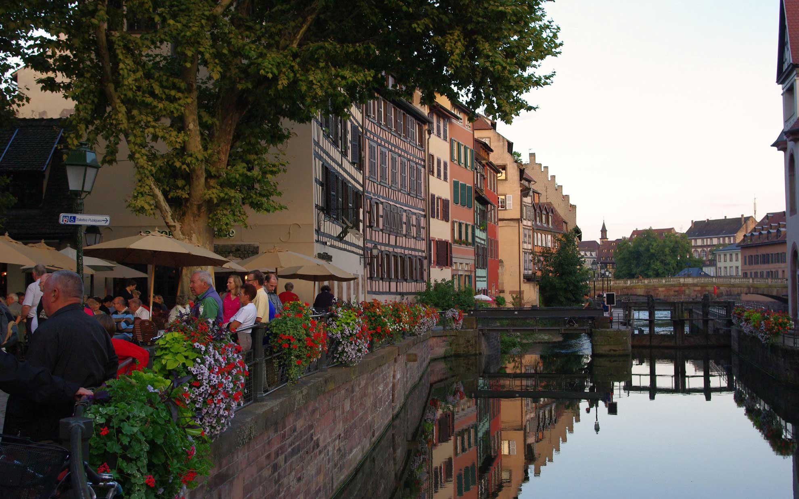

アルザス地方のストラスブールに来ました。
 <!--more-->

パリからストラスブールまではTGVで3時間かからないくらい。  
ストラスブールは大きな街ですが、中心部のプティット・フランス地区はアルザス地方独特の木組みの建物が多く見られます。  
大聖堂が赤っぽく見えるのはヴォージュ山脈からわざわざ赤い石を運んできたからだとか。これも他では見ない大聖堂です。  
　  
運河をうまく利用した街は歩いていてなんだか落ち着きます。  
アルザス地方の料理で有名な料理がいくつかあるのですがコック・オ・リーズリングを食べてみました。リーズリングワインで煮込んだ鶏肉料理。うまい！  
夜（といっても明るい）になっても皆んな会話を楽しみながらワインを飲んで夕べを過ごす。そんな街もいいなぁ。  

  
  
  
  
  
  
  
  