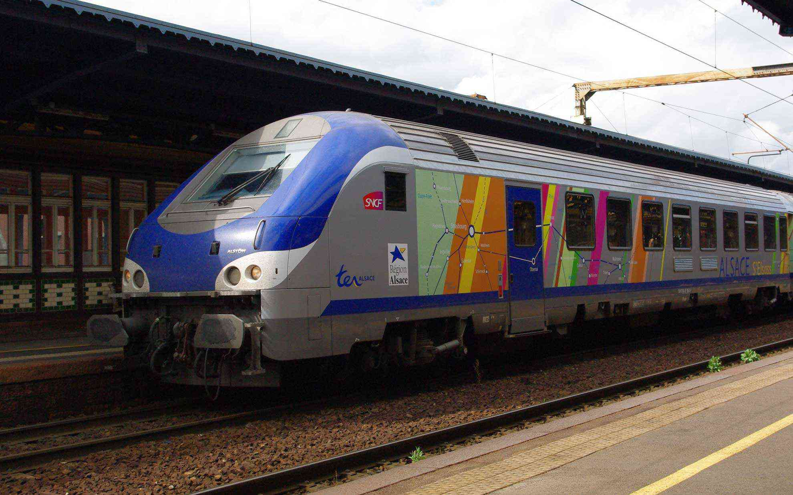
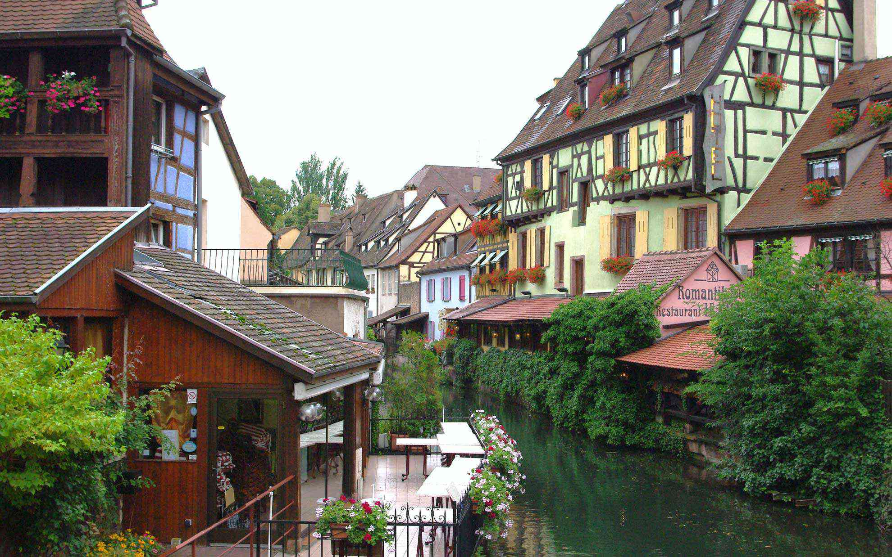

今日はアルザス地方のコルマールに来ています。
 <!--more-->

ストラスブールからローカル線で30分。駅から歩いて20分ほどで少し迷いつつながらも街の中心部にたどり着きました。  
車窓にはアルザスワインの畑が一面に広がっていて良い感じ。  
アルザス地方独特の木組みの建物（コロンバージュといいます）にカラフルな壁の色が目に入ります。かわゆい・・・。
　  
おじさんが「かわゆい」と言ってもキモいだけなので、ここで少しだけ色の歴史を紹介しておきます。  
中世の宗教革命でプロテスタントが誕生し、この街にもプロテスタントの住人が現れます。赤色の壁はプロテスタントの信仰の証しを意味しているそうで、カトリック信徒は水色の壁だったそうです。それが少し時代がたって壁の色の意味合いが変わってきます。家の壁の色で職業をあらわすようになってきます。赤色は火を扱う職業、水色は木を扱う職業、黄色はパンやお菓子のお店など・・・と色にも意味あいが変わってくるようになりました。もっと昔はキリスト教徒として質素な生活をするため壁の色は黄土色のみ許されたとか、調べてみるといろんな話が出てきます。  
　  
それにしても色合いがパステルカラーなのが良く風景にあっていて歩いていてテーマパークに来ているような錯覚さえ覚えます。  
そうそう、コルマールは優れたパティスリーが多いらしく洋菓子の修行している日本人の方も多いとか。    
可愛い街並みにお菓子の街って、これはフランスっぽいものに憧れる人は一度訪れた方がいいんじゃないかな・・・と思いました。  
　  

  
  
  
  
  