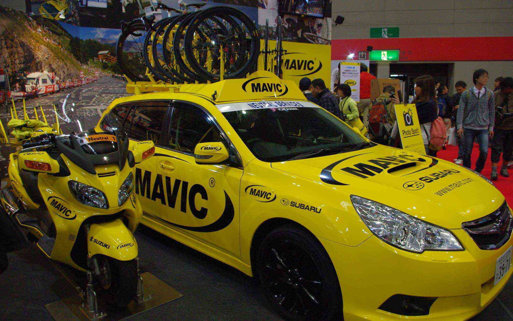

インテックス大阪で開催されたサイクルモードに行ってきました。
 <!--more-->

幕張と比べるとやっぱり出展ブースが少ないのですが、その分じっくり見ることができたような気がします。会場を歩き回って歩き疲れることもなかったので規模としては丁度よかったのかなぁ。  
　  
人気だったのは出たばかりの新しいXTR。かなりカッコいいです。ちょっとお値段がアレですが。  
JPSGブースにはコメンサルのSUPREME DHをはじめ、コメンサルのバイクが勢ぞろいしていました。今度乗り換える予定のSUPREME DHはやっぱりカッコイイ！到着するのが楽しみで仕方ありません。  
展示車のような配色にするか、もっと違う感じにするか現在構想中ですが、考えている時がしあわせ・・・。  
　  
MAVICブースでは定番のマヴィックカー＆バイクが展示してあって、ツール・ド・フランスの興奮が蘇ってくるようでいい感じでした。今年のMAVICはホイール＆タイヤシステムが充実し、R-SYS SLRなど新しいホイール＆タイヤシステムのラインナップも発表されています。それからコスミックシリーズのグラフィックが変更され、アグレッシブな印象を受けました。  
今年はそんな中おすすめなのはキシリウムSRでしょうか、フロントはキシリウムシリーズのブレードが風を裂くような空力を考え、リヤにはR-SYSのコンセプトである踏んだ力を確実にホイールに伝える構造となっております。
ホイールも日進月歩ですねぇ。  
　  
ブルーノはどんどん新しいコンセプトで自転車を出してきますね。凄く昔に日本でも流行ったランドナースタイルのようでバッグは現代的なアレンジが新しい感じがして印象的でした。  
いやぁ・・・自転車っていいですね・・・！　  
  　  
  
  
  
  
  
  
  