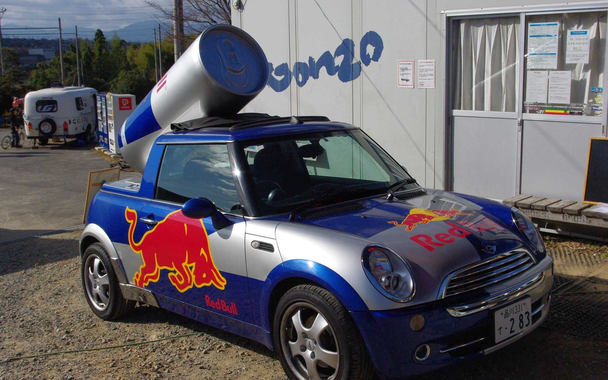
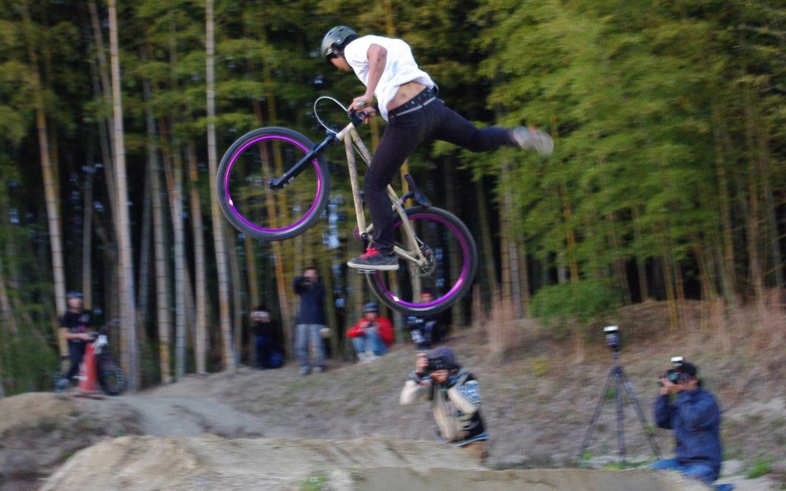
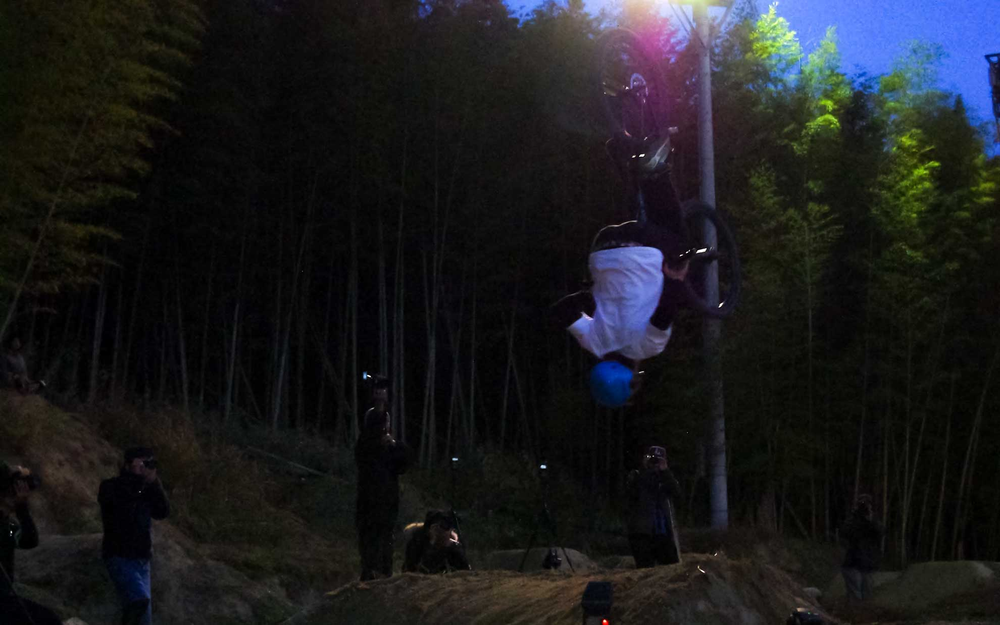

今日はGONZOでラストレースとなる「NIPPON OPEN」が開催されました。
 <!--more-->

先月参加したショートダウンヒル計測会「ML OPEN」でGONZOを知って、年内で閉鎖することを知りました。（ ※その後再オープンしました。）  
阿寺とは違ったダートの世界を知って興味を持つようになり、以前から動画とかで4Xには興味がありました。  
せっかくなら記念参加でもよいので出てみたいと思うようになり、ちょっとだけ練習して参加しましたよ。  
　  　  
たしか最下位だったと思うのですが、競い合いながらコーナーを走るのが凄く快感でした。いやぁ楽しいなぁ。  
このあと最後まで見ていたのですが、エリートクラスを間近で見られたのは貴重な体験でした。ちょっと凄すぎて訳がわからないくらい動きがすごい。  
最後はダージャンを暗くなるまで見ていました。    
  　  
  
  
  
