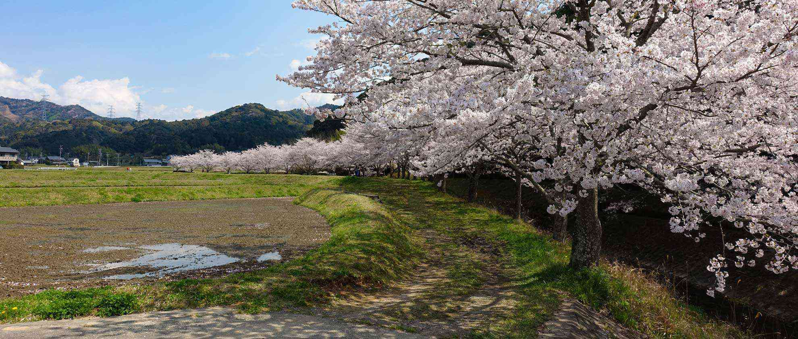

想像できない未来が突然やってきました。そんな環境ですが、それなりに人生を楽しめたらなと思っています。  
<!--more-->
　  

### 仕事以外は家で
休日は家でほとんど寝ているのは相変わらずで、仕事が定時で上がる時は少し寝るまでの間にNetflixの映画を見る様になりました。（寝ながら）  
攻殻の最新作がネトフリのオリジナルで配信されているのがきっかけで再登録したのですが、過去に気になっていた作品を見る様になりました。それが結構面白くてハマっています。何気に英語の聞き取り練習にもなるし、字幕で映画を見るのは結構好きです。  
　  
寝る前にiPadで雑誌を読んだり、Youtubeで90年代の自動車を蘇らせる動画を見たりしています。ローラー台はいつでもできるようにバッチリ準備してあるのですが、気合いが足りないというか単にヤル気がないだけで完全に怠けていますね・・・。
　  
精神的に余裕があるとスマホで写真も撮るのですが、疲れていると写真も撮らなくなってしまい直近の写真が4月始めに撮った桜しかなくて、この1ヶ月の間何をしていたっけな・・・と思い出せなかったりします。今年は新しい環境で仕事を覚えることに一生懸命で、それでも仕事を覚えるのは楽しいので結構充実した1ヶ月になりました。  
連休中には過去に撮った写真や動画を編集してみたいとは思うものの（サムネイルは今年の1月に東京で撮りました)、気合いを入れるとだいたい気持ちだけ空回りして何もしないまま過ごすのがパターンなので気の向くままチョットだけ創作的な活動ができればいいなと思います。
　  
  
　  
  
　  
  
　  
  
　  
 


