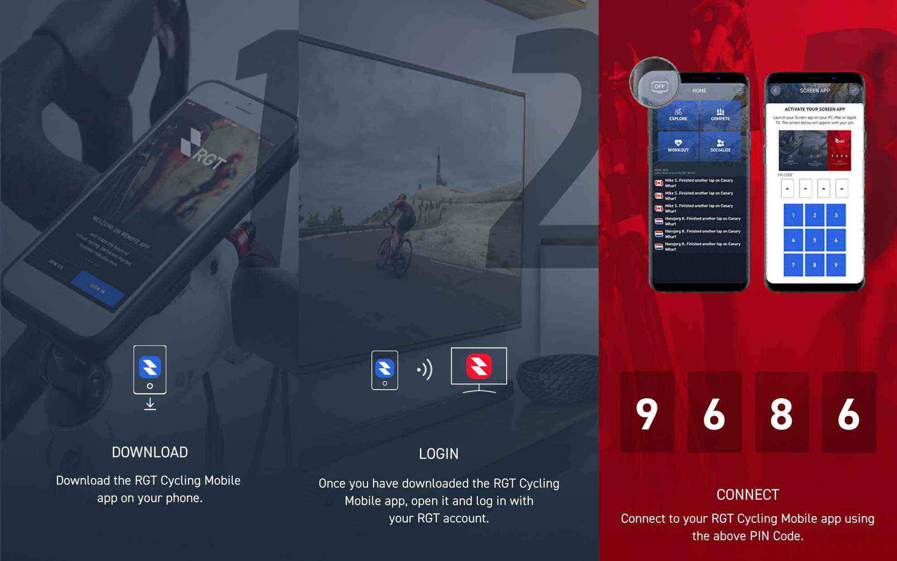
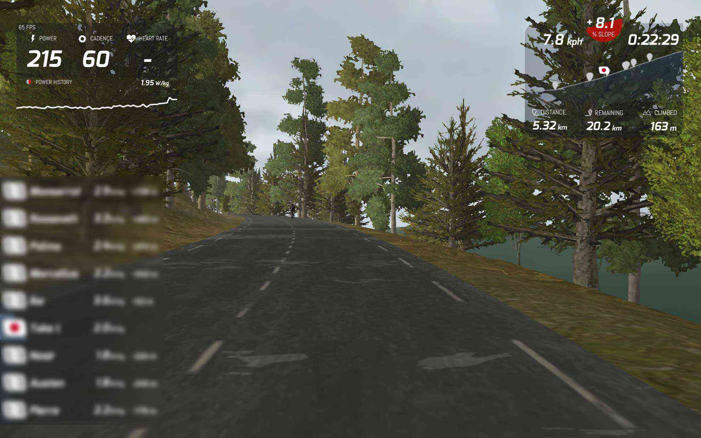

Zwiftが外出自粛モードで賑わっているようなので、他のオンライントレーナーアプリも試してみました。  
<!--more-->
　  

### Zwiftは良くできている
他のアプリと比べて改めて感じることですが、Zwiftは初心者から上級者まで楽しめる完成されたアプリだと思います。  
コースやトレーニングのバリエーションやZwiftコンパニオンアプリで接続したAppleWatchの心拍データをZwift本体アプリにブリッジできる機能など、どんどん魅力的になってきていると感じています。  
　  
### 海外の道を走ってみたい
RGT Cyclingを調べていて面白いなと思ったのは、「Real Road」、つまり実際にある道をバーチャルで走れることです。これもZwiftでロンドンやニューヨークなど走れるのですが、RGT Cyclingではちょっと違った有名な道を再現していて、その道がバーチャルで走れるのは結構面白い。    
2020年5月現在では以下のコースが走れるみたいです。  
　　  
- 8BAR・・・8BARクリテリウム（ドイツ、ベルリン）
- BORREGO SPRINGS・・・ボレゴ・スプリングス（アメリカ、サン・ディエゴ）
- CANARY WHARF・・・カナリー・ワーフ（ロンドン）
- CAP DE FORMENTOR・・・フォルメントール岬（マヨルカ島）
- MONT VENTOUX・・・モン・ヴァントゥ（南フランス）
- PATERBERG・・・パテルベルグ（ベルギー、フランドル地方）
- PIENZA・・・ピエンツァ（イタリア、トスカーナ地方）
- STELVIO・・・ステルヴィオ峠（アルプス地方）  
　  
### RGT Cyclingの遊び方
RGT Cyclingの本アプリをスマホにインストールしたら、それを画面に出力する別のアプリをPINコードでペアリングしなくてはいけません。これが他のアプリと少し変わっている点でしょうか。  
  
このスクリーンアプリをタブレットやPCなどにインストールしスペックに応じて描写クオリティを選択できるので、例えばハイスペックなPCで高画質な描写で遊ぶことも可能というワケです。なるほど良くできているなぁと感心しました。  
モバイルアプリでトレーニングを始めるとセンサー類を選択できるようになるのですが、AppleWatchの心拍は今のところ未対応だそうです。  
　  
モン・ヴァントゥーがコースにあるので試してみました。坂道が25km続くコースでしんどい。なぜ坂道が苦手なのに選んでしまったのか・・・。  
  
　　　
  
　  　  
RGT Cyclingオフィシャルサイト  


  
  
　  
  
