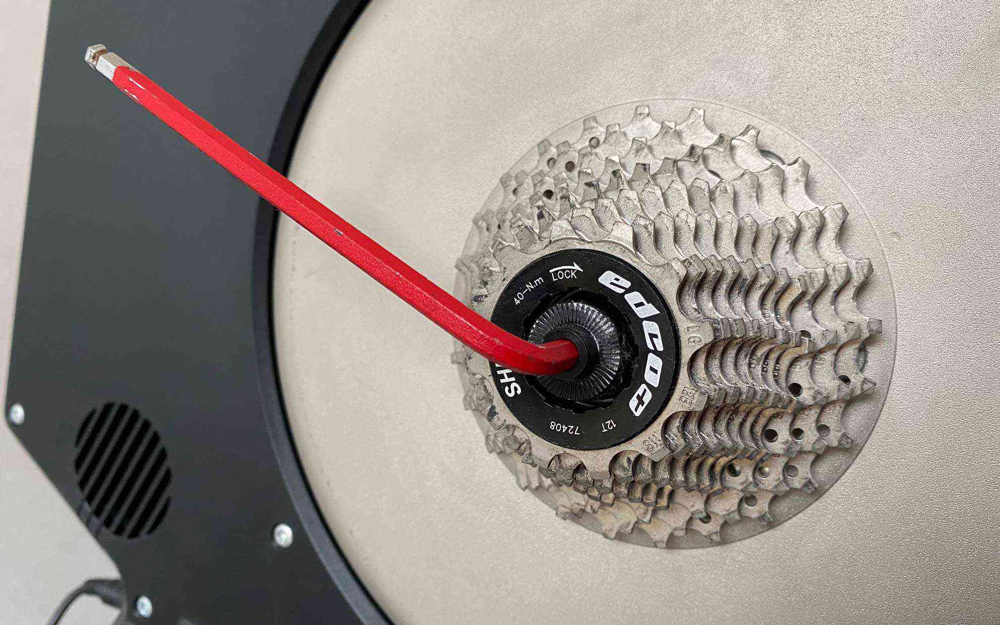
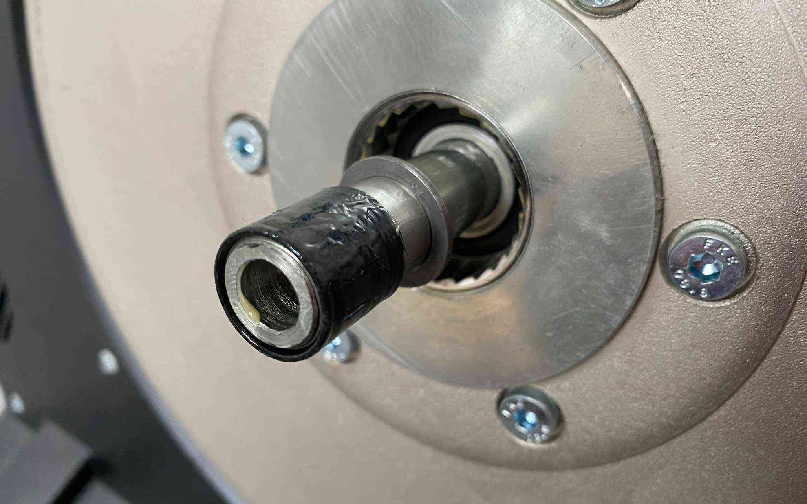

ほんの少しだけリアディレイラーがローラー台に当たるみたいです。  
<!--more-->
　  

### 単にうるさいだけと思ってた。
Tacx Neoを買ってからどれだけ経ってんだよ・・・と自分でも思ったのですが、改めて見てみるとリアディレイラーを一番軽いギアにすると少しだけローラー台にディレイラーのプーリーケージが触れているみたいでした。  
ディレイラーを調整すれば解決しそうな気もしたのですが、Di2で調整しても変わらなかったのでTacx Neoに付属していたスペーサーをいれることにします。  
　  
### 0.5mmと1.0mmのスペーサーを入れる。
作業はシンプルでした。アーレンキーでハブを取り出して黒いスペーサーをいったん取り出します。黒いスペーサーの奥にスペーサーを入れて元に戻せば完了です。僕の場合は2枚入れて1.5mmオフセットすることにしました。  
元に戻してギアを一番軽くしてもカリカリ音がしなくなりました。・・・というか何故いままで気がつかなかったのか。  

### 僅かな違いが大きな違い
むかし勤めていた会社で上司に良く言われたことなんですが、本当にそうですね(汗)・・・。とにかく快適になったのでよかったです。ちなみにカセットを12-28Tに変えてZwiftの登りにも対応できるようにしました。もう日曜日も終わりそうですが、少し頑張りますか。  

  

  

  
　  
  