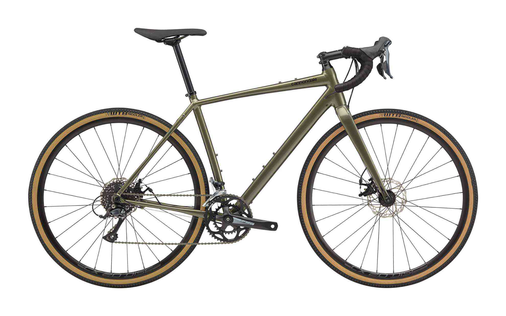
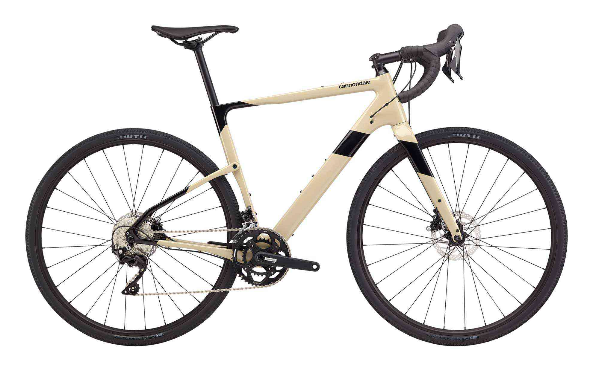

キャノンデールのTopstoneにレフティバージョンが登場しました。  
<!--more-->
　  

### キャノンデールにおけるグラベルバイクの集大成かも
数年前に登場したキャノンデールのSlateが記憶に新しいところですが、サスが高かったのかわからないものの、お値段がちょっと手が届きにくい気がしていました。  
その後同社のグラベルバイクはTopstoneに変わりました。　が、ここで従来のTopstoneにあったリアのキングピンに650bホイールという要素に、キャノンデールが従来から持ち続けてきたLefty Oliverフォークの持つ強烈な個性が追加されて再登場してきた感じがします。  
　  
  
　  
Topstoneでもアルミフレームでサス無しだと115,000円とお値打ちです。ただ、キングピン搭載モデルやレフティー搭載モデルになるにしたがってお値段は上がっていきます。  
105とキングピン搭載のアルミモデルは275,000円。そしてレフティーも搭載のカーボンモデルは380,000円。  
　  
  
　  
いやーここまできたらレフティーを買うべきでしょう！強く推す理由がまったくないのですが強そうだし・・・。だってサスペンションがあったら下る時に楽ですからね。MTBでいいじゃないかというのは置いておいて。
　  
ここで僕はいつも考えてしまうんです。  
そもそもグラベルロードにサスペンションは必要なのか。どの程度の路面を走るためにサスペンションが必要なのか・・・。日本にグラベルロードというのは存在するのか・・・。河川敷や田んぼの砂利道はグラベルですか・・・。生命とは・・・。宇宙とは・・・。  
　  
　  
  
　  
　  
[Gravel Bikes | cannondale bikes](https://www.cannondale.com/ja-jp/bikes/road/gravel#sort=%40consumername1%20ascending)

