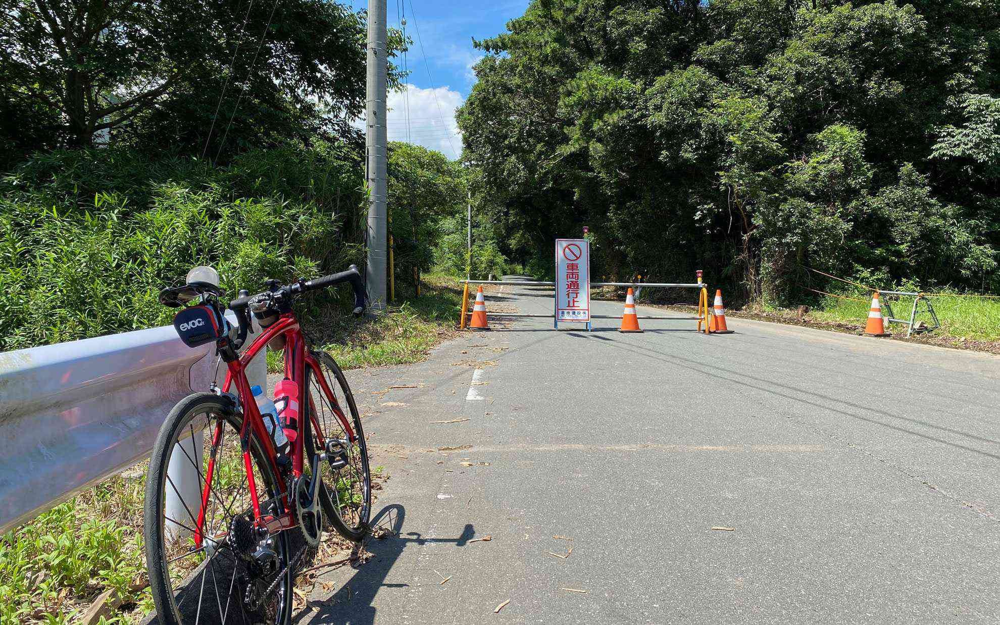

久しぶりの晴れ間が気持ち良かったので少し走ってきました。  
<!--more-->
　  

### 杣坂は通行止め
長く続いた雨の影響で杣坂は通行止めになっていました。昨日まで激しい雨が降り続いていたので崖崩れが発生していたようです。新城も崖崩れの影響で通行止めになっている区間もあることですし、この異常な豪雨が早く収束してくれればいいなと思います。  
　  
通行止めになっていた道を戻って家に帰ろうと思って曲がった道がいつもと違っていたようで、いつか行きたいと思っていた上千両神社にたどりつきました。道をしっかり道を調べれば行けるんですけど、なんだか今日は呼んでもらったのかな・・・と思いながら、ありがたくお参りして帰ってきました。
　  
  
　  
  