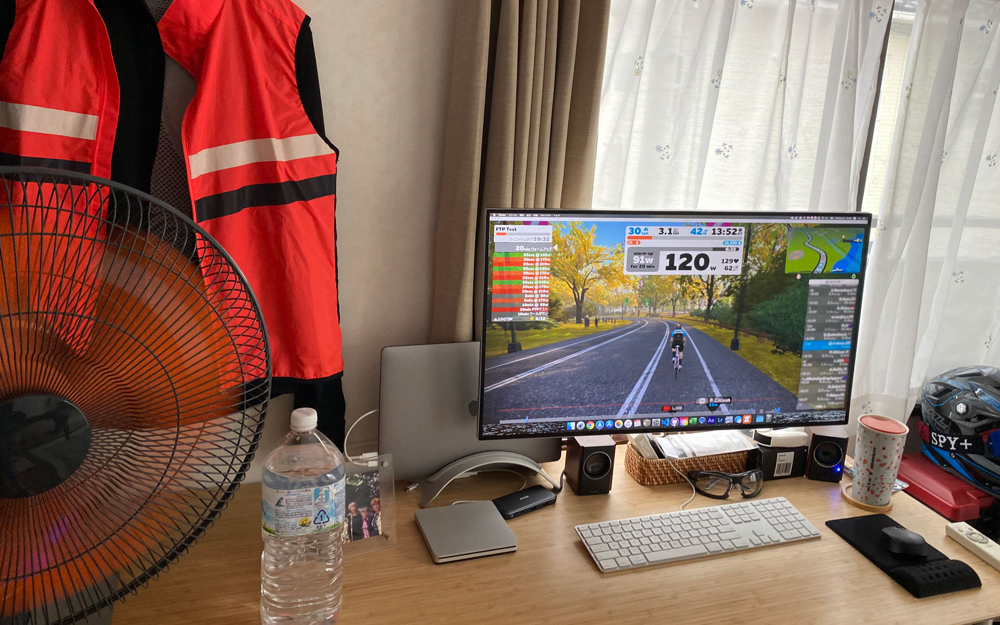
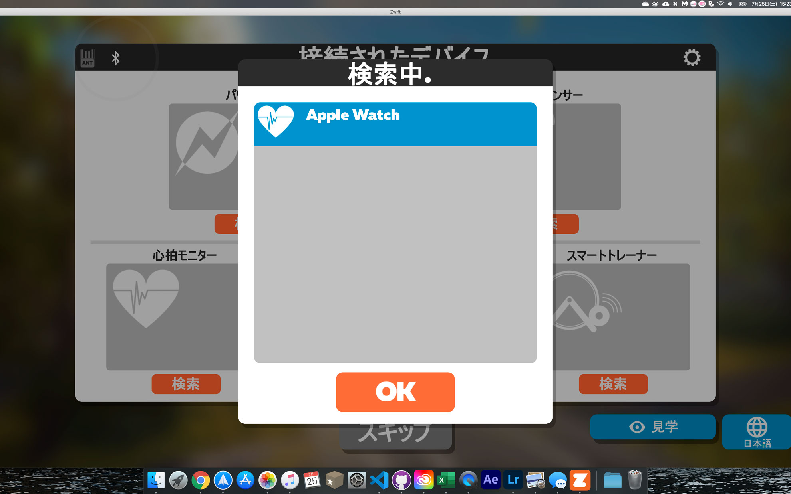
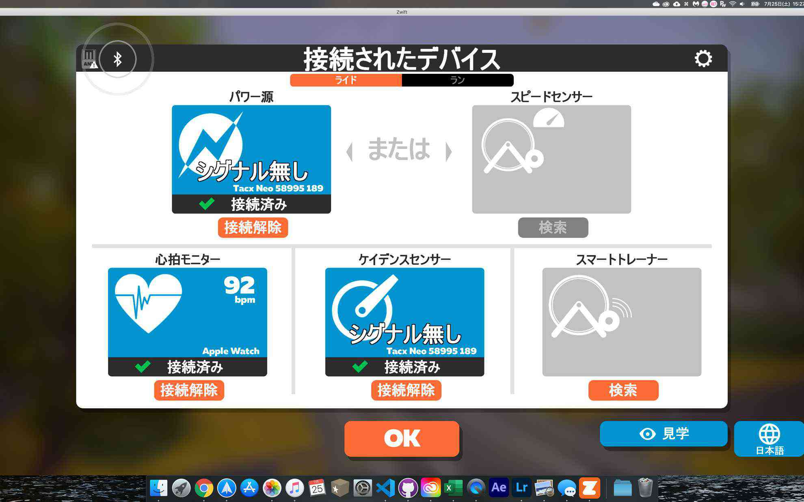

FTPテスト開始までのウォーミングアップがキツイです・・・。  
<!--more-->
　  

### MacOS版ZWIFTをインストールしてみました。
最近デスクの配置を変えてローラー台に乗りながらでもモニターが見られるようにしたので、MacOS版のアプリをインストールしてみました。  
とりあえずTacxNeoとの接続は問題なくできたのですが、iPhoneのZwiftコンパニオンアプリでリンクしているはずのApple Watchを認識しない現象がおきたので、とりあえずMacOSのアプリを終了させて、再起動してみました。再びデバイスの検索から心拍計をクリックするとApple Watchが検出されました。  
　  　  
  
　  
### ウォームアップで燃え尽きる。
実走だとそれほどキツくないと思うのですが、同じ時間ペダルを休めずに漕ぎ続けるのは結構しんどくて「More　Power!!」と画面でハッパをかけられると頑張ってしまってペースが乱れて結局「もう・・・いいか。」とやめてしまいました。いや、そんなに頑張るつもりは全然ないのですが、ついつい全力を尽くそうとしてしまい長続きしないのが自分の欠点なんだと思っています。  
適当にゆるーく長続きできるように頑張りたい・・・じゃなくて頑張らずに楽しもうと思います。  
　  
  

  

  