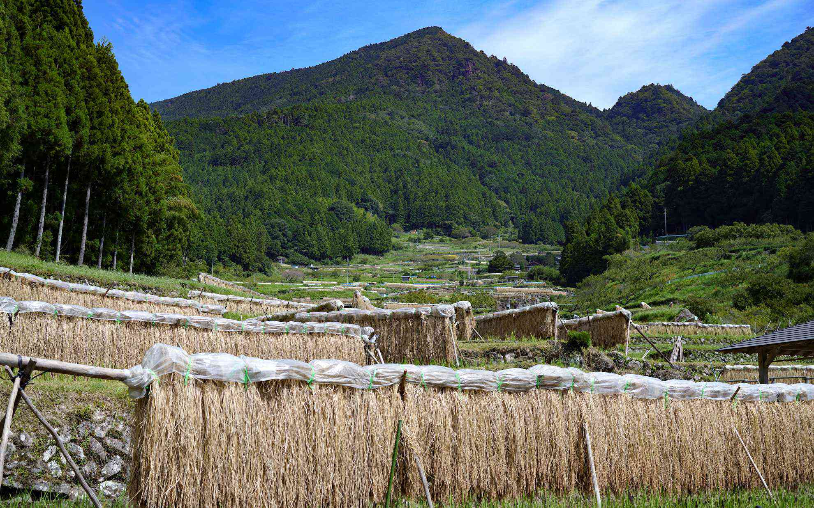
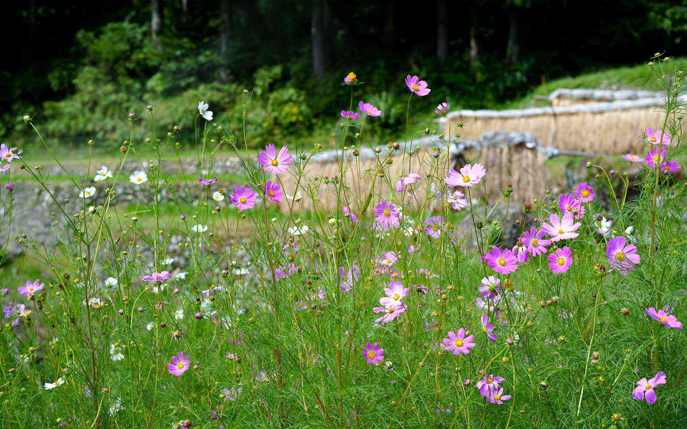
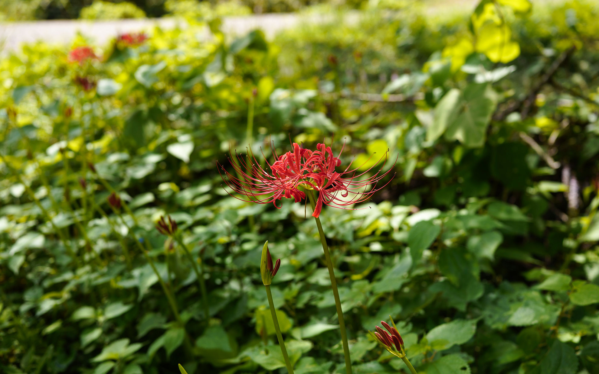
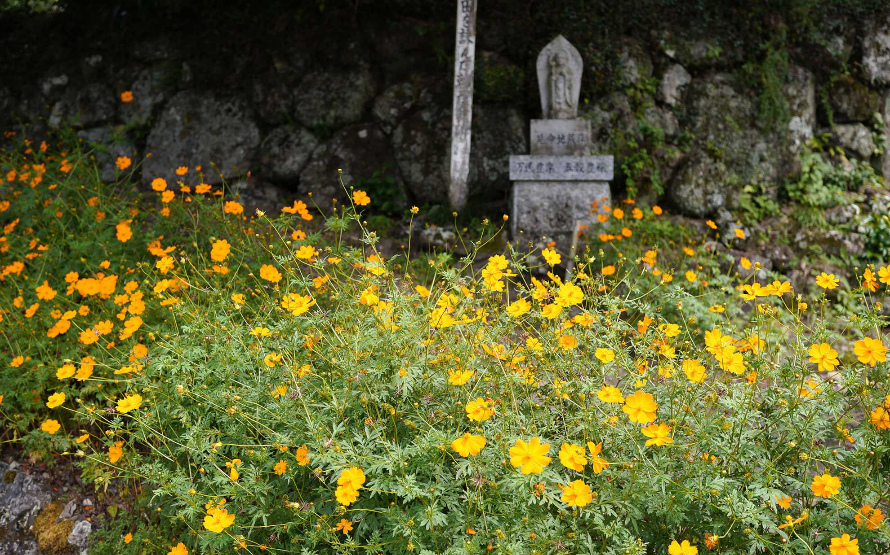
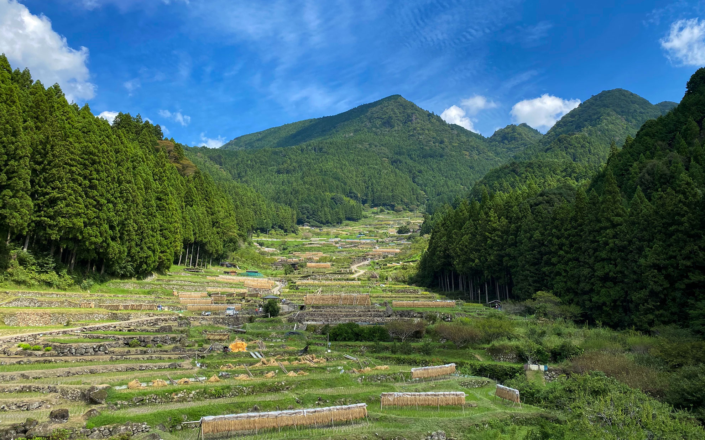

9月の4連休の最終日は四谷の千枚田に行ってきました。  
<!--more-->
　  

### セミが鳴いている秋
千枚田へは自動車でドライブに出かけたのですが、道中ロードバイクで走っている人をちらほら見かけました。気温も高くなくて気持ちが良さそう。  
すでに田んぼでは稲刈りがほとんど終わっていて、干している風景がいかにも秋らしいのですが、セミが「み”ーん”！！み”ん”み”ん”！！！」と森から元気な声で鳴いているのが聞こえて少し季節感覚がバグる感じがします。確かに秋にしては少しまだ暑いかな・・・。  
彼岸花は今の時期に咲いていることが多いのですが、それほど多くは見かけず、やっぱりもう少し涼しくならないと咲かないのかもしれません。  
それでも千枚田に吹き上がる風は確かに涼しく、秋の入り口もしくは夏の終わりの境目に自分がいるのかもしれないなと感じさせてくれました。  
　  

  
  
  
  
  

