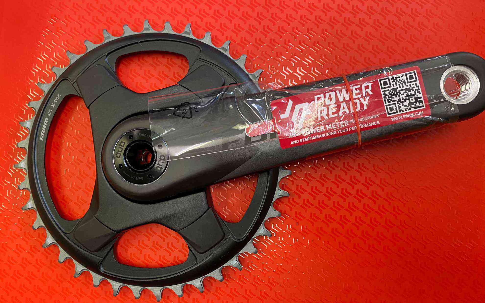

このレインボーカラー、本当にすごい。  
<!--more-->
　  

### SRAMのグラベルコンポーネント
世の中のトレンドは本当に変わるのが速くて、はじめはeTapのディスクロードがいいなぁ・・・と思っていたのですが、仕事が忙しくて気絶している間にAXS Gravelが登場。すごい理想的なコンポーネントじゃない？と感動し、もっとお祭り騒ぎになるかと思っていたのですがシマノからGRXが出てきて、さすがシマノと言える価格帯とグリップの握った感じの良さに誘惑されましたが、やっぱりAXS Gravelを買ってよかったです。  
　  
ちなみに新しいフレームにつけるパーツ構成はeTap AXS ForceをメインにリヤディレイラーはXX1 Eagle、リヤのカセットはXG-1299カセット Rainbow 10-52Tというかんじ。52Tが現状最大なので1xでもたぶん登りでも余裕があるんじゃないかな。  
　  
実物を見ないとわからないことが多いのですが、スプロケの色合いや精密な削り出しで作られた工業製品って本当にきれいですね。　  
完成が楽しみです。

  
  
  

