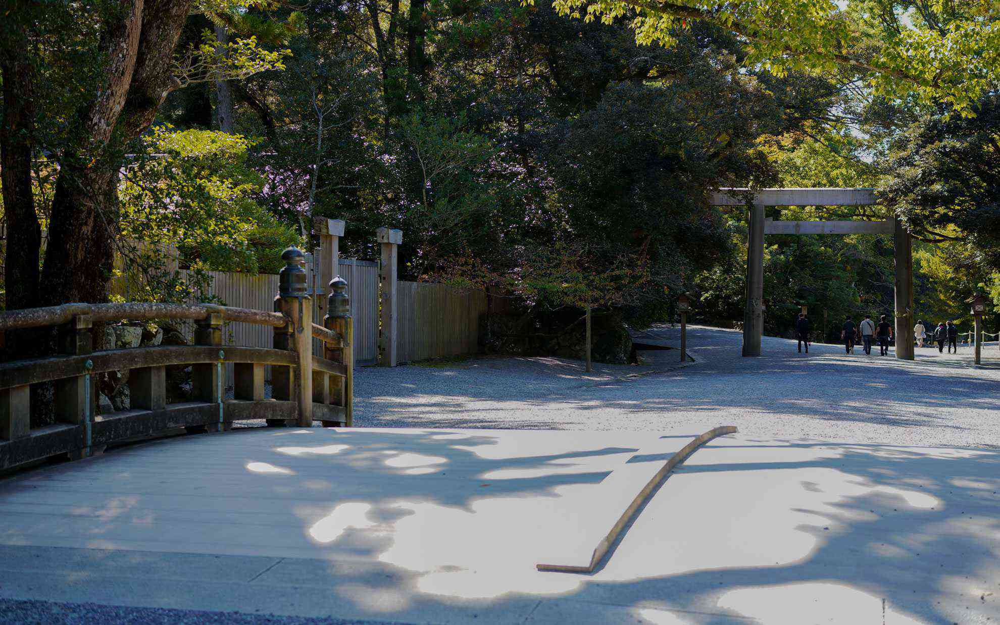

コロナの影響もあって遅ばせながらお伊勢さんに行ってきました。  
<!--more-->
　  

### 伊勢湾を一周

本当は少し前にデビューした近鉄の特急に乗ってみようかなと思って調べてみたのですが満席で、仕方がなく例年と変わらず高速で行くことになりました。自動車だと密は避けて行動できるし自由にプランを変えられるので、お参りをしてから少しパールロードを走って帰ろうということになりました。  
鳥羽は小さい頃に行ったのですが、鳥羽水族館前で撮影した古い写真での記憶しかなく大人になって改めて眺める小さな入江が続く風景はとても美しいです。  
　  
行き当たりばったりな旅でも楽しめるようになったのはスマホで情報を検索できるようになったおかげでもありますが、名も知らぬ美しい海の景色を目の前にすると実際に行ってみないと分からないことも多く、感じ方も人それぞれなので自分の気に入った場所を探しながら旅をするのもいいのかな。    
　  
帰りは時間を調べたところ15:10鳥羽港発の伊勢湾フェリーがあるのを知り、鳥羽から伊良湖岬経由で帰ってきました。  
パールロードの展望台で風が強く吹いていたのですが、鳥羽港を出港するときは波が穏やかで55分の船旅だから大丈夫だろうと油断し切っていたところ、伊良湖水道に出た途端に波が急に激しくなって船が結構揺れました。それでも天気は良いので神島を右手に眺めて海を見ていたら間も無く伊良湖岬です。展望台からは本当に渥美半島が近くに見えて昔の人もこうして景色を眺めていたのかな・・・とありきたりな妄想をしてました。  
　  
今年は少しずつ重ねた努力が実った年だったので、感謝をこめてお参りしました。努力というと嫌なことをコツコツとやるニュアンスになってしまう気がするので他の表現を考えましたが思い浮かばない。自分ができることを積み重ねていくことは好きなので苦労ではないし、だからと言って自分だけで好きなことを単に続けて成し遂げた訳でもない。ともかく病気になって以来できないことはあるものの、できることを伸ばしていくことを考えて勉強してきたのが少し形になったような、そんな感じです。なので本当は大金持ちになりたいとか俗物的にお祈りもしたいのですが、まずは感謝をみなさんにも神様にも伝えたいと思ってお祈りしました。  
　  
どんどん知らなかったことを知る機会が増えて、もっと成長できればいいなと思った小旅行でした。  
　  
  
  
  
  
  
  
  
  