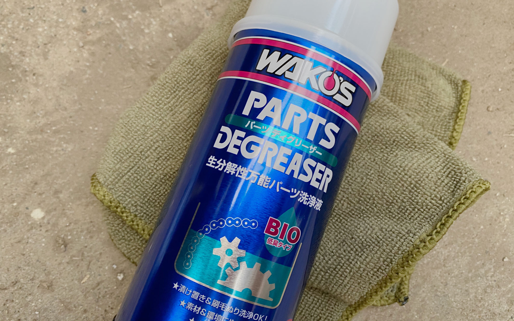
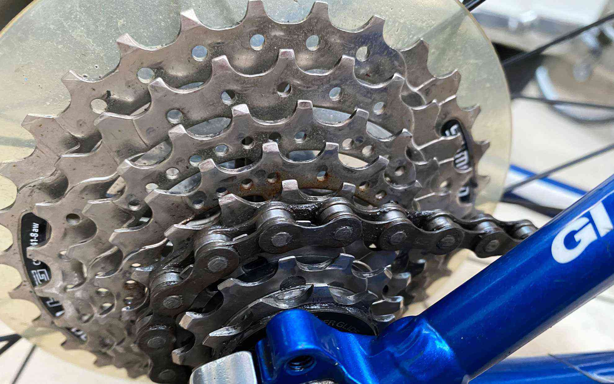
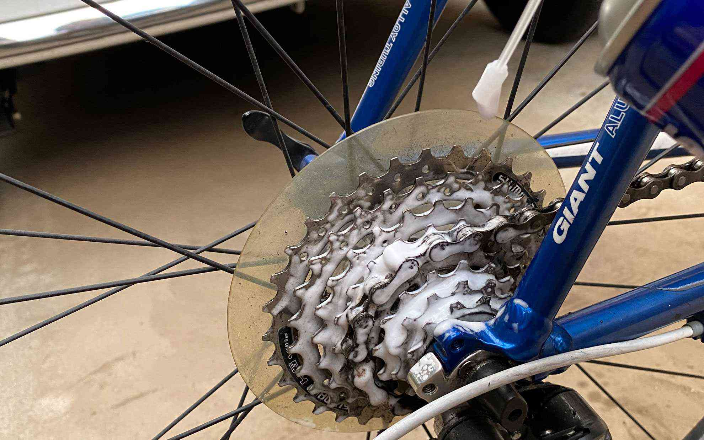
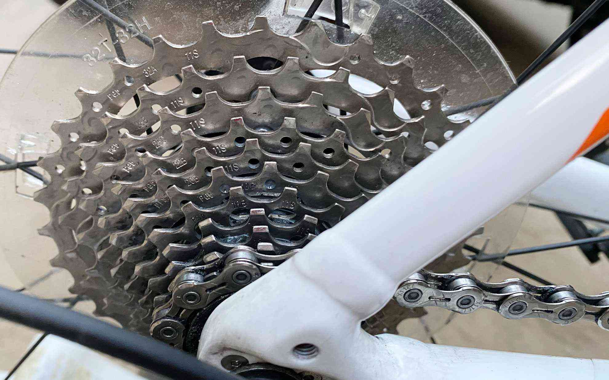

臭いも気にならなくて便利なディグリーザーでした。
<!--more-->
　  

### 父の通勤バイクとロードバイクの汚れをおとす。

もう4年前に発売開始されたみたいで知らなかったのですが、ワコーズの筆で塗るタイプのディグリーザーを買いました。これがケミカル特有の臭いもしなくて汚れが落ちるので便利で、生分解性が高いので環境にも優しい（らしい）とのことで良いお買い物をしたなぁと日曜日の午後に掃除しながら思いました。  
単に油汚れを落とすだけじゃなくて、油や泥が混じったような自転車特有のスプロケに付着しそうな汚れも筆で塗って少し時間をおいてウエスで拭いてみると綺麗になるのですごい。  
　  
  
　 
汚れが落ちてくるにつれてクロスバイクのスプロケに少しサビがついているのに初めて気がついたので、このあと更にフォーミングマルチクリーナーで洗浄してとりあえず拭いておきました。さび止め剤も後でさしておかないといけないな・・・。チェーンの汚れは通勤用バイクではキリがないので途中で妥協しましたが、普段からキレイにするなら短時間でメンテできるんじゃないかな。長期間の汚れはさすがに簡単には落ちません。  
　  
  
  
　  
同じようにロードバイクの汚れも落としてみました。割と短時間でキレイに汚れが落ちたので気持ちがいい。これでまだ連休の真ん中というのが自分にはとても新鮮に感じられます。というのも大体いままで3連休でも2日くらいは夕方まで寝込んでしまい休みらしい休みを過ごしていなかったからです。欲を言えば午前中に自転車に乗ったり外出したりして一日中を長く感じられるくらい行動できればいいのだけれど、少しずつ無理をしない範囲で楽しめればいいかな。  
　  
　  
  
  