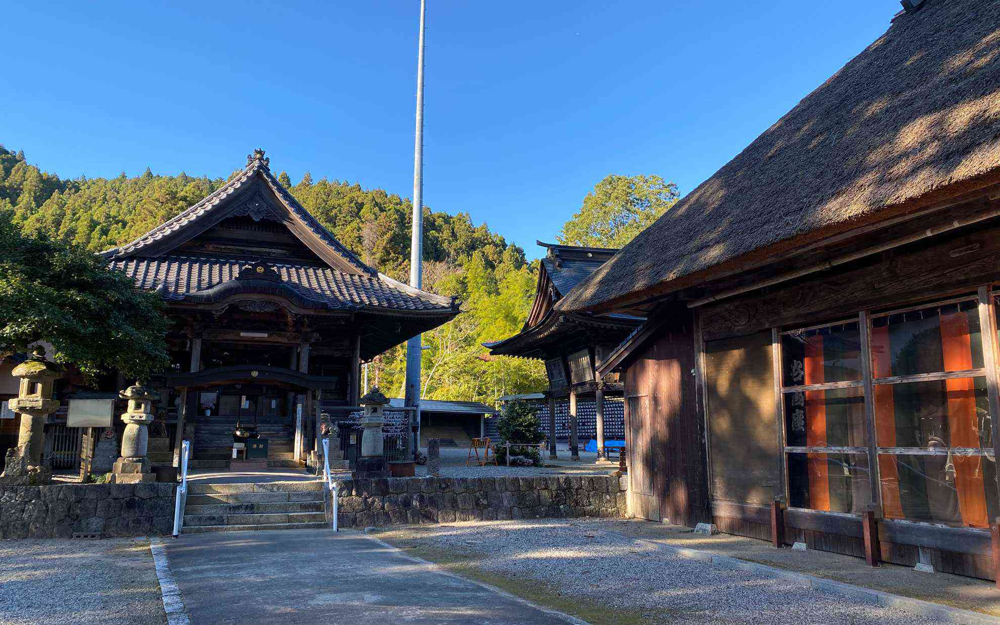
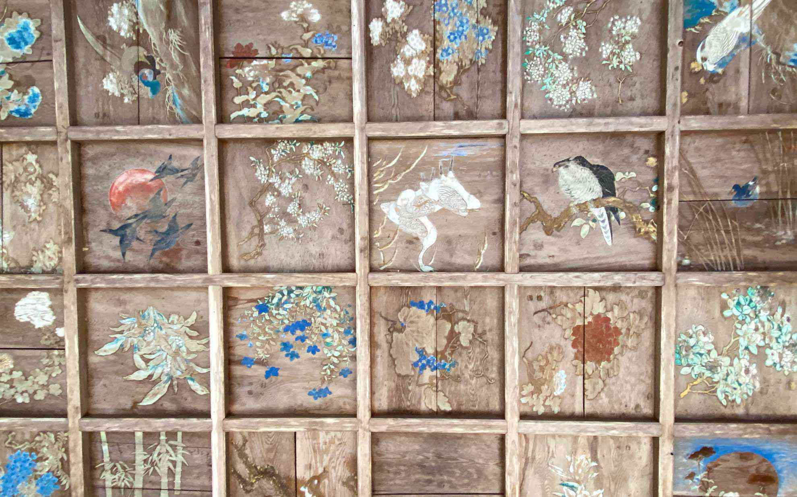
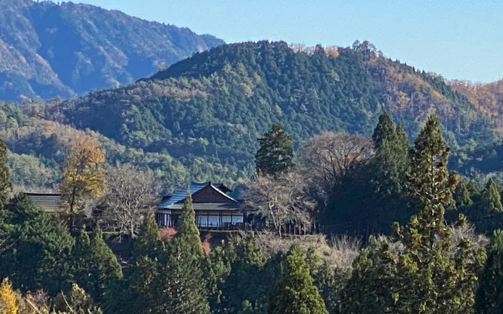
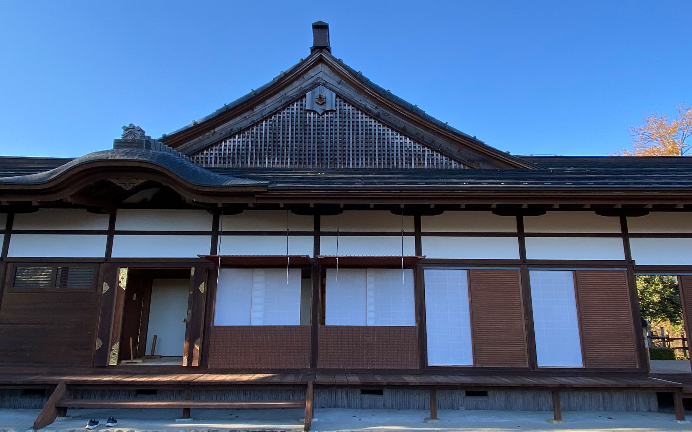
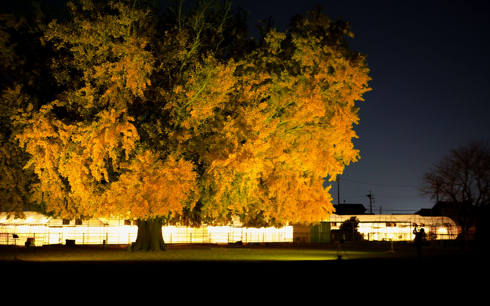

毎年楽しみにしている大和の大いちょうを見に行ってきました。
<!--more-->
　  

### まずは新城への田峯城へ行ってみた。

田峰観音の奉納歌舞伎は新聞とかで読んで知っているものの、田峰に行ったことがなかったので軽自動車で坂道を登って行ってきました。ここはロードバイクで登ったら楽しいかも・・・。田峰観音の階段を降りていると、遠くに田峯城が見えます。  
山の山頂にある山城をイメージしていましたが、田峰は起伏があるものの全体が高台にある平地のようで、その平地のキワにあるのが田峯城みたいなイメージです。豊川に面した急峻な崖が田峯城の自然の壁になっているようで、ここに城があるのもなんとなく理解できます。  
　  
帰りに大和の大いちょうを見に行ってきました。  
毎年黄色に色づくのが楽しみなのですが、大きすぎるので全体が黄色に染まる前に落ちてしまう葉っぱもあります。今年は暑かったり寒かったりしているので例年よりは緑が混ざっている印象です。  
それでも大木を前にすると巨大な生き物が目の前にいるようで、自然と畏怖の念を抱きます。  
今年も見られてよかった。  

　  
  
　 
  

  

  

  