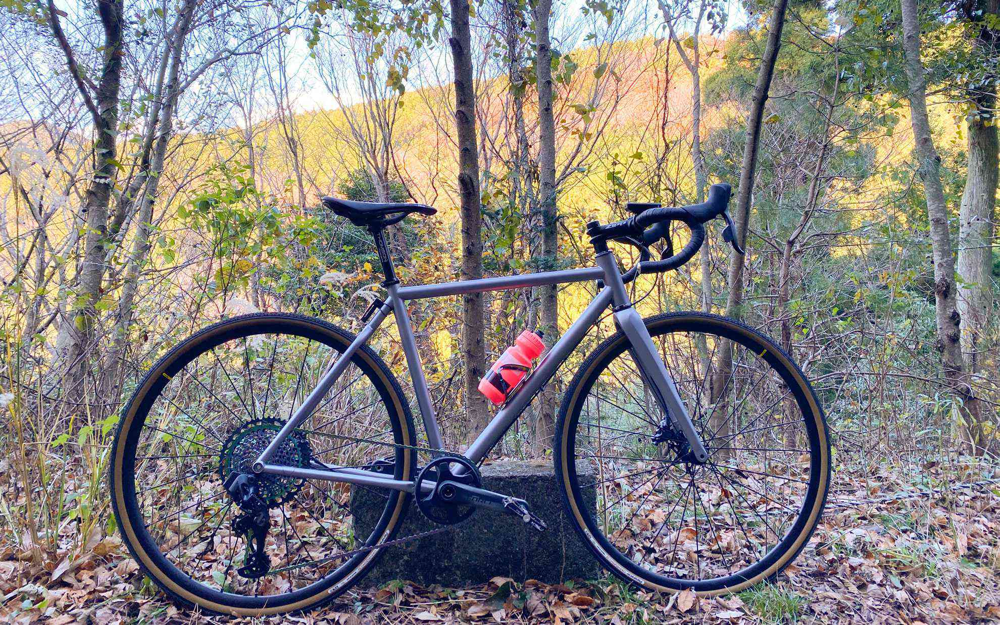
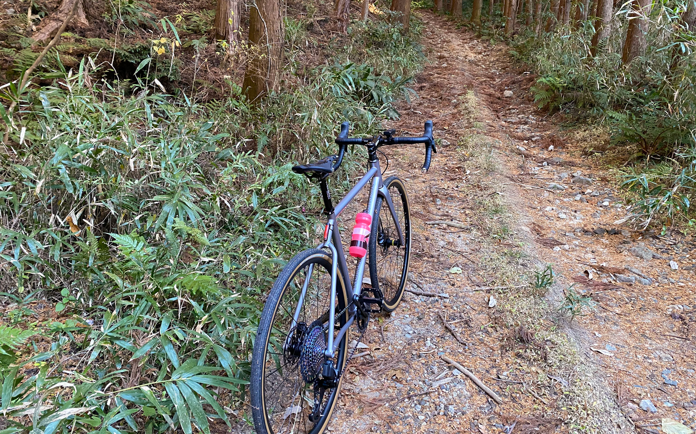

完成した自転車は最高の乗り心地です。
<!--more-->
　  

### ポートランドのハンドメイドバイク

　フレームはTONIC Fabricationで作ってもらいました。自分の普段乗っているジオメトリで作ってもらったので、乗り出しから自分の感覚にフィットして本当に素晴らしいです。  
当初の構想ではeTapで組むつもりでいたのですが、eTap AXSが登場して自分が本当に欲しいバイクの理想形にピッタリだったのでコツコツと貯金を重ねてAXS Force Gravelのコンポーネントで揃えることになりました。早速近所の山を登ってきましたが、登坂中の変速でも驚くくらい静かでスムーズな変速です。タイヤはGravel King SSのおかげか少々荒い路面でもとてもスムーズ。とりあえず32mmのタイヤを選びましたが、35mmでもいけそうです。  
おお、いきなり凄い乗り物になってしまった・・・。寒空の中どこまでも走っていけるような嬉しさのあまりガシガシと走って途中で息が切れそうになりましたが、この喜びは自分にとって良いプレゼントになったと思います。    

　  
  

  
