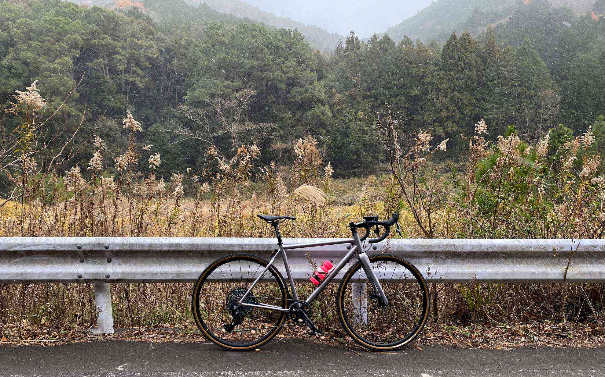

年末の恒例イベントに参加したつもりで走り納めをしてきました。
<!--more-->
　  

### 雪が降ってきたけど登ってみる。

　大寒波がやってくると聞いていたので、おそるおそる午後の空いた時間を狙って走り出したのですが、杣坂に差し掛かったところで雪がパラパラと降ってきました。山の中は木に覆われているため風や雪から守られているから大丈夫かな・・・と思いつつ登っていくうちに少し雪がやんできたので、ついでに杣坂から萩の方へ下ることにしました。  
　  
下ってきたところで雪がふたたび降り出し、勢いも本格的になってきたのでショートカットをして急いで帰宅しました。雪のせいで体調を悪くして誰かに迷惑をかけてはいけないので、準備は万全にしてこれからも冬のサイクリングを楽しみたいと思います。  
　  
RaphaとStravaがコラボしているFestive500は今年からZwiftでのライドも加算されるようになりました。自分にとって忙しいとか暗い道や寒い夜は無理と言い訳をしていたのが通じなくなる大チャンスだったのですが全然走れませんでした。やっぱり走り切る人は凄いです。強い意思がないと走れないなぁ・・・。今日はちょっと走って600kcal消費した程度なのでおはなしにならないのですが、それでも年末になんとか走ることができて気持ちがよかったです。  
　  
今年は色々ありすぎて先がまだ見通せない年となりましたが、どうか皆様にとって来年がより良い年となりますよう祈念いたします。  
　  
　  
  
　  
  
　  
  