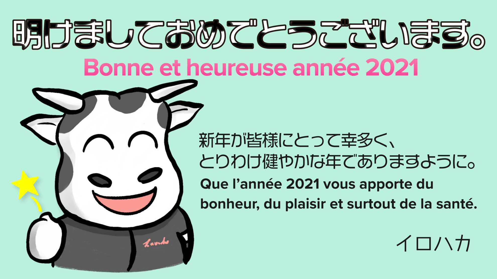
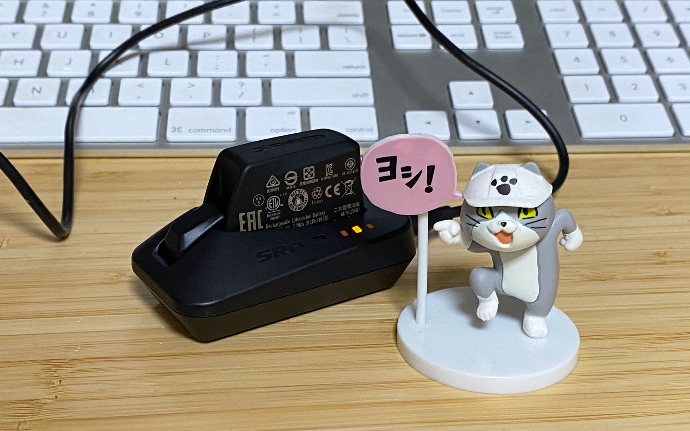

明けましておめでとうございます。本年もよろしくお願いします。
<!--more-->
　  

### 24さい（通算2回目）になる丑年

　今年の干支は丑年だそうで、そんなこと言ったら自分丑年なんスけど数がもう数えられない・・・。もういい歳なので正月は一年の計画を立てて、大局に立った境地で生きていこうと一瞬ひらめいたものの、今日は朝からなぜか突然大掃除を始めてしまい、部屋中に昔の服を引っ張り出して片付けていたり段ボールを片付けておりました。こういうのは年末にやろうな。  
　  
元旦は正月らしく氏神様へお参りに行ってきました。ここの門松は名前の通り松が門の形になっています。毎年雄松・雌松の一対を立てて竹を横に渡したところに裏白（ウラジロ）・譲葉（ユズリハ）のお飾りとしめ縄から紙垂（シデ）が三本垂らされている・・・らしいです。このスタイルの門松を検索してもなかなか見当たらず、伝え聞いただけなので間違っているかもしれません。ただ、なんとなく神域への結界を感じさせるようで、厳かな雰囲気になれるので僕は好きです。ちなみに仙台の伊達家の門松を復活させる企画が過去にあって、それに似ているような気がします。  
　  
元旦の夜は牛をモチーフにした年賀状のデザインをやろうと思いついてしまいイラストレーターでお絵描きをしたものの上手く描けず、結局イラストはiPadのProcreateで描いたものをイラストレーターに配置して文字の装飾などを考えているうちに深夜になったので寝ました。無計画な上に普段の勉強が足りていない証拠で反省しました。いろいろやりたい事はあるけど可処分時間とも言うべき時間は他の人と比べて少ないうえに油断をしていると知らない間に浪費をしてしまっています。元気があるなら勉強や自転車で充実した毎日を過ごせるようにしたいと2度目の24歳を迎えるにあたって感じるわけです。  
今年は去年よりも多めに自転車に乗ってブログも多めに更新できればいいな。  
　  
　  
  
　  
  