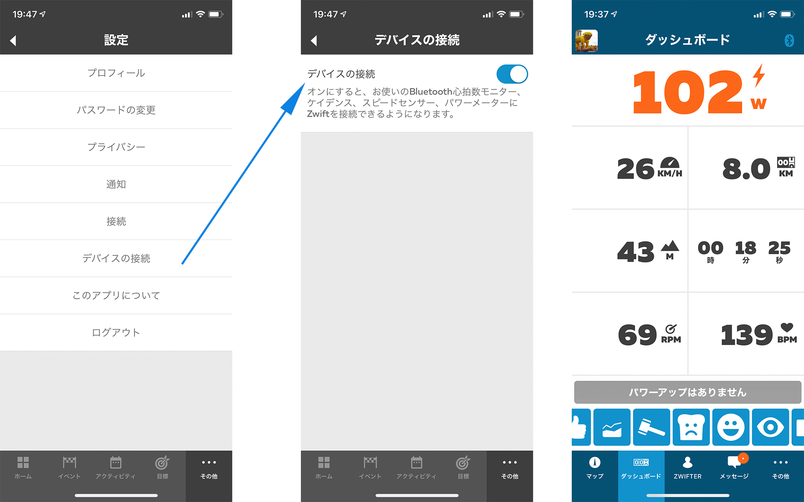
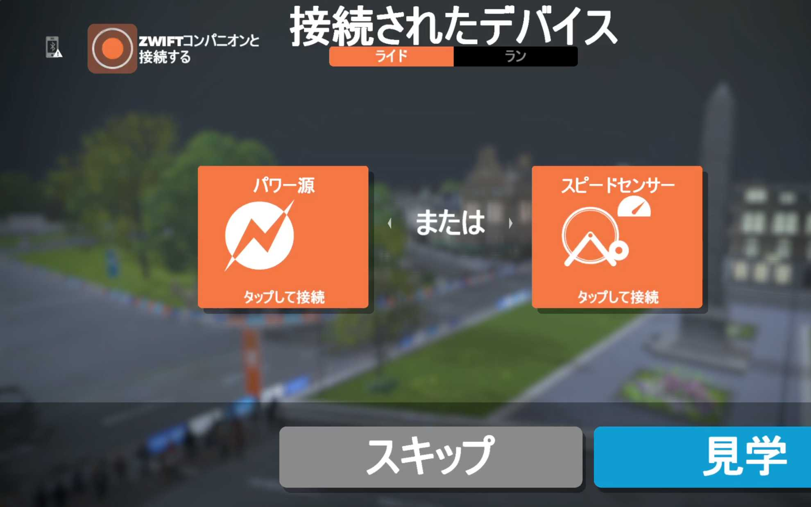
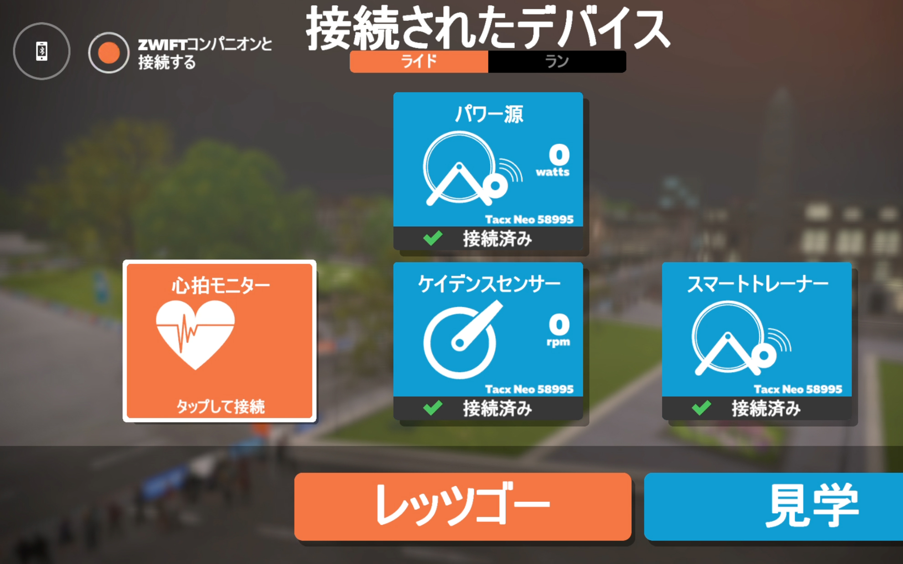
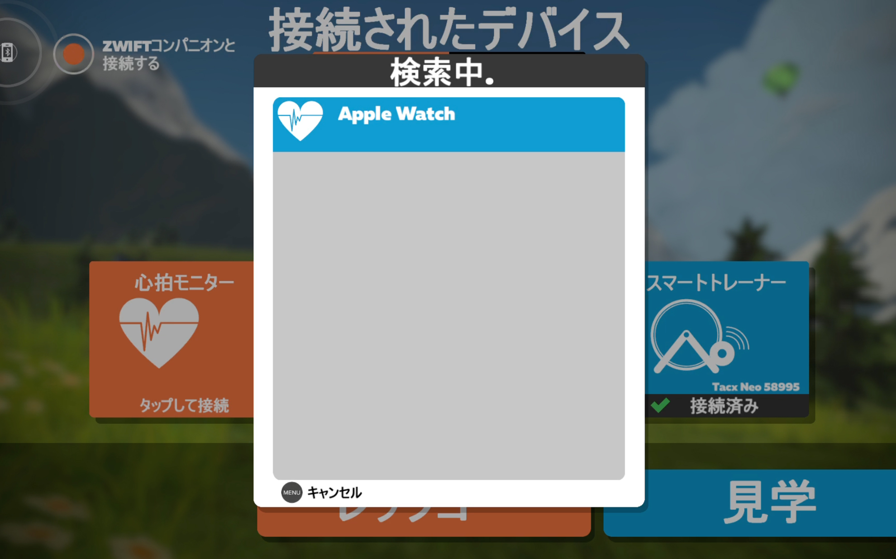
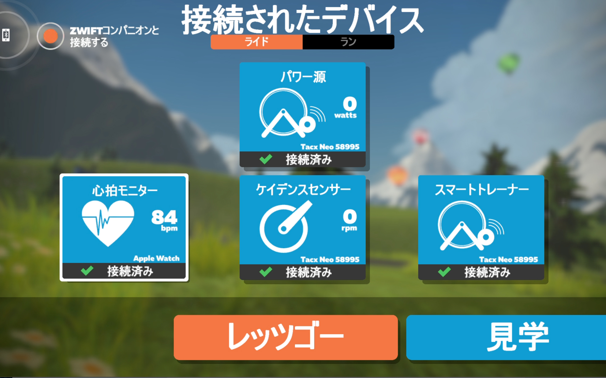
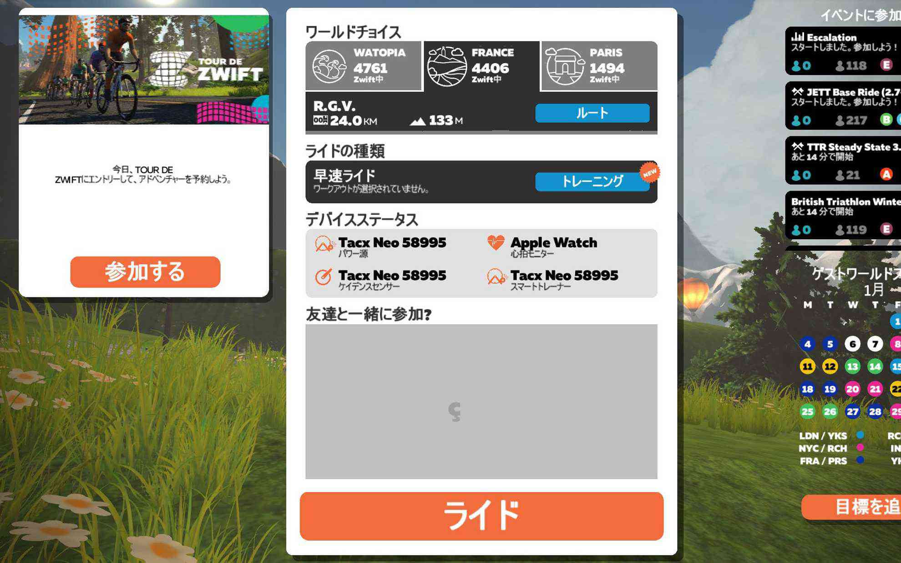
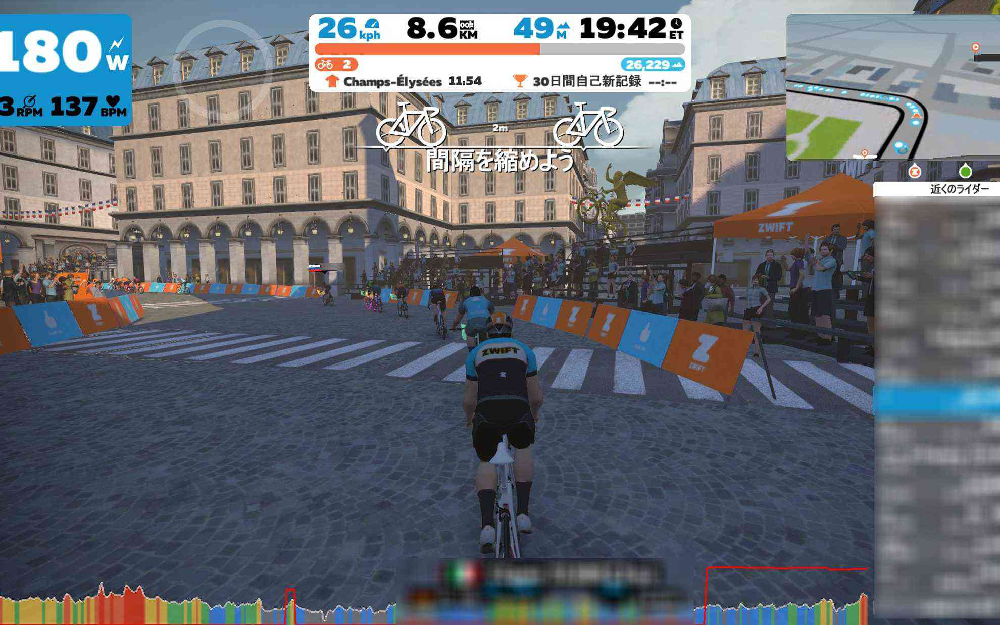

最近iPadばかりで動画を見るので、AppleTVをZwiftで再利用することにしました。
<!--more-->
　  

### AppleTVは便利だったんだけど・・・

　テレビはもっぱら動画再生マシンと化したのですが、ここ最近はテレビの画面じゃなくて布団に寝そべりながらiPadで動画をだらだらと見るのがとても心地よく、ダメ人間生活を送っています。
なのでAppleTVで動画を見ることもなくなってしまい再利用の方法を考えていました。  
そういえばAppleTVのアプリでZwiftがあるので、これはイケるかも・・・と思ってセッティングしてみました。  
iPhoneとApple Watchは今も現役で使っていますが、眠っていたモニターも再利用してZwiftの環境を作ることにします。
　  
　      
ちなみに機材環境は以下の通りです。  
 ・Tacx Neo Smart(2018年購入)  
 ・iPhone11 Pro (2019年購入)  
 ・Apple Wtach Series 3 GPS+Cellularモデル (2018年購入)  
 ・Apple TV 4K 64GB (2017年購入)  
 ・ASUS VZ239 23インチワイド液晶モニター（2017年購入）  


 

まず、Zwiftコンパニオンの設定を再確認します。アップルウォッチと連携させるには、Zwiftコンパニオンアプリの「設定」から「デバイスの接続」をオンにしておきます。ただ、設定していてもアップルウォッチの心拍計を読み込まない時があって（サムネみたいに）、そういう場合はアップルウォッチのアプリを強制終了(サイドボタンを押してZwiftコンパニオンアプリを左にスワイプ)させてからデジタルクラウンを押してZwiftアプリ（丸にZマーク）を再起動して連携させてます。Zwiftコンパニオンでは先にTacxとの連携もしておきます。  
　  　  
  
　  
AppleTVのアプリを起動したら、左上に「Zwiftコンパニオンと接続する」をオンにします。そのあとに「パワー源」アイコンを選択すると心拍計以外は設定される状態になるので、心拍計のマークをクリックしてアップルウォッチと接続します。  

  

  

Apple Watchが一覧に表示されれば連携できます。そうすると全て接続できた状態になるのでレッツゴー！です。  
基本的に操作はAppleTVのリモコンでやっていますが、iPadとかに比べるとやや使いにくい気もします。まぁでも即興ながらなかなか良い環境ができたと思います。  
今日はシャンゼリゼを走ってみましたが、よく再現されていておもしろいですね！  
凱旋門にむけて緩やかな上りになっているのは知りませんでした。これで外出自粛モードの運動解消に努めたいと思います。  
　  
  

  

  

  

