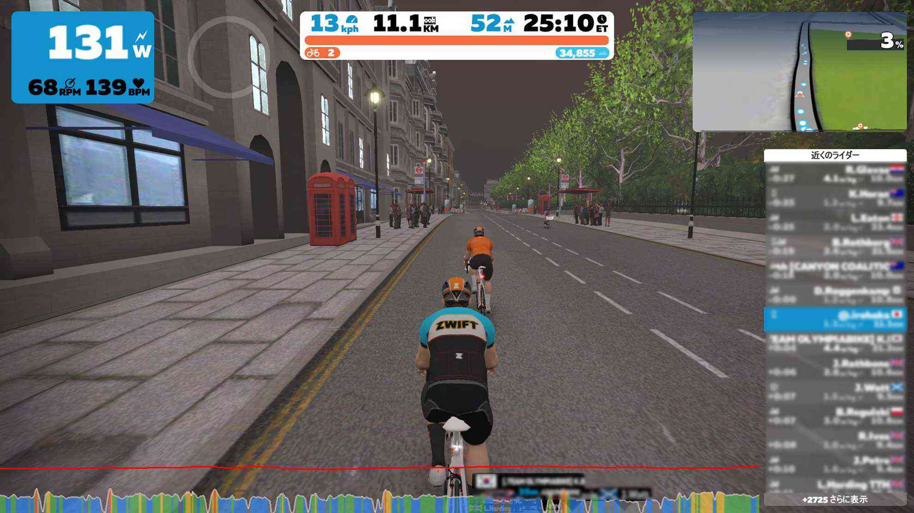

花粉がひどくて自転車に乗れないので思わずカッとなってペダルを買いました。    
<!--more-->
　  

### 目がかゆすぎる。

　今日は天気が良くて体調も良かったので外に出たのですが、花粉がひどかった・・・  
　鼻水も止まらないのですが、これはもう仕方がないので重力に逆らわずに垂れ流してもいいかなと諦めていますが、目が痒いのには耐えられないです。家に帰ったら手を洗って、そのまま眼球を取り出してゴシゴシ洗いたい気分。なんとかならないものかなあ。  
　  
　まぁ嘆いていても何も解決しないのでお部屋でZwiftをして遊びました。ロンドンみたいな平坦なコースを適当に走るのが一番長続きしそうです。  
運動や何かを始める時に、どうしても頑張ろうと思ってしまい、かえって長続きしないことが多いです。
ロンドンは25年以上前に遊びに行ったことがありますが、フランスの隣の国なのに行ってないですねー。それでも当時歩いたトラファルガー広場からの景色なんかは思い出せてバーチャルレンタバイクみたいな感覚で楽しめて面白いです。せっかくならパリやローマの裏道までポタリングできるともっと楽しくなるかもしれませんね。もっとも、実際に遊びに行けるようになるのが一番良いのですが。  
　  
コロナ禍でインドア派な人間がさらに引きこもりになりがちなので花粉が収まったら新しいペダルで走りに行きたいと思います。  
　  
　      

 

　  　  
  
