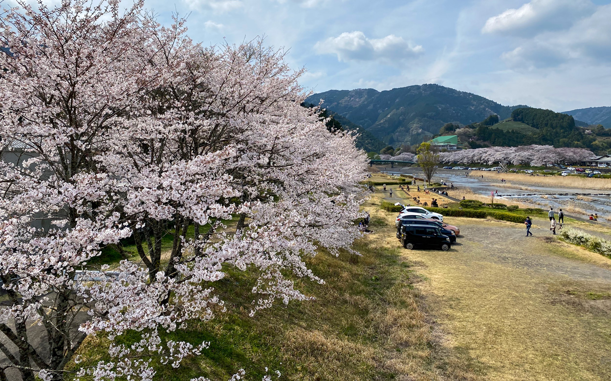
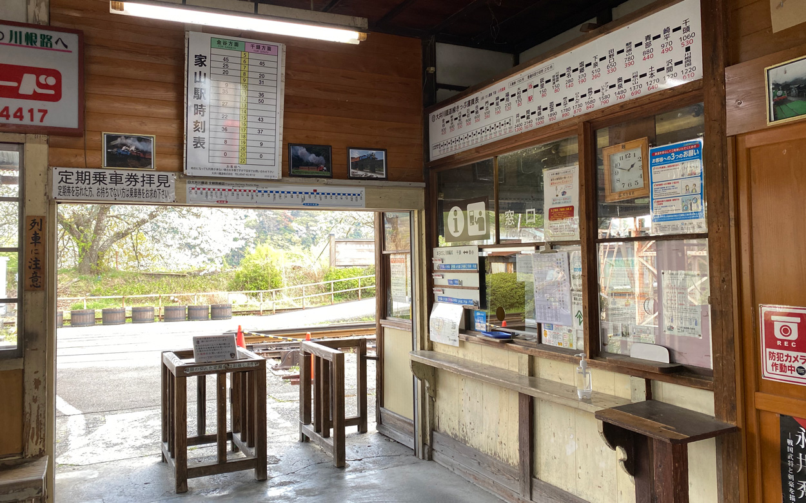
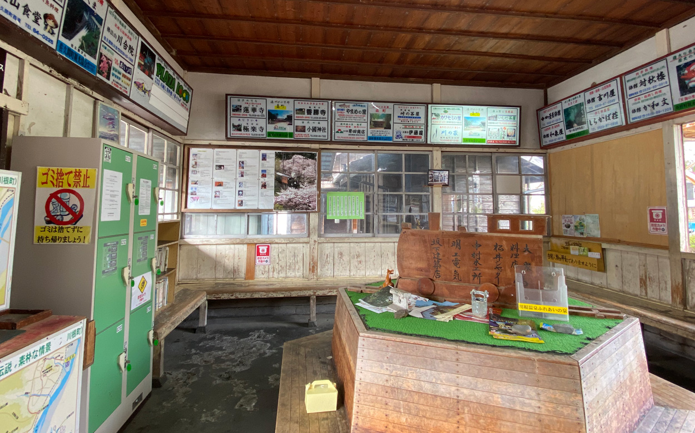
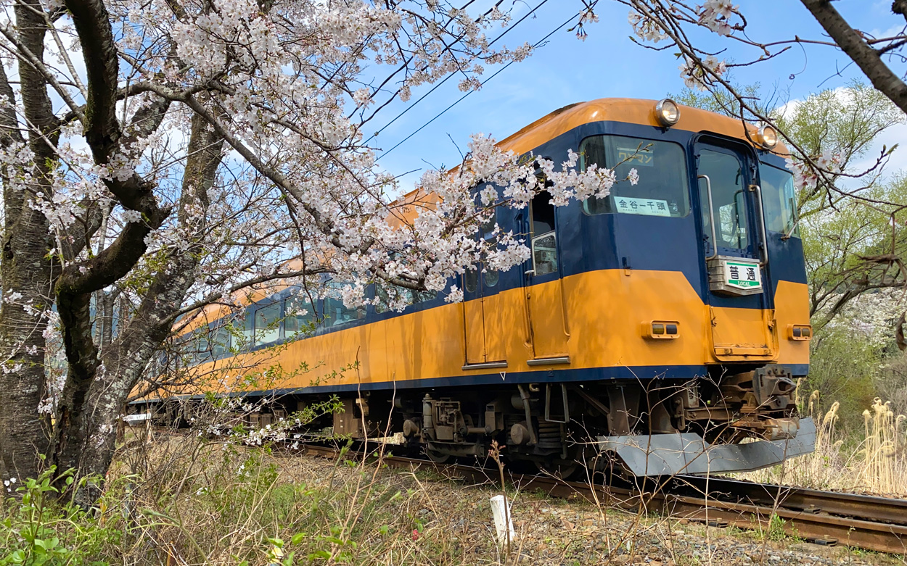
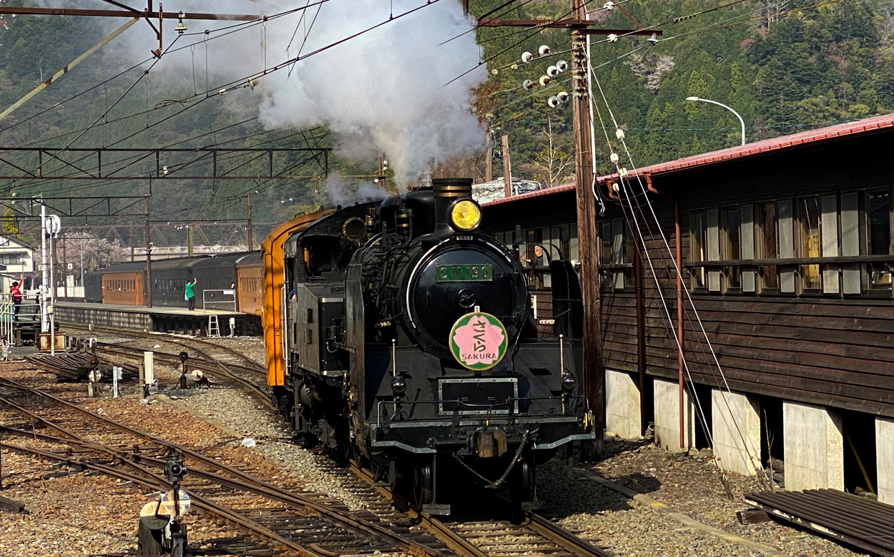

家で閉じこもっているだけでは少々つらいので自動車でドライブしてきました。    
<!--more-->
　  

### 密を避けたつもりが

　春の大井川ぞいにある家山の桜を見に行ったのですが、密を避けたつもりで行ったつもりが結構賑わっていて焦りました。  
とは言うものの、宴会をしたりする人は見かけず、人との接触は避けつつ桜をのんびりと鑑賞している人が多く見受けられました。  
　  
　大井川といえば大井川鐵道のSLが有名なのですが、時刻も調べずに適当な感じで来てしまったので電車が来ればいいかと思っていたところ、懐かしの近鉄の車両が走って行きました。こういう少し昔の車両が走っているのも大井川鐵道の魅力だと思っています。南海の車両とかは近畿の方には懐かしいかもしれません。
　  
自動車を千頭へと走らせていったところ、ちょうどSLが出発前だったようで外から写真を撮ってみました。一度は乗ってみたいなぁ。  

　  　  
  
  
  
  
 