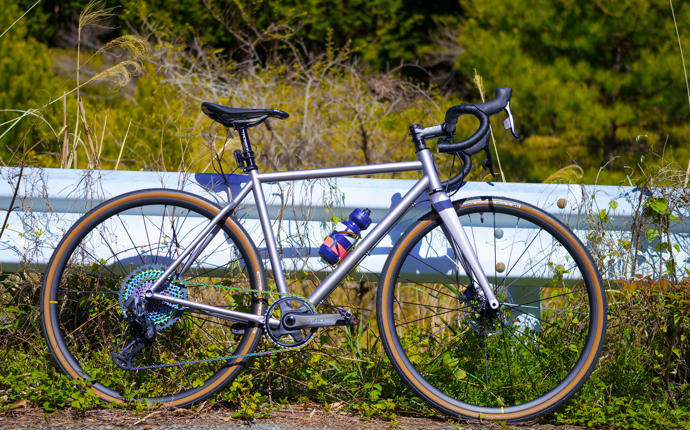

お休みをいただいてサイクリンに出かけてきました。    
<!--more-->
　  

### すっかり新緑の候、皆さんご健勝ですか

　ちょっと春めいたかと思ったら、いつの間にか桜の花は葉桜へと変わってしまい、季節を愛でる余裕がなくなっていたようです。    
土日のどちらかはベッドから起き上がれずに寝たきりというのが続いていたので、お休みをいただいて近くの山へサイクリングに出かけてきました。  
走っていくうちに目に飛び込んでくる若葉の緑が本当に鮮やかで、やっぱり自転車は最高だなぁと改めて思いました。Tシャツで出かけたのですが、峠を登り切ったあとに吹く風が心地よくて、なんだか体調が整ったような感じさえしました。    
　  
帰宅して近所のスーパーで売っていたヤマトパンの菓子パンを食べて、なんだか凄く贅沢な一日を過ごしたような充足感が得られて、こういう休日の過ごし方をできれば続けていきたいなぁと感じたのでした。ちょっと早起きしたり、ちょっと遠出をしたり、少し違うことをすることが大切なんですね。これからは次の休みは何をしようか考えるようにします。  
　  　  
  
  
  